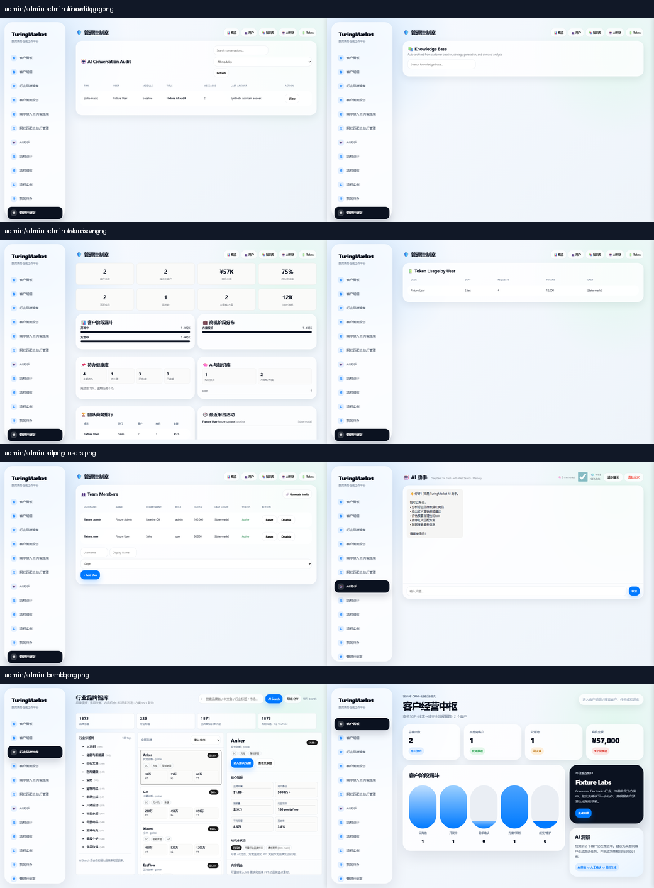
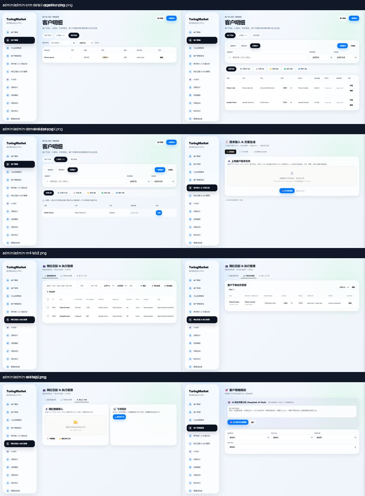
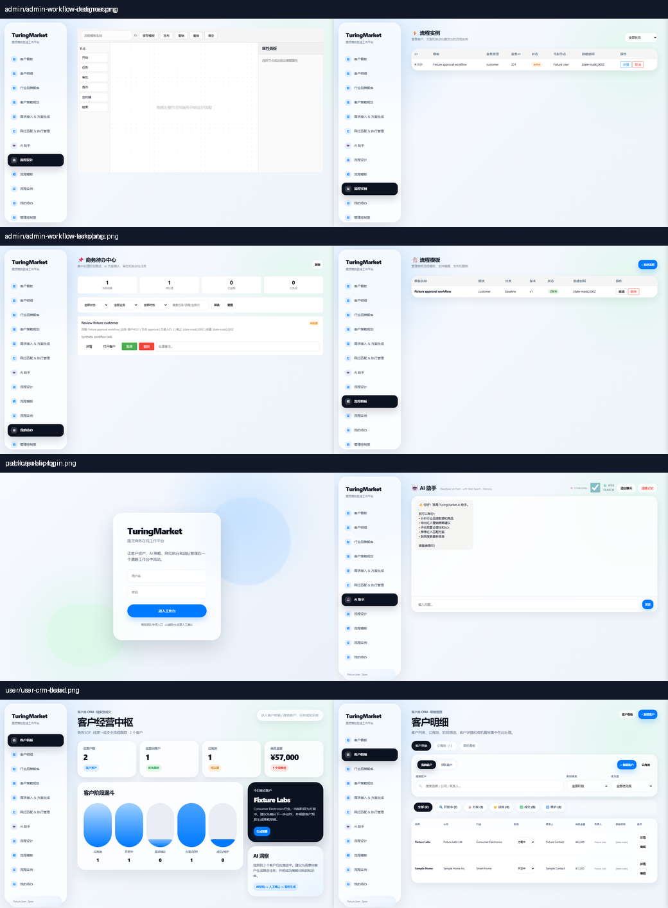
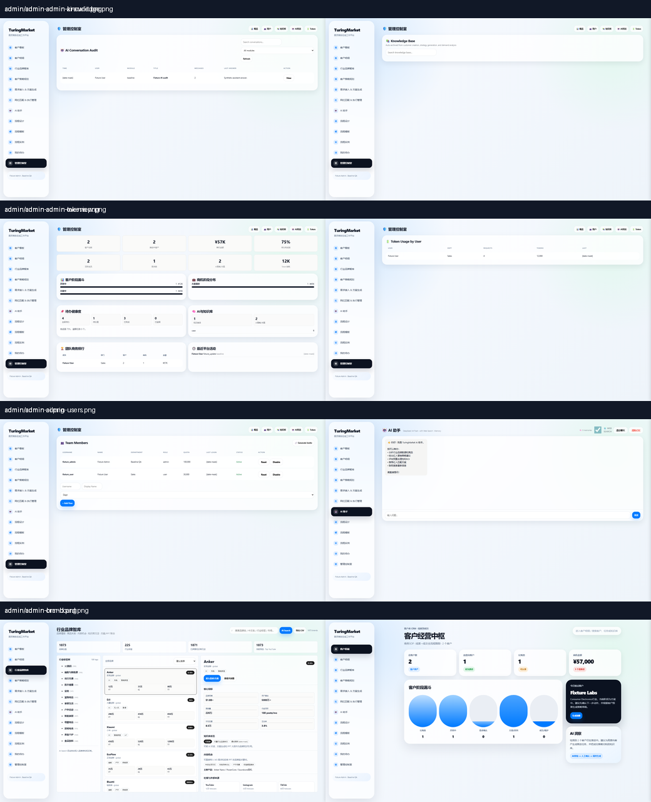
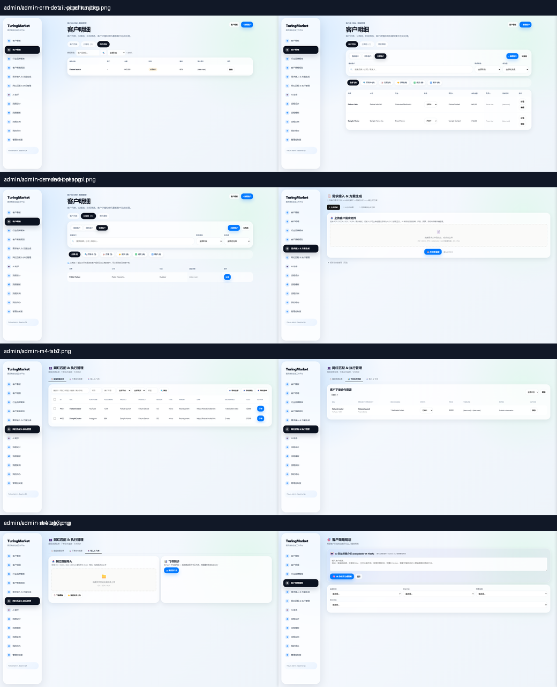
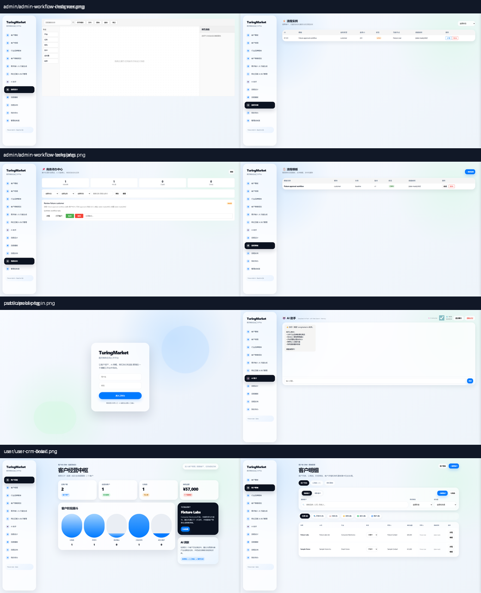
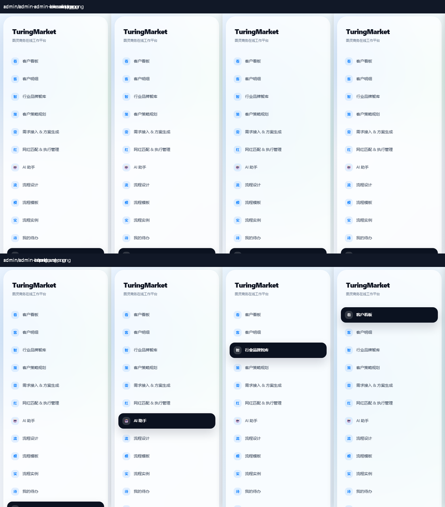
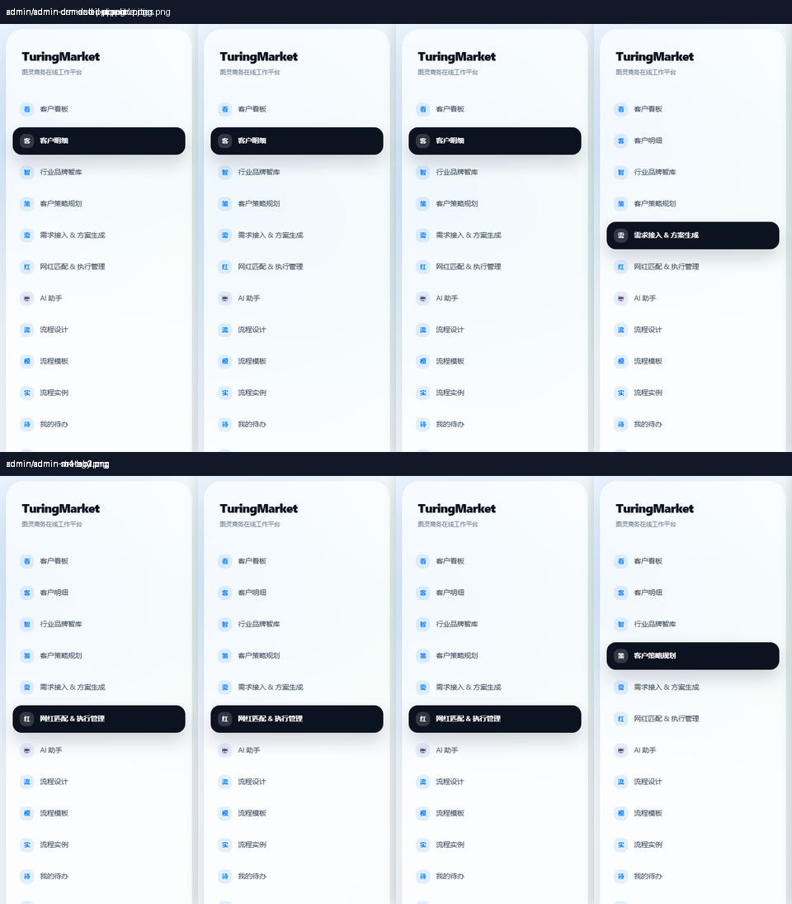
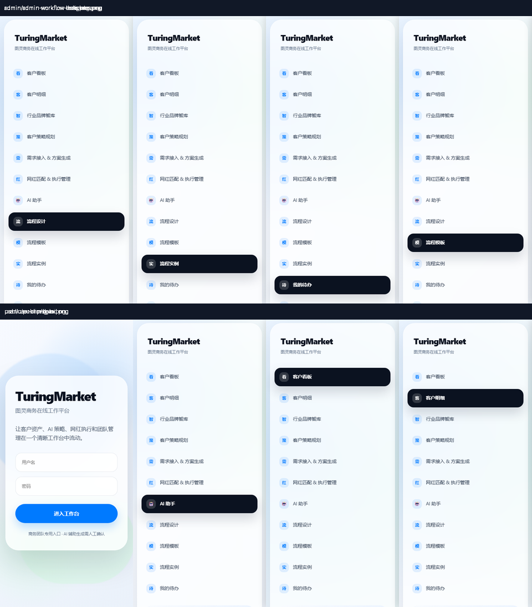

# TuringMarket Product UX Audit / 产品 UX 审计

- Audit date / 审计日期: 2026-07-14
- Product surface / 产品范围: current authenticated TuringMarket production-equivalent UI / 当前 TuringMarket 生产等价鉴权界面
- Evidence run / 证据采集: 102/102 Playwright journeys passed; 72 screenshots captured at `1440x900`, `1920x1080`, and `390x844`. / 102/102 条 Playwright 旅程通过，在三个视口采集 72 张截图。
- Approved direction / 已批准方向: Direction A, Agency Operations Console / 方向 A，代理机构运营工作台

## Overall Verdict / 总体结论

The desktop product is functionally broad and recognizable, but its shared shell uses a second, heavily rounded glass theme layered over the original theme. That produces excess whitespace, weak density, inconsistent component language, and difficult maintenance. The mobile shell is the release-blocking issue: all 23 authenticated module captures show the desktop sidebar occupying the initial viewport while primary content is displaced vertically below the fold. / 桌面端功能覆盖完整且可识别，但共享壳层是在原主题上叠加第二套大圆角玻璃风格，造成留白过多、信息密度不足、组件语言不一致和维护困难。移动端是发布阻断问题：23 个鉴权模块截图均由桌面侧栏占满首屏，主内容被向下推到首屏之外。

## Flow Health / 流程健康度

| Step / 步骤 | Surface / 界面 | Health / 健康度 | Evidence-backed finding / 证据结论 |
| --- | --- | --- | --- |
| 1 | Login / 登录 | Needs refinement / 需优化 | Mobile layout fits, but labels rely on placeholders and the decorative background competes with the task. / 移动端可容纳，但字段依赖 placeholder，装饰背景干扰登录任务。 |
| 2 | CRM board and detail / 客户看板与明细 | Desktop usable; mobile blocked / 桌面可用，移动阻断 | Separate screens are preserved. Desktop hierarchy is clear, while cards and stage graphics consume more space than an operating console needs. / 两个页面保持独立；桌面层级清楚，但卡片和阶段图占用过多操作空间。 |
| 3 | Brand, strategy, demand/PPT / 品牌、策略、需求/PPT | Desktop usable / 桌面可用 | Brand workspace is the densest and most operational screen; strategy and demand surfaces use a different spacing rhythm. / 品牌工作区最接近运营工具，策略与需求页的间距语言不同。 |
| 4 | Influencer sourcing/order/import / 网红提报、下单、导入 | Desktop usable; shared controls inconsistent / 桌面可用，共享控件不一致 | Search/import/order functions are present. Global input rules still risk oversized checkboxes, and table density differs from other modules. / 搜索、导入、下单均存在；全局输入规则仍可能放大复选框，表格密度与其他模块不一致。 |
| 5 | AI and workflow / AI 与流程 | Functionally visible / 功能可见 | AI workspace leaves a large unused canvas; workflow designer retains an older visual language and needs domain treatment later. / AI 工作区空白过多；流程设计仍是旧视觉语言，应在后续业务阶段处理。 |
| 6 | Admin / 管理控制室 | Desktop usable / 桌面可用 | Data is scan-friendly, but English/Chinese labels, emoji headings, pills, cards, and tables do not share one component contract. / 数据可扫描，但中英文、emoji 标题、胶囊、卡片和表格缺乏统一组件契约。 |
| 7 | Mobile authenticated shell / 移动鉴权壳层 | Blocked / 阻断 | Sidebar fills the viewport in every authenticated capture; no primary module content or stable menu control is visible. / 所有鉴权截图均由侧栏占满，主模块和稳定菜单控制不可见。 |

## Evidence / 证据

### Desktop 1440

### Wide Desktop 1920

### Mobile 390

## Priority Findings / 优先级问题

### P0 Release Blocker / 发布阻断

1. The mobile shell renders the full desktop navigation as normal document content. Primary content is vertically displaced below the initial viewport. / 移动壳层把完整桌面导航作为普通文档内容渲染，主内容被向下推到首屏之外。

### P1 Important / 重要

1. Navigation items are generated as clickable `div` elements and do not expose native link behavior, canonical URLs, modifier-click behavior, or `aria-current`. / 导航由可点击 `div` 生成，不具备原生链接、规范 URL、组合键新开页面或 `aria-current` 行为。
2. The original warm theme and later glass theme coexist in one inline stylesheet. Broad overrides use gradients, blur, large radii, negative letter spacing, and `transition: all`. / 原暖色主题与后置玻璃主题共存于内联样式，后者大量使用渐变、模糊、大圆角、负字距和 `transition: all`。
3. Global `input` sizing also applies to checkbox/radio controls. Shared tables do not have one sticky-header, overflow, density, and number-alignment contract. / 全局 `input` 尺寸同时影响复选框/单选框；共享表格缺少统一粘性表头、溢出、密度和数字对齐契约。
4. Focus is intentionally removed from page headings during navigation, and there is no reduced-motion fallback for the page animation. / 页面切换时标题焦点轮廓被主动移除，页面动画没有 reduced-motion 降级。
5. Login inputs have no associated labels, names, or autocomplete contracts. Several dialog/drawer surfaces lack shared semantic and mobile-size rules. / 登录输入缺少关联 label、name 和 autocomplete；多类弹窗/抽屉缺少共享语义和移动尺寸规则。
6. CRM/M4 tabs, upload surfaces, workflow palette items, and workflow nodes include pointer-only paths. Generated controls also lack a consistent programmatic-name contract. / CRM/M4 标签页、上传区、流程组件和流程节点存在仅支持指针的路径，动态控件也缺少一致的程序化名称契约。

### P2 Quality / 质量

1. The `1920x1080` views leave large inactive areas while toolbars and table controls remain visually oversized. / `1920x1080` 下存在大量闲置区域，但工具栏和表格控件仍显得偏大。
2. Most repeated surfaces look like independent floating cards. This weakens page hierarchy and makes operational scanning slower. / 多数重复区域都呈现为独立悬浮卡片，削弱页面层级并降低运营扫描效率。
3. Status is conveyed through inconsistent emoji, colors, pills, and English/Chinese labels. / 状态表达混用 emoji、颜色、胶囊和中英文。
4. Empty, loading, and error states do not share reusable classes or live-region behavior. / 空、加载和错误状态缺少复用类与 live-region 行为。

## Visual Directions / 视觉方向

### A. Agency Operations Console / 代理机构运营工作台 - Approved / 已批准

- Neutral `#f5f7fa` canvas, white work surfaces, `#101828` primary text, `#667085` secondary text, one `#2563eb` action color, and semantic green/amber/red statuses. / 中性 `#f5f7fa` 画布、白色工作面、`#101828` 主文本、`#667085` 次文本、单一 `#2563eb` 操作色和语义绿/黄/红状态色。
- Compact 40 px navigation/rows, 36-38 px controls, 6-8 px radii, restrained borders, and almost no decorative shadow. / 40 px 紧凑导航/表格行、36-38 px 控件、6-8 px 圆角、克制边框和极少装饰阴影。
- Persistent 224 px desktop rail, 24 px main gutters, a maximum 1520 px work area, and an off-canvas mobile drawer with a 56 px top bar. / 224 px 桌面固定导航栏、24 px 主区间距、最大 1520 px 工作区，移动端使用抽屉式导航和 56 px 顶栏。
- Optimized for repeated selling, sourcing, project execution, comparison, and audit. / 面向高频销售、提报、项目执行、比较和审计。

### B. Advisory Studio / 顾问提案工作室 - Not selected / 未选择

Larger editorial headings, more whitespace, and stronger proposal storytelling. It suits client presentation work but reduces CRM, influencer, and admin density. / 更大编辑式标题、更多留白和更强提案叙事，适合客户汇报，但会降低 CRM、网红与管理效率。

### C. Global Command Center / 全球指挥中心 - Not selected / 未选择

Dark, high-contrast monitoring with dense dashboards. It is visually distinctive but increases fatigue and overstates real-time monitoring capabilities. / 深色高对比监控与密集仪表盘，辨识度高，但增加疲劳并夸大实时监控能力。

## Phase 3 Boundary / 第 3 阶段边界

In scope: design tokens, application shell, desktop/mobile navigation, shared controls, checkboxes, tables, focus, reduced motion, auth form semantics, modal/drawer behavior, programmatic labels, keyboard tabs/uploads, basic workflow palette/node keyboard alternatives, empty/loading/error primitives, exact public asset allowlists, and regression tests. / 范围内：设计令牌、应用壳层、桌面/移动导航、共享控件、复选框、表格、焦点、减少动画、登录表单语义、弹窗/抽屉行为、程序化标签、键盘标签页/上传、流程组件和节点的基础键盘替代、空/加载/错误基础类、精确公开资源白名单及回归测试。

Deferred: full workflow connection-authoring accessibility/redesign belongs to a separately approved Phase 4 workflow contract. CRM information architecture, brand-workspace composition, AI layout, influencer field definitions, backend data flow, and domain-specific copy remain for Phases 5-8. / 延后：完整流程连线创作的无障碍支持与重设计由单独批准的第 4 阶段流程契约负责；CRM 信息架构、品牌工作区构成、AI 布局、网红字段、后端数据流和业务文案分别由阶段 5-8 处理。

## Acceptance Criteria / 验收标准

- At `390x844`, the sidebar is closed by default, the active page is visible, the top-bar menu opens/closes with pointer, keyboard, and Escape, and focus returns to the opener. / `390x844` 下侧栏默认关闭，活动页可见；菜单支持点击、键盘和 Escape，关闭后焦点回到触发器。
- When authentication is absent or expires at `390x844`, `#app` remains computed `display:none`; the responsive shell must never override the authentication boundary. / `390x844` 下未鉴权或鉴权过期时，`#app` 的计算样式必须保持 `display:none`，响应式壳层不得覆盖鉴权边界。
- At `1440x900` and `1920x1080`, sidebar and main content do not overlap, and no shared shell element creates viewport-level horizontal scrolling. / 两个桌面视口下侧栏与主内容不重叠，共享壳层不产生整页横向滚动。
- Navigation uses canonical native anchors, preserves modifier/middle clicks, exposes `aria-current="page"`, and preserves role visibility, deep links, refresh, and history behavior. / 导航使用带规范 URL 的原生链接，保留组合键/中键新开页面能力，暴露 `aria-current="page"`，并保持角色可见性、深链接、刷新和历史行为。
- Checkbox glyphs remain `16x16` inside targets of at least `24x24` on desktop and `44x44` on mobile; every checkbox has an accessible name and select-all exposes `indeterminate`; table headers are sticky and tables scroll inside their own container on mobile. / 复选框图形保持 `16x16`，桌面点击目标至少 `24x24`、移动至少 `44x44`；每个复选框均有可访问名称，全选支持 `indeterminate`；表头粘性，移动端表格仅在自身容器内滚动。
- Focus is visible, motion respects `prefers-reduced-motion`, icon-only controls have accessible names, login controls have persistent labels/autocomplete/inline errors, and expired authentication returns focus to username. / 焦点可见，动画遵守 `prefers-reduced-motion`，纯图标控件有可访问名称；登录控件具备持久标签、autocomplete 和行内错误，鉴权过期后焦点回到用户名。
- Representative CRM/M4 tabs follow keyboard tab patterns, upload surfaces activate with Enter/Space, and workflow palette items/nodes have a basic keyboard alternative. / 代表性 CRM/M4 标签页遵循键盘标签页模式，上传区支持 Enter/Space，流程组件和节点具备基础键盘替代。
- At `320px` width and at `200%`/`400%` zoom, shell, drawer, dialogs, and shared controls reflow without loss of content or operation. / 在 `320px` 宽度及 `200%`/`400%` 缩放下，壳层、抽屉、弹窗和共享控件可重排且不丢失内容或操作。
- Existing CRM, brand intelligence, strategy, demand/PPT, influencer, AI, workflow, admin, and knowledge journeys remain behaviorally equivalent. / 现有 CRM、品牌智库、策略、需求/PPT、网红、AI、流程、管理和知识库旅程保持行为等价。

## Evidence Limits / 证据边界

Screenshots prove layout and visible-state issues but cannot establish full screen-reader compatibility, contrast in every dynamic state, or all keyboard paths. Phase 3 therefore requires DOM contracts, axe checks, and real Playwright keyboard/interaction/zoom tests in addition to visual comparison. This release improves the shared shell and representative primitives; it does not claim complete WCAG conformance for the legacy workflow authoring canvas. Screen-reader checks run where a compatible environment is available, and any unavailable check is recorded as residual risk rather than reported as passed. / 截图可证明布局和可见状态问题，但不能证明完整读屏兼容、所有动态状态对比度或全部键盘路径，因此第 3 阶段还必须增加 DOM 契约、axe 及真实 Playwright 键盘/交互/缩放测试。本版本改进共享壳层和代表性基础控件，不宣称旧流程创作画布已完整符合 WCAG；读屏测试仅在环境支持时执行，无法执行的项目作为剩余风险记录，不能报告为通过。
