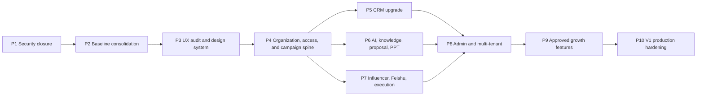

# TuringMarket Platform V1 Roadmap Implementation Plan

> **For agentic workers:** REQUIRED SUB-SKILL: Use superpowers:subagent-driven-development (recommended) or superpowers:executing-plans to implement this plan task-by-task. Steps use checkbox (`- [ ]`) syntax for tracking.

**Goal:** Upgrade the current production TuringMarket platform into a stable, traceable overseas-influencer-marketing operating system whose CRM, demand, proposal, PPT, influencer, execution, AI, and knowledge-base workflows share one durable business backbone.

**Architecture:** Keep the current Express + SQLite + static JavaScript production baseline and evolve it in independently deployable releases. First close security and regression risks, establish a behavior-preserving design-system shell, then introduce canonical organization/access and campaign/project spines before progressively connecting CRM, AI/knowledge, PPT, influencer execution, Feishu, and administration. Domain-level UI upgrades ship with their corresponding stabilized business phase. Every release must preserve the latest PPT build and pass local, remote, browser, security, rollback, and independent-review gates.

**Tech Stack:** Node.js 20, Express 5, SQLite/FTS5, vanilla JavaScript/CSS, Playwright, DeepSeek, Tavily, Feishu APIs/webhooks, PM2, Nginx, PowerShell deployment, Git/GitHub, Obsidian release archive.

## Global Constraints

- Authoritative checkout: `C:\Users\29272\Documents\在线商务平台-github-sync`.
- Current delivery branch: `codex/ai-knowledge-foundation`. Each later phase uses the `codex/` prefix and branches from the latest verified production tag or the release branch recorded by the immediately preceding production version, not from a permanently pinned historical branch.
- Production baseline starts at commit `29fa5c631dd834bc90a896f8b85b19056d23bec4` (`v0.2.9-production-static-exposure-hotfix`).
- Preserve the latest PPT bridge unless a later approved PPT release intentionally replaces it: `ppt.js?v=20260702v916kbbridge` and `window.tmPPTBuild = "20260702-v916-kb-bridge-client-cn"`.
- Do not deploy from `C:\Users\29272\Documents\在线商务平台`; it is not the authoritative production source.
- Do not expose DeepSeek, Tavily, Feishu, database, session, password, SSH, or deployment credentials to browser code, Git history, logs, screenshots, or release documents.
- Store Markdown, JavaScript, CSS, JSON, SQL, and user-facing Chinese text as UTF-8; release verification must read them explicitly as UTF-8 and fail on replacement characters or mojibake markers.
- All schema changes must support both an empty database and an existing production database, include an idempotent migration, and include a tested rollback or restore procedure.
- Every new business table and tenant-owned record from Phase 4 onward must carry stable organization ownership and use the same backend-enforced organization/team/role access primitives.
- All AI proposal flows must preserve `AI draft -> human edit/confirm -> final generation`.
- Ordinary users can access only records allowed by ownership/team policy; administrators can audit all AI conversations and platform-level records, with the admin read recorded in audit logs.
- UI work must preserve the separate `客户看板` and `客户明细` screens and must not regress the current influencer import, template, search, sticky header, order, knowledge, AI chat, or PPT workflows.
- Every phase is independently deployable and reversible. A phase is not complete after local success; production verification is mandatory.
- Every released version must update `CHANGELOG.md`, create a version record, archive the same release under `D:\主盘\图灵集市\图灵商务平台开发\01-版本归档`, commit to Git, and push to GitHub.
- Sales-growth features in Phase 9 require explicit product approval per feature before implementation. Their roadmap slot is approved; their detailed scope is not pre-approved.

---

## Current Baseline

The roadmap starts from the following verified production capabilities:

- CRM customer board and customer detail are separate screens.
- AI chat and knowledge-base foundation exist, including RAG, knowledge references, Tavily support, and administrator-wide chat audit.
- Demand/PPT generation is bridged to the knowledge base and the latest client-facing PPT implementation is preserved.
- Influencer import supports the current 20-column Chinese template and historical 19-column English aliases.
- Influencer workflow includes template download, upload, global search, sticky table header, Feishu fallback export, and collaboration ordering.
- Express and Nginx no longer expose the complete platform directory; sensitive paths return `404`.
- Local and production server regression suites contain 36 passing tests at the baseline commit.

Known constraints that this roadmap must remove:

- `platform/app.js` is monolithic and contains duplicate function definitions whose final declaration silently wins.
- Navigation is runtime DOM manipulation rather than a stable route/state model.
- CRM stage names and priority filtering are inconsistent between UI, API, and database behavior.
- Demand, proposal, PPT, influencer order, execution, workflow, AI, and knowledge records do not share one mandatory project/campaign identity.
- Feishu production credentials/workflow are not configured and placeholder route/client files do not provide a real integration.
- Collaboration/order ownership checks, external-provider timeout/retry behavior, migration governance, and production observability need strengthening.
- The account/tenant prototype is frontend-only in a non-authoritative worktree and must not be copied into production without backend enforcement.

---

## Delivery Sequence

| Phase | Target release | Indicative effort | Production outcome |
| --- | --- | ---: | --- |
| 1 | `v0.2.10` | 0.5-1 day | Credentials and incident response are closed |
| 2 | `v0.3.0` | 3-5 days | One authoritative, regression-protected frontend/backend baseline |
| 3 | `v0.4.0` | 3-5 days | Approved design system, core shell, and behavior-preserving shared interaction guardrails |
| 4 | `v0.5.0` | 6-9 days | Stable organization/access primitives and one campaign identity connect the business chain |
| 5 | `v0.6.0` | 5-8 days | CRM supports disciplined sales and opportunity execution |
| 6 | `v0.7.0` | 6-10 days | AI, knowledge, proposal, and PPT form an auditable learning loop |
| 7 | `v0.8.0` | 6-10 days | Influencer sourcing through execution and settlement is operational |
| 8 | `v0.9.0` | 5-8 days | Backend-enforced organization, role, entitlement, and audit controls |
| 9 | `v0.10.x` | 3-7 days per approved feature | Approved sales-growth capabilities are added independently |
| 10 | `v1.0.0` | 3-5 days | Full production, performance, security, migration, and recovery sign-off |

Effort is a sequencing estimate, not a completion promise. A phase moves forward only after its production exit criteria pass.

---

### Phase 1: Credential Rotation And Incident Closure

**Release:** `v0.2.10-security-credential-rotation`

**Primary files and systems:**

- Inspect: `platform/server/server.js`, `platform/server/db.js`, `platform/ecosystem.config.js`, production environment configuration, Nginx and PM2 configuration.
- Modify when required: `.env.example`, `platform/DEPLOY.md`, `docs/handoff/2026-06-30/SECURITY.md`.
- Test: `platform/server/tests/public_static_security.test.js`, `platform/server/tests/security_and_crm_access.test.js`.
- Record: `CHANGELOG.md`, `docs/version-records/`, `archive/versions/`, Obsidian release archive.

**Work items:**

- [ ] Inventory every credential that may have existed under the formerly exposed platform root without printing its value.
- [ ] Rotate administrator and team passwords, invalidate all active sessions, and prove old credentials/tokens fail.
- [ ] Rotate DeepSeek, Tavily, Feishu, deployment, and other exposed service secrets where applicable; store only server-side environment references.
- [ ] Review Nginx/PM2/application access logs for suspicious requests to source, database, environment, backup, and deployment paths.
- [ ] Add a documented credential-rotation and session-revocation runbook.
- [ ] Re-run the full local and production security suite and authenticated smoke flow.

**Exit criteria:**

- Old passwords, sessions, and rotated provider keys no longer authenticate.
- New administrator login, `/api/auth/me`, logout, template download, AI provider health, and production UI smoke pass.
- No raw secret appears in tracked files, public assets, browser network responses, or release notes.
- Independent application-security review verdict is `APPROVE`.

---

### Phase 2: Baseline Consolidation And Regression Guardrails

**Release:** `v0.3.0-baseline-consolidation`

**Primary files:**

- Modify: `platform/app.js`, `platform/index.html`, `platform/server/server.js`, `platform/server/services/public_assets_service.js`, `platform/deploy_v8.ps1`.
- Create incrementally: `platform/client/core/`, `platform/client/modules/`, `platform/client/shared/`.
- Test: existing files under `platform/server/tests/` plus new frontend contract and browser regression tests in the same test root.
- Document: `platform/DEPLOY.md`, `CLAUDE_CODE_MIGRATION.md`, `docs/handoff/`.
- Create baseline artifacts: `docs/baselines/v0.2.9/ui-ppt-manifest.json` and deterministic screenshots under `docs/baselines/v0.2.9/screenshots/`.

**Work items:**

- [ ] Capture current production behavior, screenshots, build markers, API contracts, and critical user journeys before structural edits.
- [ ] Record SHA-256 hashes for `platform/index.html`, `platform/app.js`, and `platform/ppt.js`, the PPT cache/build markers, seeded-data fixture version, routes, and screenshot viewport metadata in `docs/baselines/v0.2.9/ui-ppt-manifest.json`.
- [ ] Capture deterministic baseline screenshots at `1440x900`, `1920x1080`, and `390x844`; mask timestamps/random IDs and require `maxDiffPixelRatio <= 0.005` for behavior-preserving releases unless an approved UI change documents the expected regions.
- [ ] Identify every duplicate top-level function and event binding in `platform/app.js`; add tests proving which implementation is currently active.
- [ ] Remove duplicate declarations in small behavior-preserving slices and extract focused modules only when the slice has regression coverage.
- [ ] Replace implicit last-definition-wins behavior with one exported function per responsibility and one initialization path.
- [ ] Introduce stable page state/deep-link handling while preserving existing navigation labels and permissions.
- [ ] Extend the Express/Nginx public allowlist and deployment manifest only for explicitly created client assets.
- [ ] Establish a production-like preview channel or feature-flag path for UI changes before public activation.
- [ ] Align application build markers, version records, deployment source checks, and documentation with the authoritative checkout.

**Exit criteria:**

- No duplicate production function definitions remain in the migrated surface.
- Current CRM, brand intelligence, demand/PPT, influencer, AI, workflow, task, admin, and knowledge flows behave as captured at baseline.
- Direct/deep navigation, refresh, back/forward, keyboard focus, and role-based entry visibility are deterministic.
- Full local/remote tests and desktop/mobile Playwright smoke pass with the PPT bridge unchanged.
- The baseline manifest hashes/build markers match, and screenshot differences remain within the behavior-preserving threshold or an explicitly approved visual-change record.
- `minimal-change-engineer` and `code-reviewer` both return `APPROVE`.

---

### Phase 3: Product UX Audit, Design Tokens, And Shell Guardrails

**Release:** `v0.4.0-product-shell-and-design-system`

**Primary files:**

- Modify: `platform/index.html`, `platform/app.js` or extracted files under `platform/client/`.
- Create: `platform/client/styles/tokens.css`, `platform/client/styles/components.css`, `platform/client/styles/layout.css`.
- Test: UI contract tests under `platform/server/tests/` and Playwright visual/interaction coverage.
- Document: `docs/product/2026-07-ux-audit.md`, `docs/product/turingmarket-design-system.md`.

**Work items:**

- [ ] Capture every production module at desktop and mobile widths before critique.
- [ ] Audit information architecture, navigation, density, tables, forms, drawers/modals, empty/loading/error states, accessibility, and responsive behavior.
- [ ] Produce three visual directions grounded in overseas influencer agency operations and obtain product approval for one direction before broad restyling.
- [ ] Define typography, spacing, color, borders, elevation, icons, table, input, tab, drawer, modal, toast, loading, empty, and error-state tokens/components.
- [ ] Upgrade only the application shell and shared behavior-preserving components in this phase; keep domain workflows and domain page composition unchanged.
- [ ] Enforce correctly sized checkboxes, sticky table headers, field-level search/filter patterns, readable dense tables, keyboard navigation, visible focus, and mobile overflow handling.
- [ ] Publish implementation rules and regression fixtures so CRM, AI/PPT, influencer, and admin domain styling can roll out with Phases 5-8 after each domain contract is stable.

**Exit criteria:**

- The user-approved visual direction is represented in tokens, the application shell, and shared components without broad domain-page restyling.
- No text, control, table header, modal, or floating action overlaps at supported desktop/mobile widths.
- Core workflows remain functionally equivalent and pass production Playwright tests.
- Product manager, frontend developer, accessibility reviewer, and code reviewer approve the release.

---

### Phase 4: Organization, Access, Campaign, And Project Business Spine

**Release:** `v0.5.0-campaign-business-spine`

**Primary files:**

- Modify: `platform/server/db.js`, `platform/server/routes.js`, `platform/server/routes_customers.js`, `platform/server/routes_workflow.js`, `platform/server/workflow_engine.js`.
- Create: `platform/server/services/organization_access_service.js`, `platform/server/services/campaign_service.js`, `platform/server/services/campaign_access_service.js`, `platform/server/migrations/`, organization/campaign API tests.
- Modify frontend campaign selectors and context panels under `platform/client/modules/` or the corresponding migrated section of `platform/app.js`.

**Canonical lifecycle:**

`lead -> qualified -> demand_confirmed -> proposal_draft -> proposal_confirmed -> influencer_shortlist -> ordered -> executing -> published -> settled -> reviewed`

**Work items:**

- [ ] Add versioned, idempotent migrations and schema-version tracking before adding business tables.
- [ ] Add minimum backend-enforced `organizations`, `organization_memberships`, stable role codes, team membership, and organization/team/user scope resolution; migrate existing production users into an explicit default organization without changing their current access unexpectedly.
- [ ] Add a canonical `campaigns`/project record linked to customer, opportunity, owner, team, product, region, currency, dates, budget, and lifecycle state.
- [ ] Require `org_id` on campaign and every new tenant-owned record, and provide one reusable authorization contract consumed by all later CRM, AI/knowledge, influencer, order, workflow, and admin services.
- [ ] Add durable campaign linkage to demand, proposal/PPT, influencer shortlist, collaboration order, execution, AI run, workflow instance, and knowledge entry records.
- [ ] Add backend ownership/team/admin authorization for every campaign-linked read and write.
- [ ] Add append-only lifecycle and audit events for state transition, actor, timestamp, reason, and source.
- [ ] Trigger workflow rules from business state transitions rather than only from customer-stage changes.
- [ ] Add a project workspace that lets a user trace the complete record chain without copying IDs manually.
- [ ] Before deployment, run the schema release gate against a production-shaped sanitized copy: record backup checksum, migrate twice, verify row counts/foreign keys, restore to a clean database, and prove the documented rollback decision path.

**Exit criteria:**

- A single production campaign can be followed from CRM opportunity through demand, confirmed proposal/PPT, influencer order, execution, settlement, and knowledge archive.
- Stable organization/team/role primitives exist before any later tenant-owned table is introduced, and cross-organization access fails in API tests.
- Invalid state transitions and unauthorized cross-owner access fail with tested API errors.
- Existing records are migrated or safely represented as unlinked legacy data without loss.
- Backend architect, workflow architect, data engineer, security reviewer, and code reviewer approve the release.

---

### Phase 5: CRM Sales Workspace Upgrade

**Release:** `v0.6.0-crm-sales-workspace`

**Primary files:**

- Modify: `platform/server/routes_customers.js`, `platform/server/services/crm_access_service.js`, `platform/server/db.js`.
- Modify frontend customer board/detail/opportunity modules under `platform/client/modules/crm/` or their current `platform/app.js` sections.
- Test: `platform/server/tests/customer_workspace_ui.test.js`, `platform/server/tests/security_and_crm_access.test.js`, new CRM API/browser tests.

**Work items:**

- [ ] Standardize CRM stage vocabulary and mappings across database, API, board, detail, filters, modal, statistics, workflow, and AI prompts.
- [ ] Make priority, owner, team, stage, industry, country, tag, source, next-action date, and keyword filters backend-driven and composable.
- [ ] Keep `客户看板` focused on funnel health, priorities, stalled deals, next actions, forecast, and AI insight.
- [ ] Keep `客户明细` focused on searchable records, public-pool claiming, ownership, activities, contacts, opportunities, tasks, notes, and audit history.
- [ ] Add opportunity amount, probability, expected-close date, competitors, decision chain, next action, loss reason, and campaign linkage.
- [ ] Add duplicate detection, public-pool claim/release policy, ownership transfer, activity timeline, and reminder/escalation rules.
- [ ] Benchmark operating logic against 纷享销客 while retaining TuringMarket's influencer-marketing-specific fields.
- [ ] Apply the approved Phase 3 design system to CRM only after CRM API/stage/filter contracts pass, then run before/after screenshot and interaction regression checks.
- [ ] Before deployment, run the schema release gate against a production-shaped sanitized copy and prove migration rerun, backup checksum, integrity comparison, restore, and rollback criteria.

**Exit criteria:**

- Customer save, edit, display, duplicate detection, filter, public-pool claim, ownership transfer, stage transition, opportunity creation, and refresh work in production.
- CRM dashboard numbers reconcile with filtered detail records.
- Ordinary users cannot access unauthorized customers/opportunities; administrators can audit all changes.
- Backend architect, frontend developer, product manager, minimal-change engineer, and code reviewer approve the release.

---

### Phase 6: AI, Self-Growing Knowledge, Proposal, And PPT Loop

**Release:** `v0.7.0-ai-knowledge-proposal-ppt-loop`

**Primary files:**

- Modify: `platform/server/services/knowledge_service.js`, `rag_service.js`, `llm_service.js`, `web_search_service.js`, `ai_service.js`, `business_knowledge_service.js`, `file_ingest_service.js`, `latest_ui_compat_service.js`.
- Modify: `platform/server/routes.js`, `platform/server/db.js`, `platform/ppt.js`, relevant AI/KB/demand frontend modules.
- Test: `platform/server/tests/ai_knowledge_foundation.test.js`, `obsidian_and_business_knowledge.test.js`, `file_ingest_service.test.js`, plus proposal/PPT/run-audit tests.

**Work items:**

- [ ] Represent chat, strategy, demand analysis, proposal draft, and PPT outline generation as one auditable AI-run model with user, campaign, prompt, model, tokens, latency, knowledge references, web sources, and result state.
- [ ] Apply ownership/team/admin knowledge visibility before retrieval and preserve administrator-wide conversation audit with audit logging.
- [ ] Make requirement sheets, influencer batches, confirmed proposals, PPT outputs, project reviews, AI summaries, and selected conclusions enter the knowledge base through one deduplicated ingestion contract.
- [ ] Add source hash, business linkage, visibility, metadata, chunking, FTS retrieval, citation counts, quality state, supersession/version linkage, and retention controls.
- [ ] Add provider timeout, bounded retry, cache, circuit-breaker/fallback, token/cost tracking, and safe error messages for DeepSeek and Tavily.
- [ ] Preserve `AI draft -> human edit/confirm -> final generation`; only confirmed/favorited/high-value summaries become durable reusable knowledge by default while raw conversations remain fully archived.
- [ ] Require proposal and PPT generation to retrieve permitted internal knowledge first, optionally search the web, display citations, and archive the final confirmed artifact back to the campaign knowledge context.
- [ ] Keep client-facing PPT language, latest layout behavior, supplementary-material processing, HTML export, and PPTX export under regression coverage.
- [ ] Apply the approved Phase 3 design system to AI, knowledge, demand, proposal, and PPT control surfaces only after their API/run/version contracts pass.
- [ ] Before deployment, run the schema release gate against a production-shaped sanitized copy and prove migration rerun, backup checksum, knowledge/AI row integrity, restore, and rollback criteria.

**Exit criteria:**

- A production demand upload produces linked knowledge, an AI draft with citations, a human-confirmed proposal, a PPT, an auditable AI run, and a final knowledge artifact under one campaign.
- No-knowledge, no-Tavily-key, provider-timeout, duplicate-upload, unauthorized-reference, and regeneration/version cases pass.
- Administrator can inspect every AI conversation/run and its internal/web references; ordinary users cannot inspect another user's private runs.
- AI engineer, data engineer, workflow architect, security reviewer, product manager, and code reviewer approve the release.

---

### Phase 7: Influencer, Feishu, Ordering, Execution, And Settlement

**Release:** `v0.8.0-influencer-execution-loop`

**Primary files:**

- Modify: `platform/server/services/influencer_workflow_service.js`, `file_ingest_service.js`, `platform/server/routes.js`, `platform/server/db.js`.
- Implement: `platform/server/feishu_client.js`, `platform/server/routes_feishu.js`; remove or consolidate unused placeholder Feishu routes after compatibility tests.
- Modify influencer frontend modules and shared table/filter components.
- Test: `platform/server/tests/influencer_workflow.test.js`, `file_ingest_service.test.js`, new Feishu provider/order/execution/access tests.

**Work items:**

- [ ] Preserve the approved 20-column Chinese upload contract and historical 19-column aliases; add user-guided field mapping and row-level import errors without discarding valid rows.
- [ ] Add field-level search/filter support for every displayed influencer column, including ID, handle, tags, links, platform, country, project, product, deliverable, cost, quote, CPM, CPV, and parent record.
- [ ] Add saved views, column visibility/order, bulk selection, export-before-filter, export-after-filter, and deterministic sticky-header/checkbox behavior.
- [ ] Implement a Feishu provider interface supporting webhook and app/table API modes, encrypted server-side configuration, connection test, sync status, idempotency, retry, and actionable failure logs.
- [ ] Define collaboration orders with campaign, customer, influencer, owner, deliverables, cost, client quote, currency, margin, deadlines, contract, payment, content review, publish link, performance, settlement, and notes.
- [ ] Enforce owner/team/admin access on shortlist, order, execution, and settlement operations.
- [ ] Connect order and execution state changes to workflows, tasks, AI/knowledge context, Feishu sync, and campaign lifecycle events.
- [ ] Apply the approved Phase 3 design system to influencer, order, execution, and settlement surfaces only after import/search/order contracts pass.
- [ ] Before deployment, run the schema release gate against a production-shaped sanitized copy and prove migration rerun, backup checksum, influencer/order row integrity, restore, and rollback criteria.

**Exit criteria:**

- Template download, current/historical import, row validation, global/field search, saved filter, sticky header, bulk selection, both export modes, and order creation pass in production.
- A real configured Feishu workflow receives an idempotent test order and reports success/failure status back to the platform.
- One collaboration order can move through negotiation, contracted, content review, published, payment, settlement, and review with complete audit history.
- Backend architect, frontend developer, workflow architect, product manager, security reviewer, and code reviewer approve the release.

---

### Phase 8: Admin Control Room, Entitlements, And Multi-Tenant Governance

**Release:** `v0.9.0-admin-tenant-governance`

**Primary files:**

- Modify: `platform/server/db.js`, `platform/server/server.js`, authentication/authorization routes and services, admin frontend modules.
- Extend: Phase 4 organization/access services; create entitlement, quota, privileged-audit, and tenant-governance services under `platform/server/services/`.
- Test: organization isolation, role matrix, subscription/expiry, quota, admin audit, AI conversation audit, and migration tests.

**Work items:**

- [ ] Extend the Phase 4 backend-enforced organization, membership, stable role, and tenant-ownership primitives; do not copy the non-authoritative frontend-only prototype into production.
- [ ] Add explicit module/action permission policies for platform admin, company owner, administrator, manager, member, and read-only roles on top of the Phase 4 stable role codes.
- [ ] Add organization-scoped customers, campaigns, knowledge, AI runs, influencer selections, orders, workflows, tasks, and exports.
- [ ] Add plan, module entitlement, quota, usage, expiry, disabled-account, password reset, session revoke, and ownership-transfer controls.
- [ ] Add a searchable admin control room for users, organizations, roles, AI conversations/runs, knowledge, provider status, import jobs, workflows, audit events, and security events.
- [ ] Record every privileged admin view/change, including access to another user's AI conversation.
- [ ] Apply the approved Phase 3 design system to administration and tenant-governance surfaces after permission/entitlement contracts pass.
- [ ] Before deployment, run the schema release gate against a production-shaped sanitized copy and prove migration rerun, backup checksum, tenant/audit row integrity, restore, and rollback criteria.

**Exit criteria:**

- Cross-organization reads/writes fail in automated and production smoke tests.
- Plan/role/expiry/quota changes take effect server-side and cannot be bypassed by browser manipulation.
- Administrator-wide AI conversation visibility remains complete and auditable.
- Backend architect, security reviewer, product manager, minimal-change engineer, and code reviewer approve the release.

---

### Phase 9: Approval-Gated Sales Growth Features

**Release family:** `v0.10.x`

The following feature slots are part of the development roadmap, but each one requires a separate written product decision and implementation plan before code changes:

1. **Client Proposal Room**: shareable client-safe proposal/PPT workspace with creator shortlist, comments, approvals, and version history.
2. **Execution And Settlement Cockpit**: campaign delivery, content review, publish, payment, settlement, margin, and exception dashboard.
3. **Margin And Quote Approval Center**: cost/quote/margin rules, discount thresholds, manager approval, and quote history.
4. **Creator Freshness And Negotiation Intelligence**: data freshness, response reliability, historical pricing, delivery risk, and negotiation recommendations.
5. **Lead Enrichment And Signal Radar**: account signals, competitor activity, influencer fit, opportunity scoring, and suggested outreach.

**Recommended order after explicit approval:** Client Proposal Room, Execution And Settlement Cockpit, Margin And Quote Approval Center, Creator Intelligence, Lead Signal Radar.

**Work items:**

- [ ] For each candidate, produce a product brief with user, job-to-be-done, workflow, permissions, data inputs, success metrics, scope exclusions, UI direction, API/schema impact, and production acceptance criteria.
- [ ] Obtain explicit product approval for that candidate.
- [ ] Implement and release each approved feature independently; do not bundle unapproved candidates into another phase.
- [ ] Measure adoption, cycle time, approval time, margin leakage, execution exceptions, or lead conversion according to the approved feature's KPI plan.

**Exit criteria:**

- Only explicitly approved candidates are present in production.
- Every shipped candidate has its own release, rollback, analytics, security review, browser E2E, version record, Obsidian archive, and GitHub commit.

---

### Phase 10: V1 Production Hardening And Release

**Release:** `v1.0.0`

**Primary systems:** complete `platform/` application, production server, Nginx, PM2, SQLite backups/migrations, provider integrations, GitHub and Obsidian release records.

**Work items:**

- [ ] Run full schema migration and restore rehearsals against a sanitized production-sized database copy.
- [ ] Add or verify foreign-key enforcement, integrity checks, backup retention, restore checksums, job idempotency, and failure recovery.
- [ ] Run end-to-end journeys for administrator, company owner, manager, member, and unauthorized user roles.
- [ ] Run desktop/mobile visual, accessibility, interaction, upload/download, PPTX, AI/RAG/web, Feishu, workflow, and audit E2E suites.
- [ ] Run security checks for static exposure, authorization, tenant isolation, session handling, secret scanning, upload/path policies, prompt/content rendering, rate limits, and privileged audit.
- [ ] Run performance checks against a sanitized fixture at least twice the current production row/chunk volume: core API p95 `<= 800 ms`, dashboards p95 `<= 1.5 s`, 10,000-row influencer import `<= 60 s`, FTS search p95 `<= 500 ms`, and PPT generation p95 `<= 90 s`.
- [ ] Prove 50 concurrent authenticated sessions plus 10 concurrent AI/PPT jobs for 15 minutes with HTTP 5xx rate `< 1%`, no database corruption, and provider failure returning a controlled fallback/error within 60 seconds.
- [ ] Run automated accessibility checks on every critical journey at desktop/mobile widths and reach WCAG 2.2 AA with zero critical or serious Axe violations.
- [ ] Resolve every critical/high finding and every release-blocking medium finding from independent reviews.
- [ ] Create production backup, deploy, verify real user journeys, monitor logs/metrics, and execute rollback if any mandatory smoke check fails.
- [ ] Publish the final changelog, version record, Obsidian archive, Git tag, GitHub push, architecture map, operator runbook, and user-facing release summary.

**Exit criteria:**

- All mandatory local and remote suites pass from a clean authoritative checkout.
- Production browser E2E passes on desktop and mobile for every critical business chain.
- Backup restore, migration rerun, provider failure, and rollback drills are proven with release RPO no older than the last verified backup (maximum 24 hours) and restore/rollback RTO `<= 60 minutes`.
- The performance, concurrency, accessibility, and provider-failure thresholds defined above pass on the production release candidate.
- Product manager, senior developer, code reviewer, application-security reviewer, data/migration reviewer, and release owner all return `APPROVE`.

---

## Role Assignment

Every phase uses the user's default delivery chain:

| Role | Responsibility |
| --- | --- |
| `codebase-onboarding-engineer` | Reconfirm authoritative baseline, current production behavior, affected files, data, and deployment state before edits |
| `minimal-change-engineer` | Reject unrelated refactors and protect the latest UI/PPT/business behavior |
| `senior-developer` | Implement the approved slice with tests, migrations, observability, and rollback support |
| `code-reviewer` | Review regressions, security, permissions, edge cases, maintainability, and test gaps |
| `git-workflow-master` | Keep phase branches, commits, tags, changelog, version record, Obsidian archive, and GitHub synchronized |

Specialist roles are mandatory by scope:

- CRM and business-spine phases: `backend-architect`, `frontend-developer`, `product-manager`.
- AI and knowledge phases: `ai-engineer`, `data-engineer`, `workflow-architect`.
- Security, tenant, credential, and V1 phases: independent `application-security-engineer`.
- UI phase: product-design auditor, frontend accessibility reviewer, and Playwright QA reviewer.
- Database migrations: independent data/migration reviewer.

No implementer may be the sole final reviewer of their own output. Every release receives at least a specification/behavior review and a separate code/security review.

---

## Mandatory Release Gate For Every Phase

- [ ] Branch from the latest verified production tag or the release branch recorded by the immediately preceding production version; confirm the selected SHA matches production and no unowned local changes will be overwritten.
- [ ] Create the phase-specific detailed plan under `docs/superpowers/plans/` before implementation.
- [ ] Add failing tests before behavior changes and record the expected failure.
- [ ] Implement the smallest independently testable slice and make the focused tests pass.
- [ ] Run `node --check` on every changed JavaScript file, the focused tests, the full local test suite, and `git diff --check`.
- [ ] Run browser E2E and screenshot checks at supported desktop/mobile widths; compare build markers, file hashes, and seeded screenshots with the latest approved baseline manifest.
- [ ] Run independent minimal-change, code, product/architecture, and security reviews required by the phase.
- [ ] For every schema/data phase, create a production-shaped sanitized rehearsal copy, record a backup checksum, run the migration twice, verify row counts/foreign keys/integrity, restore to a clean target, and record explicit rollback triggers before production deployment.
- [ ] Create a timestamped production backup, record its checksum, and verify the rollback target before deployment.
- [ ] Deploy only from the authoritative checkout and verify PM2, Nginx, database migration, `/api/health`, authentication, and phase-specific critical journeys.
- [ ] Run the full remote test suite and real production browser smoke after deployment.
- [ ] Roll back immediately when a mandatory smoke check fails; do not patch production outside the versioned checkout.
- [ ] Update `CHANGELOG.md`, version record, Obsidian archive, Git commit/tag, and GitHub remote; verify local and remote SHAs.
- [ ] Validate all tracked text as UTF-8 and fail the release when replacement characters or known mojibake sequences appear in changed user-facing content.

## Program Definition Of Done

The roadmap is complete only when the production platform can demonstrate this chain with real persisted records and correct permissions:

`客户/商机 -> 需求上传 -> 知识检索 + 联网 -> AI 草稿 -> 人工确认 -> 最终方案/PPT -> 网红筛选 -> 飞书同步/下单 -> 内容执行 -> 发布 -> 付款结算 -> 复盘 -> 知识沉淀`

The administrator can audit all AI conversations/runs and their references; ordinary users see only allowed personal/team data; the latest approved UI and PPT remain intact; every production version is backed up, tested, independently reviewed, archived, committed, pushed, and reversible.
