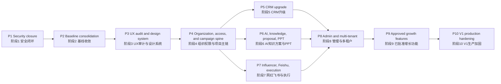

# TuringMarket Platform V1 Roadmap Implementation Plan / TuringMarket 平台 V1 开发路线图

> **For agentic workers / 面向执行代理：** REQUIRED SUB-SKILL: Use `superpowers:subagent-driven-development` (recommended) or `superpowers:executing-plans` to implement this plan task-by-task. Steps use checkbox (`- [ ]`) syntax for tracking. / 必须使用 `superpowers:subagent-driven-development`（推荐）或 `superpowers:executing-plans`，按任务逐项实施本计划；使用复选框（`- [ ]`）跟踪进度。

**Goal:** Upgrade the current production TuringMarket platform into a stable, traceable overseas-influencer-marketing operating system whose CRM, demand, proposal, PPT, influencer, execution, AI, and knowledge-base workflows share one durable business backbone.

**目标：** 将当前生产环境中的 TuringMarket 平台升级为稳定、可追溯的海外红人营销运营系统，使 CRM、需求、方案、PPT、红人、执行、AI 和知识库流程共享同一条持久化业务主链。

**Architecture:** Keep the current Express + SQLite + static JavaScript production baseline and evolve it in independently deployable releases. First close security and regression risks, establish a behavior-preserving design-system shell, then introduce canonical organization/access and campaign/project spines before progressively connecting CRM, AI/knowledge, PPT, influencer execution, Feishu, and administration. Domain-level UI upgrades ship with their corresponding stabilized business phase. Every release must preserve the latest PPT build and pass local, remote, browser, security, rollback, and independent-review gates.

**架构：** 保留当前 Express + SQLite + 静态 JavaScript 的生产基线，通过可独立部署的版本逐步演进。先完成安全闭环和回归风险治理，建立不改变业务行为的设计系统壳层，再引入统一的组织/权限底座与活动/项目主链，随后逐步串联 CRM、AI/知识库、PPT、红人执行、飞书和管理能力。各业务模块的 UI 升级随相应业务阶段一并发布。每个版本都必须保留最新 PPT 构建，并通过本地、远端、浏览器、安全、回滚和独立审查门禁。

**Tech Stack / 技术栈：** Node.js 20, Express 5, SQLite/FTS5, vanilla JavaScript/CSS, Playwright, DeepSeek, Tavily, Feishu APIs/webhooks, PM2, Nginx, PowerShell deployment, Git/GitHub, Obsidian release archive. / Node.js 20、Express 5、SQLite/FTS5、原生 JavaScript/CSS、Playwright、DeepSeek、Tavily、飞书 API/Webhook、PM2、Nginx、PowerShell 部署、Git/GitHub、Obsidian 版本归档。

## Global Constraints / 全局约束

- **EN:** Authoritative checkout: `C:\Users\29272\Documents\在线商务平台-github-sync`. **中文：** 权威代码库：`C:\Users\29272\Documents\在线商务平台-github-sync`。
- **EN:** Current delivery branch: `codex/ai-knowledge-foundation`. Each later phase uses the `codex/` prefix and branches from the latest verified production tag or the release branch recorded by the immediately preceding production version, not from a permanently pinned historical branch. **中文：** 当前交付分支为 `codex/ai-knowledge-foundation`。后续每个阶段使用 `codex/` 前缀，并从最新已验证的生产标签或上一生产版本记录的发布分支创建，不得长期固定在历史分支上。
- **EN:** Production baseline starts at commit `29fa5c631dd834bc90a896f8b85b19056d23bec4` (`v0.2.9-production-static-exposure-hotfix`). **中文：** 生产基线从提交 `29fa5c631dd834bc90a896f8b85b19056d23bec4`（`v0.2.9-production-static-exposure-hotfix`）开始。
- **EN:** Preserve the latest PPT bridge unless a later approved PPT release intentionally replaces it: `ppt.js?v=20260702v916kbbridge` and `window.tmPPTBuild = "20260702-v916-kb-bridge-client-cn"`. **中文：** 除非后续经批准的 PPT 版本明确替换，否则必须保留最新 PPT 桥接：`ppt.js?v=20260702v916kbbridge` 和 `window.tmPPTBuild = "20260702-v916-kb-bridge-client-cn"`。
- **EN:** Do not deploy from `C:\Users\29272\Documents\在线商务平台`; it is not the authoritative production source. **中文：** 禁止从 `C:\Users\29272\Documents\在线商务平台` 部署，该目录不是权威生产发布源。
- **EN:** Do not expose DeepSeek, Tavily, Feishu, database, session, password, SSH, or deployment credentials to browser code, Git history, logs, screenshots, or release documents. **中文：** 不得在浏览器代码、Git 历史、日志、截图或版本文档中暴露 DeepSeek、Tavily、飞书、数据库、会话、密码、SSH 或部署凭据。
- **EN:** Store Markdown, JavaScript, CSS, JSON, SQL, and user-facing Chinese text as UTF-8; release verification must read them explicitly as UTF-8 and fail on replacement characters or mojibake markers. **中文：** Markdown、JavaScript、CSS、JSON、SQL 和面向用户的中文文本统一使用 UTF-8；发布校验必须显式按 UTF-8 读取，发现替换字符或乱码标记时立即失败。
- **EN:** All schema changes must support both an empty database and an existing production database, include an idempotent migration, and include a tested rollback or restore procedure. **中文：** 所有数据库结构变更必须同时支持空库和现有生产库，提供幂等迁移，并包含经过测试的回滚或恢复流程。
- **EN:** Every new business table and tenant-owned record from Phase 4 onward must carry stable organization ownership and use the same backend-enforced organization/team/role access primitives. **中文：** 从阶段 4 开始，所有新增业务表和租户数据都必须具备稳定的组织归属，并统一使用后端强制执行的组织/团队/角色权限原语。
- **EN:** All AI proposal flows must preserve `AI draft -> human edit/confirm -> final generation`. **中文：** 所有 AI 方案流程必须保留 `AI 草稿 -> 人工编辑/确认 -> 最终生成`。
- **EN:** Ordinary users can access only records allowed by ownership/team policy; administrators can audit all AI conversations and platform-level records, with the admin read recorded in audit logs. **中文：** 普通用户只能访问所有权/团队策略允许的数据；管理员可审计全部 AI 对话和平台级记录，且管理员读取行为必须写入审计日志。
- **EN:** UI work must preserve the separate `客户看板` and `客户明细` screens and must not regress the current influencer import, template, search, sticky header, order, knowledge, AI chat, or PPT workflows. **中文：** UI 改造必须保留独立的 `客户看板` 与 `客户明细` 页面，不得回退现有网红导入、模板、搜索、粘性表头、下单、知识库、AI 对话或 PPT 流程。
- **EN:** Every phase is independently deployable and reversible. A phase is not complete after local success; production verification is mandatory. **中文：** 每个阶段都必须可独立部署、可回滚；本地通过不代表阶段完成，必须完成生产环境验证。
- **EN:** Every released version must update `CHANGELOG.md`, create a version record, archive the same release under `D:\主盘\图灵集市\图灵商务平台开发\01-版本归档`, commit to Git, and push to GitHub. **中文：** 每个正式版本都必须更新 `CHANGELOG.md`、创建版本记录、同步归档到 `D:\主盘\图灵集市\图灵商务平台开发\01-版本归档`，并完成 Git 提交和 GitHub 推送。
- **EN:** Sales-growth features in Phase 9 require explicit product approval per feature before implementation. Their roadmap slot is approved; their detailed scope is not pre-approved. **中文：** 阶段 9 的销售增长功能必须逐项获得明确的产品批准后才能实施；目前仅批准其进入路线图，不代表详细范围已获批准。

---

## Current Baseline / 当前基线

**EN:** The roadmap starts from the following verified production capabilities:

**中文：** 本路线图从以下已验证的生产能力开始：

- **EN:** CRM customer board and customer detail are separate screens. **中文：** CRM 的客户看板与客户明细已拆分为独立页面。
- **EN:** AI chat and knowledge-base foundation exist, including RAG, knowledge references, Tavily support, and administrator-wide chat audit. **中文：** 已具备 AI 对话和知识库底座，包括 RAG、知识引用、Tavily 支持和管理员全量对话审计。
- **EN:** Demand/PPT generation is bridged to the knowledge base and the latest client-facing PPT implementation is preserved. **中文：** 需求/PPT 生成已桥接知识库，并保留最新的客户汇报版 PPT 实现。
- **EN:** Influencer import supports the current 20-column Chinese template and historical 19-column English aliases. **中文：** 网红导入支持当前 20 列中文模板和历史 19 列英文别名。
- **EN:** Influencer workflow includes template download, upload, global search, sticky table header, Feishu fallback export, and collaboration ordering. **中文：** 网红工作流已包含模板下载、上传、全局搜索、粘性表头、飞书不可用时的降级导出和合作下单。
- **EN:** Express and Nginx no longer expose the complete platform directory; sensitive paths return `404`. **中文：** Express 和 Nginx 已不再暴露完整平台目录，敏感路径返回 `404`。
- **EN:** Local and production server regression suites contain 36 passing tests at the baseline commit. **中文：** 基线提交的本地与生产服务器回归套件包含 36 个通过的测试。

**EN:** Known constraints that this roadmap must remove:

**中文：** 本路线图必须消除的已知约束：

- **EN:** `platform/app.js` is monolithic and contains duplicate function definitions whose final declaration silently wins. **中文：** `platform/app.js` 体积庞大，并存在重复函数定义，当前由最后一次声明静默覆盖前面的实现。
- **EN:** Navigation is runtime DOM manipulation rather than a stable route/state model. **中文：** 导航依赖运行时 DOM 操作，而不是稳定的路由/状态模型。
- **EN:** CRM stage names and priority filtering are inconsistent between UI, API, and database behavior. **中文：** CRM 阶段名称和优先级筛选在 UI、API 与数据库行为之间不一致。
- **EN:** Demand, proposal, PPT, influencer order, execution, workflow, AI, and knowledge records do not share one mandatory project/campaign identity. **中文：** 需求、方案、PPT、网红订单、执行、工作流、AI 和知识记录尚未共享一个强制的项目/活动标识。
- **EN:** Feishu production credentials/workflow are not configured and placeholder route/client files do not provide a real integration. **中文：** 飞书生产凭据/工作流尚未配置，占位路由和客户端文件未提供真实集成。
- **EN:** Collaboration/order ownership checks, external-provider timeout/retry behavior, migration governance, and production observability need strengthening. **中文：** 合作/订单所有权校验、外部服务超时与重试、迁移治理和生产可观测性仍需加强。
- **EN:** The account/tenant prototype is frontend-only in a non-authoritative worktree and must not be copied into production without backend enforcement. **中文：** 账号/租户原型仅存在于非权威工作树的前端实现中，在后端强制权限完成前不得复制到生产环境。

---

## Delivery Sequence / 交付顺序

| Phase / 阶段 | Target release / 目标版本 | Indicative effort / 参考工期 | Production outcome / 生产结果 |
| --- | --- | ---: | --- |
| 1 | `v0.2.10` | 0.5-1 day / 天 | Credentials and incident response are closed / 完成凭据与安全事件闭环 |
| 2 | `v0.3.0` | 3-5 days / 天 | One authoritative, regression-protected frontend/backend baseline / 建立唯一权威且具备回归保护的前后端基线 |
| 3 | `v0.4.0` | 3-5 days / 天 | Approved design system, core shell, and behavior-preserving shared interaction guardrails / 获批的设计系统、核心壳层和不改变业务行为的共享交互护栏 |
| 4 | `v0.5.0` | 6-9 days / 天 | Stable organization/access primitives and one campaign identity connect the business chain / 以稳定组织权限原语和统一活动标识连接业务主链 |
| 5 | `v0.6.0` | 5-8 days / 天 | CRM supports disciplined sales and opportunity execution / CRM 支撑规范化销售与商机执行 |
| 6 | `v0.7.0` | 6-10 days / 天 | AI, knowledge, proposal, and PPT form an auditable learning loop / AI、知识、方案和 PPT 形成可审计学习闭环 |
| 7 | `v0.8.0` | 6-10 days / 天 | Influencer sourcing through execution and settlement is operational / 网红提报至执行结算全链路可运营 |
| 8 | `v0.9.0` | 5-8 days / 天 | Backend-enforced organization, role, entitlement, and audit controls / 后端强制执行组织、角色、权益和审计控制 |
| 9 | `v0.10.x` | 3-7 days per approved feature / 每项获批功能 3-7 天 | Approved sales-growth capabilities are added independently / 独立交付已批准的销售增长能力 |
| 10 | `v1.0.0` | 3-5 days / 天 | Full production, performance, security, migration, and recovery sign-off / 完成生产、性能、安全、迁移和恢复验收 |

**EN:** Effort is a sequencing estimate, not a completion promise. A phase moves forward only after its production exit criteria pass.

**中文：** 工期仅用于安排顺序，不构成完成承诺。每个阶段只有通过生产退出标准后才能进入下一阶段。

---

### Phase 1: Credential Rotation And Incident Closure / 阶段 1：凭据轮换与安全事件闭环

**Release / 版本：** `v0.2.10-security-credential-rotation`

**Primary files and systems / 主要文件与系统：**

- **Inspect / 检查：** `platform/server/server.js`, `platform/server/db.js`, `platform/ecosystem.config.js`, production environment configuration, Nginx and PM2 configuration. / 生产环境配置、Nginx 和 PM2 配置。
- **Modify when required / 按需修改：** `.env.example`, `platform/DEPLOY.md`, `docs/handoff/2026-06-30/SECURITY.md`.
- **Test / 测试：** `platform/server/tests/public_static_security.test.js`, `platform/server/tests/security_and_crm_access.test.js`.
- **Record / 记录：** `CHANGELOG.md`, `docs/version-records/`, `archive/versions/`, Obsidian release archive / Obsidian 版本归档。

**Work items / 工作项：**

- [ ] **EN:** Inventory every credential that may have existed under the formerly exposed platform root without printing its value. **中文：** 盘点曾可能存在于已暴露平台根目录下的全部凭据，过程中不得输出其值。
- [ ] **EN:** Rotate administrator and team passwords, invalidate all active sessions, and prove old credentials/tokens fail. **中文：** 轮换管理员和团队账号密码，失效全部活动会话，并证明旧凭据/令牌无法继续使用。
- [ ] **EN:** Rotate DeepSeek, Tavily, Feishu, deployment, and other exposed service secrets where applicable; store only server-side environment references. **中文：** 按实际暴露范围轮换 DeepSeek、Tavily、飞书、部署及其他服务密钥，仅保留服务器端环境变量引用。
- [ ] **EN:** Review Nginx/PM2/application access logs for suspicious requests to source, database, environment, backup, and deployment paths. **中文：** 审查 Nginx、PM2 和应用访问日志，排查对源码、数据库、环境文件、备份和部署路径的可疑请求。
- [ ] **EN:** Add a documented credential-rotation and session-revocation runbook. **中文：** 新增可执行的凭据轮换与会话撤销运行手册。
- [ ] **EN:** Re-run the full local and production security suite and authenticated smoke flow. **中文：** 重新运行完整的本地与生产安全测试套件及鉴权冒烟流程。

**Exit criteria / 退出标准：**

- **EN:** Old passwords, sessions, and rotated provider keys no longer authenticate. **中文：** 旧密码、旧会话和已轮换的服务密钥均无法继续鉴权。
- **EN:** New administrator login, `/api/auth/me`, logout, template download, AI provider health, and production UI smoke pass. **中文：** 新管理员登录、`/api/auth/me`、退出、模板下载、AI 服务健康检查和生产 UI 冒烟均通过。
- **EN:** No raw secret appears in tracked files, public assets, browser network responses, or release notes. **中文：** 受版本控制文件、公开资源、浏览器网络响应和版本说明中均不存在原始密钥。
- **EN:** Independent application-security review verdict is `APPROVE`. **中文：** 独立应用安全审查结论为 `APPROVE`。

---

### Phase 2: Baseline Consolidation And Regression Guardrails / 阶段 2：基线收敛与回归护栏

**Release / 版本：** `v0.3.0-baseline-consolidation`

**Primary files / 主要文件：**

- **Modify / 修改：** `platform/app.js`, `platform/index.html`, `platform/server/server.js`, `platform/server/services/public_assets_service.js`, `platform/deploy_v8.ps1`.
- **Create incrementally / 分步创建：** `platform/client/core/`, `platform/client/modules/`, `platform/client/shared/`.
- **Test / 测试：** existing files under `platform/server/tests/` plus new frontend contract and browser regression tests in the same test root. / 现有 `platform/server/tests/` 测试，以及同一测试根目录下新增的前端契约和浏览器回归测试。
- **Document / 文档：** `platform/DEPLOY.md`, `CLAUDE_CODE_MIGRATION.md`, `docs/handoff/`.
- **Create baseline artifacts / 创建基线产物：** `docs/baselines/v0.2.9/ui-ppt-manifest.json` and deterministic screenshots under `docs/baselines/v0.2.9/screenshots/`. / 以及该目录下的确定性截图。

**Work items / 工作项：**

- [ ] **EN:** Capture current production behavior, screenshots, build markers, API contracts, and critical user journeys before structural edits. **中文：** 在结构调整前记录当前生产行为、截图、构建标记、API 契约和关键用户旅程。
- [ ] **EN:** Record SHA-256 hashes for `platform/index.html`, `platform/app.js`, and `platform/ppt.js`, the PPT cache/build markers, seeded-data fixture version, routes, and screenshot viewport metadata in `docs/baselines/v0.2.9/ui-ppt-manifest.json`. **中文：** 在 `docs/baselines/v0.2.9/ui-ppt-manifest.json` 中记录上述三个文件的 SHA-256、PPT 缓存/构建标记、种子数据版本、路由和截图视口元数据。
- [ ] **EN:** Capture deterministic baseline screenshots at `1440x900`, `1920x1080`, and `390x844`; mask timestamps/random IDs and require `maxDiffPixelRatio <= 0.005` for behavior-preserving releases unless an approved UI change documents the expected regions. **中文：** 在 `1440x900`、`1920x1080` 和 `390x844` 视口生成确定性基线截图，遮蔽时间戳/随机 ID；不改变业务行为的版本要求 `maxDiffPixelRatio <= 0.005`，除非已批准的 UI 变更明确记录预期差异区域。
- [ ] **EN:** Identify every duplicate top-level function and event binding in `platform/app.js`; add tests proving which implementation is currently active. **中文：** 识别 `platform/app.js` 中所有重复的顶层函数和事件绑定，并用测试证明当前实际生效的实现。
- [ ] **EN:** Remove duplicate declarations in small behavior-preserving slices and extract focused modules only when the slice has regression coverage. **中文：** 以不改变行为的小批次移除重复声明，仅在对应批次具备回归覆盖时提取聚焦模块。
- [ ] **EN:** Replace implicit last-definition-wins behavior with one exported function per responsibility and one initialization path. **中文：** 用“每项职责一个导出函数、一个初始化入口”替代隐式的“最后定义覆盖”行为。
- [ ] **EN:** Introduce stable page state/deep-link handling while preserving existing navigation labels and permissions. **中文：** 在保留现有导航名称和权限的前提下，引入稳定的页面状态与深链接处理。
- [ ] **EN:** Extend the Express/Nginx public allowlist and deployment manifest only for explicitly created client assets. **中文：** 仅针对明确创建的客户端资源扩展 Express/Nginx 公开白名单和部署清单。
- [ ] **EN:** Establish a production-like preview channel or feature-flag path for UI changes before public activation. **中文：** UI 变更公开启用前，建立类生产预览通道或功能开关路径。
- [ ] **EN:** Align application build markers, version records, deployment source checks, and documentation with the authoritative checkout. **中文：** 将应用构建标记、版本记录、部署源校验和文档统一到权威代码库。

**Exit criteria / 退出标准：**

- **EN:** No duplicate production function definitions remain in the migrated surface. **中文：** 已迁移范围内不再存在重复的生产函数定义。
- **EN:** Current CRM, brand intelligence, demand/PPT, influencer, AI, workflow, task, admin, and knowledge flows behave as captured at baseline. **中文：** CRM、品牌智库、需求/PPT、网红、AI、工作流、待办、管理和知识库流程与基线记录一致。
- **EN:** Direct/deep navigation, refresh, back/forward, keyboard focus, and role-based entry visibility are deterministic. **中文：** 直接/深链接导航、刷新、前进后退、键盘焦点和基于角色的入口可见性均具备确定性。
- **EN:** Full local/remote tests and desktop/mobile Playwright smoke pass with the PPT bridge unchanged. **中文：** 完整本地/远端测试和桌面/移动端 Playwright 冒烟通过，PPT 桥接保持不变。
- **EN:** The baseline manifest hashes/build markers match, and screenshot differences remain within the behavior-preserving threshold or an explicitly approved visual-change record. **中文：** 基线清单中的哈希和构建标记一致，截图差异处于不改变行为的阈值内，或具备明确批准的视觉变更记录。
- **EN:** `minimal-change-engineer` and `code-reviewer` both return `APPROVE`. **中文：** `minimal-change-engineer` 与 `code-reviewer` 均返回 `APPROVE`。

---

### Phase 3: Product UX Audit, Design Tokens, And Shell Guardrails / 阶段 3：产品 UX 审计、设计令牌与壳层护栏

**Release / 版本：** `v0.4.0-product-shell-and-design-system`

**Primary files / 主要文件：**

- **Modify / 修改：** `platform/index.html`, `platform/app.js` or extracted files under `platform/client/`. / 或 `platform/client/` 下已拆分的文件。
- **Create / 创建：** `platform/client/styles/tokens.css`, `platform/client/styles/components.css`, `platform/client/styles/layout.css`.
- **Test / 测试：** UI contract tests under `platform/server/tests/` and Playwright visual/interaction coverage. / `platform/server/tests/` 下的 UI 契约测试和 Playwright 视觉/交互覆盖。
- **Document / 文档：** `docs/product/2026-07-ux-audit.md`, `docs/product/turingmarket-design-system.md`.

**Work items / 工作项：**

- [ ] **EN:** Capture every production module at desktop and mobile widths before critique. **中文：** 在评审前采集所有生产模块的桌面端和移动端截图。
- [ ] **EN:** Audit information architecture, navigation, density, tables, forms, drawers/modals, empty/loading/error states, accessibility, and responsive behavior. **中文：** 审计信息架构、导航、信息密度、表格、表单、抽屉/弹窗、空/加载/错误状态、无障碍和响应式行为。
- [ ] **EN:** Produce three visual directions grounded in overseas influencer agency operations and obtain product approval for one direction before broad restyling. **中文：** 基于海外红人营销代理机构的实际运营产出三套视觉方向，在大范围改版前取得其中一套的产品批准。
- [ ] **EN:** Define typography, spacing, color, borders, elevation, icons, table, input, tab, drawer, modal, toast, loading, empty, and error-state tokens/components. **中文：** 定义字体、间距、颜色、边框、层级、图标、表格、输入框、标签页、抽屉、弹窗、提示、加载、空状态和错误状态的设计令牌/组件。
- [ ] **EN:** Upgrade only the application shell and shared behavior-preserving components in this phase; keep domain workflows and domain page composition unchanged. **中文：** 本阶段只升级应用壳层和不改变业务行为的共享组件，业务流程和业务页面构成保持不变。
- [ ] **EN:** Enforce correctly sized checkboxes, sticky table headers, field-level search/filter patterns, readable dense tables, keyboard navigation, visible focus, and mobile overflow handling. **中文：** 统一正确尺寸的复选框、粘性表头、字段级搜索/筛选、可读的高密度表格、键盘导航、可见焦点和移动端溢出处理。
- [ ] **EN:** Publish implementation rules and regression fixtures so CRM, AI/PPT, influencer, and admin domain styling can roll out with Phases 5-8 after each domain contract is stable. **中文：** 发布实施规则和回归夹具，使 CRM、AI/PPT、网红和管理模块可在各自契约稳定后，随阶段 5-8 分批应用设计系统。

**Exit criteria / 退出标准：**

- **EN:** The user-approved visual direction is represented in tokens, the application shell, and shared components without broad domain-page restyling. **中文：** 用户批准的视觉方向已体现在设计令牌、应用壳层和共享组件中，尚未无序扩大到业务页面重构。
- **EN:** No text, control, table header, modal, or floating action overlaps at supported desktop/mobile widths. **中文：** 在支持的桌面端/移动端宽度下，文本、控件、表头、弹窗和浮动操作均无重叠。
- **EN:** Core workflows remain functionally equivalent and pass production Playwright tests. **中文：** 核心流程功能保持等价，并通过生产 Playwright 测试。
- **EN:** Product manager, frontend developer, accessibility reviewer, and code reviewer approve the release. **中文：** 产品经理、前端开发、无障碍审查者和代码审查者均批准本版本。

---

### Phase 4: Organization, Access, Campaign, And Project Business Spine / 阶段 4：组织、权限、活动与项目业务主链

**Release / 版本：** `v0.5.0-campaign-business-spine`

**Primary files / 主要文件：**

- **Modify / 修改：** `platform/server/db.js`, `platform/server/routes.js`, `platform/server/routes_customers.js`, `platform/server/routes_workflow.js`, `platform/server/workflow_engine.js`.
- **Create / 创建：** `platform/server/services/organization_access_service.js`, `platform/server/services/campaign_service.js`, `platform/server/services/campaign_access_service.js`, `platform/server/migrations/`, organization/campaign API tests / 组织与活动 API 测试。
- **Modify frontend / 修改前端：** campaign selectors and context panels under `platform/client/modules/` or the corresponding migrated section of `platform/app.js`. / `platform/client/modules/` 下的活动选择器和上下文面板，或 `platform/app.js` 中对应的已迁移区域。

**Canonical lifecycle / 标准生命周期：**

`lead -> qualified -> demand_confirmed -> proposal_draft -> proposal_confirmed -> influencer_shortlist -> ordered -> executing -> published -> settled -> reviewed`

`潜客 -> 已甄别 -> 需求已确认 -> 方案草稿 -> 方案已确认 -> 网红候选 -> 已下单 -> 执行中 -> 已发布 -> 已结算 -> 已复盘`

**Work items / 工作项：**

- [ ] **EN:** Add versioned, idempotent migrations and schema-version tracking before adding business tables. **中文：** 新增业务表前，先建立有版本、幂等的迁移机制和数据库结构版本跟踪。
- [ ] **EN:** Add minimum backend-enforced `organizations`, `organization_memberships`, stable role codes, team membership, and organization/team/user scope resolution; migrate existing production users into an explicit default organization without changing their current access unexpectedly. **中文：** 建立后端强制执行的最小 `organizations`、`organization_memberships`、稳定角色编码、团队成员关系和组织/团队/用户范围解析；将现有生产用户迁移到明确的默认组织，且不得意外改变当前访问权限。
- [ ] **EN:** Add a canonical `campaigns`/project record linked to customer, opportunity, owner, team, product, region, currency, dates, budget, and lifecycle state. **中文：** 新增统一的 `campaigns`/项目记录，关联客户、商机、负责人、团队、产品、区域、币种、日期、预算和生命周期状态。
- [ ] **EN:** Require `org_id` on campaign and every new tenant-owned record, and provide one reusable authorization contract consumed by all later CRM, AI/knowledge, influencer, order, workflow, and admin services. **中文：** 活动及所有新增租户数据必须包含 `org_id`，并提供统一可复用的鉴权契约，供后续 CRM、AI/知识、网红、订单、工作流和管理服务使用。
- [ ] **EN:** Add durable campaign linkage to demand, proposal/PPT, influencer shortlist, collaboration order, execution, AI run, workflow instance, and knowledge entry records. **中文：** 为需求、方案/PPT、网红候选、合作订单、执行、AI 运行、工作流实例和知识条目建立持久的活动关联。
- [ ] **EN:** Add backend ownership/team/admin authorization for every campaign-linked read and write. **中文：** 对所有活动关联数据的读写增加后端所有者/团队/管理员权限校验。
- [ ] **EN:** Add append-only lifecycle and audit events for state transition, actor, timestamp, reason, and source. **中文：** 为状态变更、操作者、时间戳、原因和来源增加仅追加的生命周期与审计事件。
- [ ] **EN:** Trigger workflow rules from business state transitions rather than only from customer-stage changes. **中文：** 工作流规则由业务状态变更触发，而不是仅依赖客户阶段变更。
- [ ] **EN:** Add a project workspace that lets a user trace the complete record chain without copying IDs manually. **中文：** 新增项目工作台，使用户无需手工复制 ID 即可追踪完整记录链。
- [ ] **EN:** Before deployment, run the schema release gate against a production-shaped sanitized copy: record backup checksum, migrate twice, verify row counts/foreign keys, restore to a clean database, and prove the documented rollback decision path. **中文：** 部署前在类生产脱敏副本上执行数据库发布门禁：记录备份校验和、连续迁移两次、校验行数/外键、恢复到干净数据库，并证明文档化的回滚决策路径可执行。

**Exit criteria / 退出标准：**

- **EN:** A single production campaign can be followed from CRM opportunity through demand, confirmed proposal/PPT, influencer order, execution, settlement, and knowledge archive. **中文：** 一个生产活动可从 CRM 商机追踪到需求、已确认方案/PPT、网红订单、执行、结算和知识归档。
- **EN:** Stable organization/team/role primitives exist before any later tenant-owned table is introduced, and cross-organization access fails in API tests. **中文：** 在后续租户数据表引入前，稳定的组织/团队/角色原语已存在，跨组织访问在 API 测试中被拒绝。
- **EN:** Invalid state transitions and unauthorized cross-owner access fail with tested API errors. **中文：** 非法状态变更和未授权跨负责人访问均返回经过测试的 API 错误。
- **EN:** Existing records are migrated or safely represented as unlinked legacy data without loss. **中文：** 现有记录完成迁移，或安全标记为未关联历史数据，且无数据丢失。
- **EN:** Backend architect, workflow architect, data engineer, security reviewer, and code reviewer approve the release. **中文：** 后端架构师、工作流架构师、数据工程师、安全审查者和代码审查者均批准本版本。

---

### Phase 5: CRM Sales Workspace Upgrade / 阶段 5：CRM 销售工作台升级

**Release / 版本：** `v0.6.0-crm-sales-workspace`

**Primary files / 主要文件：**

- **Modify / 修改：** `platform/server/routes_customers.js`, `platform/server/services/crm_access_service.js`, `platform/server/db.js`.
- **Modify frontend / 修改前端：** customer board/detail/opportunity modules under `platform/client/modules/crm/` or their current `platform/app.js` sections. / `platform/client/modules/crm/` 下的客户看板、明细和商机模块，或 `platform/app.js` 中对应区域。
- **Test / 测试：** `platform/server/tests/customer_workspace_ui.test.js`, `platform/server/tests/security_and_crm_access.test.js`, new CRM API/browser tests / 新增 CRM API 与浏览器测试。

**Work items / 工作项：**

- [ ] **EN:** Standardize CRM stage vocabulary and mappings across database, API, board, detail, filters, modal, statistics, workflow, and AI prompts. **中文：** 统一数据库、API、看板、明细、筛选、弹窗、统计、工作流和 AI 提示词中的 CRM 阶段词汇及映射。
- [ ] **EN:** Make priority, owner, team, stage, industry, country, tag, source, next-action date, and keyword filters backend-driven and composable. **中文：** 将优先级、负责人、团队、阶段、行业、国家、标签、来源、下一步日期和关键词筛选改为后端驱动且可组合。
- [ ] **EN:** Keep `客户看板` focused on funnel health, priorities, stalled deals, next actions, forecast, and AI insight. **中文：** `客户看板` 聚焦漏斗健康度、优先事项、停滞商机、下一步行动、预测和 AI 洞察。
- [ ] **EN:** Keep `客户明细` focused on searchable records, public-pool claiming, ownership, activities, contacts, opportunities, tasks, notes, and audit history. **中文：** `客户明细` 聚焦可搜索记录、公海领取、所有权、活动、联系人、商机、任务、备注和审计历史。
- [ ] **EN:** Add opportunity amount, probability, expected-close date, competitors, decision chain, next action, loss reason, and campaign linkage. **中文：** 增加商机金额、概率、预计成交日期、竞品、决策链、下一步行动、丢单原因和活动关联。
- [ ] **EN:** Add duplicate detection, public-pool claim/release policy, ownership transfer, activity timeline, and reminder/escalation rules. **中文：** 增加重复检测、公海领取/释放策略、所有权转移、活动时间线和提醒/升级规则。
- [ ] **EN:** Benchmark operating logic against 纷享销客 while retaining TuringMarket's influencer-marketing-specific fields. **中文：** 运营逻辑对标纷享销客，同时保留 TuringMarket 海外红人营销专属字段。
- [ ] **EN:** Apply the approved Phase 3 design system to CRM only after CRM API/stage/filter contracts pass, then run before/after screenshot and interaction regression checks. **中文：** 仅在 CRM API、阶段和筛选契约通过后应用阶段 3 的设计系统，并执行改造前后截图与交互回归检查。
- [ ] **EN:** Before deployment, run the schema release gate against a production-shaped sanitized copy and prove migration rerun, backup checksum, integrity comparison, restore, and rollback criteria. **中文：** 部署前在类生产脱敏副本上执行数据库发布门禁，证明迁移可重跑、备份校验和正确、完整性对比通过、可恢复且回滚标准明确。

**Exit criteria / 退出标准：**

- **EN:** Customer save, edit, display, duplicate detection, filter, public-pool claim, ownership transfer, stage transition, opportunity creation, and refresh work in production. **中文：** 客户保存、编辑、展示、重复检测、筛选、公海领取、所有权转移、阶段变更、商机创建和刷新均在生产环境正常工作。
- **EN:** CRM dashboard numbers reconcile with filtered detail records. **中文：** CRM 看板数据与筛选后的明细记录可核对一致。
- **EN:** Ordinary users cannot access unauthorized customers/opportunities; administrators can audit all changes. **中文：** 普通用户无法访问未授权客户/商机，管理员可审计全部变更。
- **EN:** Backend architect, frontend developer, product manager, minimal-change engineer, and code reviewer approve the release. **中文：** 后端架构师、前端开发、产品经理、最小改动工程师和代码审查者均批准本版本。

---

### Phase 6: AI, Self-Growing Knowledge, Proposal, And PPT Loop / 阶段 6：AI、自成长知识库、方案与 PPT 闭环

**Release / 版本：** `v0.7.0-ai-knowledge-proposal-ppt-loop`

**Primary files / 主要文件：**

- **Modify / 修改：** `platform/server/services/knowledge_service.js`, `rag_service.js`, `llm_service.js`, `web_search_service.js`, `ai_service.js`, `business_knowledge_service.js`, `file_ingest_service.js`, `latest_ui_compat_service.js`.
- **Modify / 修改：** `platform/server/routes.js`, `platform/server/db.js`, `platform/ppt.js`, relevant AI/KB/demand frontend modules / 对应 AI、知识库和需求前端模块。
- **Test / 测试：** `platform/server/tests/ai_knowledge_foundation.test.js`, `obsidian_and_business_knowledge.test.js`, `file_ingest_service.test.js`, plus proposal/PPT/run-audit tests / 以及方案、PPT 和 AI 运行审计测试。

**Work items / 工作项：**

- [ ] **EN:** Represent chat, strategy, demand analysis, proposal draft, and PPT outline generation as one auditable AI-run model with user, campaign, prompt, model, tokens, latency, knowledge references, web sources, and result state. **中文：** 将对话、策略、需求分析、方案草稿和 PPT 大纲生成统一为可审计的 AI 运行模型，记录用户、活动、提示词、模型、Token、延迟、知识引用、联网来源和结果状态。
- [ ] **EN:** Apply ownership/team/admin knowledge visibility before retrieval and preserve administrator-wide conversation audit with audit logging. **中文：** 检索前执行所有者/团队/管理员知识可见性规则，并保留管理员全量对话审计及审计日志。
- [ ] **EN:** Make requirement sheets, influencer batches, confirmed proposals, PPT outputs, project reviews, AI summaries, and selected conclusions enter the knowledge base through one deduplicated ingestion contract. **中文：** 需求表、网红批次、已确认方案、PPT 输出、项目复盘、AI 摘要和选定结论通过统一去重入库契约进入知识库。
- [ ] **EN:** Add source hash, business linkage, visibility, metadata, chunking, FTS retrieval, citation counts, quality state, supersession/version linkage, and retention controls. **中文：** 增加来源哈希、业务关联、可见性、元数据、切片、FTS 检索、引用次数、质量状态、替代/版本关联和保留策略。
- [ ] **EN:** Add provider timeout, bounded retry, cache, circuit-breaker/fallback, token/cost tracking, and safe error messages for DeepSeek and Tavily. **中文：** 为 DeepSeek 和 Tavily 增加超时、有界重试、缓存、熔断/降级、Token/成本跟踪和安全错误信息。
- [ ] **EN:** Preserve `AI draft -> human edit/confirm -> final generation`; only confirmed/favorited/high-value summaries become durable reusable knowledge by default while raw conversations remain fully archived. **中文：** 保留 `AI 草稿 -> 人工编辑/确认 -> 最终生成`；默认仅将已确认、已收藏或高价值摘要转为可复用的持久知识，原始对话仍全量归档。
- [ ] **EN:** Require proposal and PPT generation to retrieve permitted internal knowledge first, optionally search the web, display citations, and archive the final confirmed artifact back to the campaign knowledge context. **中文：** 方案和 PPT 生成必须先检索有权限的内部知识，再按需联网搜索、展示引用，并将最终确认产物归档回活动知识上下文。
- [ ] **EN:** Keep client-facing PPT language, latest layout behavior, supplementary-material processing, HTML export, and PPTX export under regression coverage. **中文：** 将客户版 PPT 文案、最新布局行为、补充材料处理、HTML 导出和 PPTX 导出纳入回归覆盖。
- [ ] **EN:** Apply the approved Phase 3 design system to AI, knowledge, demand, proposal, and PPT control surfaces only after their API/run/version contracts pass. **中文：** 仅在 API、AI 运行和版本契约通过后，将阶段 3 的设计系统应用到 AI、知识库、需求、方案和 PPT 控制界面。
- [ ] **EN:** Before deployment, run the schema release gate against a production-shaped sanitized copy and prove migration rerun, backup checksum, knowledge/AI row integrity, restore, and rollback criteria. **中文：** 部署前在类生产脱敏副本上执行数据库发布门禁，证明迁移可重跑、备份校验和正确、知识/AI 数据完整、可恢复且回滚标准明确。

**Exit criteria / 退出标准：**

- **EN:** A production demand upload produces linked knowledge, an AI draft with citations, a human-confirmed proposal, a PPT, an auditable AI run, and a final knowledge artifact under one campaign. **中文：** 一次生产需求上传可在同一活动下产生关联知识、带引用的 AI 草稿、人工确认方案、PPT、可审计 AI 运行和最终知识产物。
- **EN:** No-knowledge, no-Tavily-key, provider-timeout, duplicate-upload, unauthorized-reference, and regeneration/version cases pass. **中文：** 无知识命中、缺少 Tavily 密钥、服务超时、重复上传、未授权引用和重新生成/版本管理场景均通过。
- **EN:** Administrator can inspect every AI conversation/run and its internal/web references; ordinary users cannot inspect another user's private runs. **中文：** 管理员可检查所有 AI 对话/运行及其内部/联网引用，普通用户无法查看其他用户的私有运行。
- **EN:** AI engineer, data engineer, workflow architect, security reviewer, product manager, and code reviewer approve the release. **中文：** AI 工程师、数据工程师、工作流架构师、安全审查者、产品经理和代码审查者均批准本版本。

---

### Phase 7: Influencer, Feishu, Ordering, Execution, And Settlement / 阶段 7：网红、飞书、下单、执行与结算

**Release / 版本：** `v0.8.0-influencer-execution-loop`

**Primary files / 主要文件：**

- **Modify / 修改：** `platform/server/services/influencer_workflow_service.js`, `file_ingest_service.js`, `platform/server/routes.js`, `platform/server/db.js`.
- **Implement / 实现：** `platform/server/feishu_client.js`, `platform/server/routes_feishu.js`; remove or consolidate unused placeholder Feishu routes after compatibility tests. / 兼容性测试后移除或合并未使用的飞书占位路由。
- **Modify frontend / 修改前端：** influencer modules and shared table/filter components / 网红模块及共享表格/筛选组件。
- **Test / 测试：** `platform/server/tests/influencer_workflow.test.js`, `file_ingest_service.test.js`, new Feishu provider/order/execution/access tests / 新增飞书服务、订单、执行和权限测试。

**Work items / 工作项：**

- [ ] **EN:** Preserve the approved 20-column Chinese upload contract and historical 19-column aliases; add user-guided field mapping and row-level import errors without discarding valid rows. **中文：** 保留已批准的 20 列中文上传契约和历史 19 列别名，增加用户引导的字段映射和逐行导入错误，且不得丢弃有效行。
- [ ] **EN:** Add field-level search/filter support for every displayed influencer column, including ID, handle, tags, links, platform, country, project, product, deliverable, cost, quote, CPM, CPV, and parent record. **中文：** 为所有展示的网红字段增加字段级搜索/筛选，包括 ID、账号、标签、链接、平台、国家、项目、产品、交付物、成本、报价、CPM、CPV 和父记录。
- [ ] **EN:** Add saved views, column visibility/order, bulk selection, export-before-filter, export-after-filter, and deterministic sticky-header/checkbox behavior. **中文：** 增加保存视图、列显示/顺序、批量选择、筛选前导出、筛选后导出，以及确定性的粘性表头/复选框行为。
- [ ] **EN:** Implement a Feishu provider interface supporting webhook and app/table API modes, encrypted server-side configuration, connection test, sync status, idempotency, retry, and actionable failure logs. **中文：** 实现飞书服务接口，支持 Webhook 和应用/多维表格 API 模式、服务器端加密配置、连接测试、同步状态、幂等、重试和可执行的失败日志。
- [ ] **EN:** Define collaboration orders with campaign, customer, influencer, owner, deliverables, cost, client quote, currency, margin, deadlines, contract, payment, content review, publish link, performance, settlement, and notes. **中文：** 合作订单包含活动、客户、网红、负责人、交付物、成本、客户报价、币种、毛利、截止日期、合同、付款、内容审核、发布链接、效果、结算和备注。
- [ ] **EN:** Enforce owner/team/admin access on shortlist, order, execution, and settlement operations. **中文：** 对候选名单、订单、执行和结算操作强制执行负责人/团队/管理员权限。
- [ ] **EN:** Connect order and execution state changes to workflows, tasks, AI/knowledge context, Feishu sync, and campaign lifecycle events. **中文：** 将订单和执行状态变更连接到工作流、任务、AI/知识上下文、飞书同步和活动生命周期事件。
- [ ] **EN:** Apply the approved Phase 3 design system to influencer, order, execution, and settlement surfaces only after import/search/order contracts pass. **中文：** 仅在导入、搜索和订单契约通过后，将阶段 3 的设计系统应用到网红、订单、执行和结算界面。
- [ ] **EN:** Before deployment, run the schema release gate against a production-shaped sanitized copy and prove migration rerun, backup checksum, influencer/order row integrity, restore, and rollback criteria. **中文：** 部署前在类生产脱敏副本上执行数据库发布门禁，证明迁移可重跑、备份校验和正确、网红/订单数据完整、可恢复且回滚标准明确。

**Exit criteria / 退出标准：**

- **EN:** Template download, current/historical import, row validation, global/field search, saved filter, sticky header, bulk selection, both export modes, and order creation pass in production. **中文：** 模板下载、当前/历史格式导入、逐行校验、全局/字段搜索、保存筛选、粘性表头、批量选择、两种导出模式和订单创建均在生产环境通过。
- **EN:** A real configured Feishu workflow receives an idempotent test order and reports success/failure status back to the platform. **中文：** 已真实配置的飞书工作流可接收幂等测试订单，并将成功/失败状态回传平台。
- **EN:** One collaboration order can move through negotiation, contracted, content review, published, payment, settlement, and review with complete audit history. **中文：** 一个合作订单可完整流转谈判、签约、内容审核、发布、付款、结算和复盘，并保留完整审计历史。
- **EN:** Backend architect, frontend developer, workflow architect, product manager, security reviewer, and code reviewer approve the release. **中文：** 后端架构师、前端开发、工作流架构师、产品经理、安全审查者和代码审查者均批准本版本。

---

### Phase 8: Admin Control Room, Entitlements, And Multi-Tenant Governance / 阶段 8：管理控制室、权益与多租户治理

**Release / 版本：** `v0.9.0-admin-tenant-governance`

**Primary files / 主要文件：**

- **Modify / 修改：** `platform/server/db.js`, `platform/server/server.js`, authentication/authorization routes and services, admin frontend modules / 鉴权路由与服务、管理端前端模块。
- **Extend / 扩展：** Phase 4 organization/access services; create entitlement, quota, privileged-audit, and tenant-governance services under `platform/server/services/`. / 扩展阶段 4 的组织/权限服务，并在 `platform/server/services/` 下新增权益、配额、特权审计和租户治理服务。
- **Test / 测试：** organization isolation, role matrix, subscription/expiry, quota, admin audit, AI conversation audit, and migration tests / 组织隔离、角色矩阵、订阅/到期、配额、管理员审计、AI 对话审计和迁移测试。

**Work items / 工作项：**

- [ ] **EN:** Extend the Phase 4 backend-enforced organization, membership, stable role, and tenant-ownership primitives; do not copy the non-authoritative frontend-only prototype into production. **中文：** 扩展阶段 4 的后端强制组织、成员、稳定角色和租户所有权原语；不得将非权威的纯前端原型复制到生产环境。
- [ ] **EN:** Add explicit module/action permission policies for platform admin, company owner, administrator, manager, member, and read-only roles on top of the Phase 4 stable role codes. **中文：** 在阶段 4 稳定角色编码基础上，为平台管理员、企业所有者、管理员、经理、成员和只读角色增加明确的模块/操作权限策略。
- [ ] **EN:** Add organization-scoped customers, campaigns, knowledge, AI runs, influencer selections, orders, workflows, tasks, and exports. **中文：** 客户、活动、知识、AI 运行、网红选择、订单、工作流、任务和导出全部纳入组织范围隔离。
- [ ] **EN:** Add plan, module entitlement, quota, usage, expiry, disabled-account, password reset, session revoke, and ownership-transfer controls. **中文：** 增加套餐、模块权益、配额、用量、到期、账号禁用、密码重置、会话撤销和所有权转移控制。
- [ ] **EN:** Add a searchable admin control room for users, organizations, roles, AI conversations/runs, knowledge, provider status, import jobs, workflows, audit events, and security events. **中文：** 新增可搜索的管理控制室，覆盖用户、组织、角色、AI 对话/运行、知识、服务状态、导入任务、工作流、审计事件和安全事件。
- [ ] **EN:** Record every privileged admin view/change, including access to another user's AI conversation. **中文：** 记录所有管理员特权查看/变更，包括访问其他用户的 AI 对话。
- [ ] **EN:** Apply the approved Phase 3 design system to administration and tenant-governance surfaces after permission/entitlement contracts pass. **中文：** 权限/权益契约通过后，将阶段 3 的设计系统应用到管理和租户治理界面。
- [ ] **EN:** Before deployment, run the schema release gate against a production-shaped sanitized copy and prove migration rerun, backup checksum, tenant/audit row integrity, restore, and rollback criteria. **中文：** 部署前在类生产脱敏副本上执行数据库发布门禁，证明迁移可重跑、备份校验和正确、租户/审计数据完整、可恢复且回滚标准明确。

**Exit criteria / 退出标准：**

- **EN:** Cross-organization reads/writes fail in automated and production smoke tests. **中文：** 跨组织读写在自动化测试和生产冒烟中均被拒绝。
- **EN:** Plan/role/expiry/quota changes take effect server-side and cannot be bypassed by browser manipulation. **中文：** 套餐/角色/到期/配额变更在服务器端生效，无法通过浏览器篡改绕过。
- **EN:** Administrator-wide AI conversation visibility remains complete and auditable. **中文：** 管理员全量 AI 对话可见性保持完整且可审计。
- **EN:** Backend architect, security reviewer, product manager, minimal-change engineer, and code reviewer approve the release. **中文：** 后端架构师、安全审查者、产品经理、最小改动工程师和代码审查者均批准本版本。

---

### Phase 9: Approval-Gated Sales Growth Features / 阶段 9：需审批的销售增长功能

**Release family / 版本系列：** `v0.10.x`

**EN:** The following feature slots are part of the development roadmap, but each one requires a separate written product decision and implementation plan before code changes:

**中文：** 以下功能已进入开发路线图，但每项功能在修改代码前都必须单独形成书面产品决策和实施计划：

1. **Client Proposal Room / 客户方案协作室**: shareable client-safe proposal/PPT workspace with creator shortlist, comments, approvals, and version history. / 面向客户安全分享的方案/PPT 工作区，包含红人候选、评论、审批和版本历史。
2. **Execution And Settlement Cockpit / 执行与结算驾驶舱**: campaign delivery, content review, publish, payment, settlement, margin, and exception dashboard. / 覆盖活动交付、内容审核、发布、付款、结算、毛利和异常的运营看板。
3. **Margin And Quote Approval Center / 毛利与报价审批中心**: cost/quote/margin rules, discount thresholds, manager approval, and quote history. / 覆盖成本、报价、毛利规则、折扣阈值、经理审批和报价历史。
4. **Creator Freshness And Negotiation Intelligence / 红人资源新鲜度与谈判智能**: data freshness, response reliability, historical pricing, delivery risk, and negotiation recommendations. / 覆盖数据新鲜度、回复可靠性、历史报价、交付风险和谈判建议。
5. **Lead Enrichment And Signal Radar / 线索增强与商机信号雷达**: account signals, competitor activity, influencer fit, opportunity scoring, and suggested outreach. / 覆盖客户信号、竞品动态、红人匹配度、商机评分和建议触达动作。

**Recommended order after explicit approval / 明确批准后的建议顺序：** Client Proposal Room / 客户方案协作室；Execution And Settlement Cockpit / 执行与结算驾驶舱；Margin And Quote Approval Center / 毛利与报价审批中心；Creator Intelligence / 红人智能；Lead Signal Radar / 线索信号雷达。

**Work items / 工作项：**

- [ ] **EN:** For each candidate, produce a product brief with user, job-to-be-done, workflow, permissions, data inputs, success metrics, scope exclusions, UI direction, API/schema impact, and production acceptance criteria. **中文：** 为每个候选功能编写产品简报，包含用户、待完成任务、工作流、权限、数据输入、成功指标、范围排除、UI 方向、API/数据库影响和生产验收标准。
- [ ] **EN:** Obtain explicit product approval for that candidate. **中文：** 为该候选功能取得明确的产品批准。
- [ ] **EN:** Implement and release each approved feature independently; do not bundle unapproved candidates into another phase. **中文：** 每项获批功能独立实施和发布，不得将未批准候选功能夹带到其他阶段。
- [ ] **EN:** Measure adoption, cycle time, approval time, margin leakage, execution exceptions, or lead conversion according to the approved feature's KPI plan. **中文：** 按获批功能的 KPI 计划衡量采用率、周期时间、审批时间、毛利流失、执行异常或线索转化。

**Exit criteria / 退出标准：**

- **EN:** Only explicitly approved candidates are present in production. **中文：** 生产环境中只能存在已明确批准的候选功能。
- **EN:** Every shipped candidate has its own release, rollback, analytics, security review, browser E2E, version record, Obsidian archive, and GitHub commit. **中文：** 每项已发布功能都具备独立版本、回滚、数据分析、安全审查、浏览器 E2E、版本记录、Obsidian 归档和 GitHub 提交。

---

### Phase 10: V1 Production Hardening And Release / 阶段 10：V1 生产加固与发布

**Release / 版本：** `v1.0.0`

**Primary systems / 主要系统：** complete `platform/` application, production server, Nginx, PM2, SQLite backups/migrations, provider integrations, GitHub and Obsidian release records. / 完整 `platform/` 应用、生产服务器、Nginx、PM2、SQLite 备份/迁移、第三方服务集成、GitHub 和 Obsidian 版本记录。

**Work items / 工作项：**

- [ ] **EN:** Run full schema migration and restore rehearsals against a sanitized production-sized database copy. **中文：** 在生产规模的脱敏数据库副本上执行完整结构迁移和恢复演练。
- [ ] **EN:** Add or verify foreign-key enforcement, integrity checks, backup retention, restore checksums, job idempotency, and failure recovery. **中文：** 新增或验证外键强制、完整性检查、备份保留、恢复校验和、任务幂等和故障恢复。
- [ ] **EN:** Run end-to-end journeys for administrator, company owner, manager, member, and unauthorized user roles. **中文：** 对管理员、企业所有者、经理、成员和未授权用户角色执行端到端旅程。
- [ ] **EN:** Run desktop/mobile visual, accessibility, interaction, upload/download, PPTX, AI/RAG/web, Feishu, workflow, and audit E2E suites. **中文：** 运行桌面/移动端视觉、无障碍、交互、上传/下载、PPTX、AI/RAG/联网、飞书、工作流和审计 E2E 套件。
- [ ] **EN:** Run security checks for static exposure, authorization, tenant isolation, session handling, secret scanning, upload/path policies, prompt/content rendering, rate limits, and privileged audit. **中文：** 对静态资源暴露、鉴权、租户隔离、会话处理、密钥扫描、上传/路径策略、提示词/内容渲染、限流和特权审计执行安全检查。
- [ ] **EN:** Run performance checks against a sanitized fixture at least twice the current production row/chunk volume: core API p95 `<= 800 ms`, dashboards p95 `<= 1.5 s`, 10,000-row influencer import `<= 60 s`, FTS search p95 `<= 500 ms`, and PPT generation p95 `<= 90 s`. **中文：** 使用至少为当前生产行数/切片数两倍的脱敏夹具执行性能检查：核心 API p95 `<= 800 ms`、看板 p95 `<= 1.5 s`、10,000 行网红导入 `<= 60 s`、FTS 搜索 p95 `<= 500 ms`、PPT 生成 p95 `<= 90 s`。
- [ ] **EN:** Prove 50 concurrent authenticated sessions plus 10 concurrent AI/PPT jobs for 15 minutes with HTTP 5xx rate `< 1%`, no database corruption, and provider failure returning a controlled fallback/error within 60 seconds. **中文：** 验证 50 个并发鉴权会话和 10 个并发 AI/PPT 任务持续 15 分钟，HTTP 5xx 比例 `< 1%`、数据库无损坏，第三方服务失败时在 60 秒内返回受控降级/错误。
- [ ] **EN:** Run automated accessibility checks on every critical journey at desktop/mobile widths and reach WCAG 2.2 AA with zero critical or serious Axe violations. **中文：** 在桌面/移动端宽度对每条关键旅程执行自动无障碍检查，达到 WCAG 2.2 AA，Axe 严重或关键违规为 0。
- [ ] **EN:** Resolve every critical/high finding and every release-blocking medium finding from independent reviews. **中文：** 解决独立审查中的全部关键/高风险问题和所有阻断发布的中风险问题。
- [ ] **EN:** Create production backup, deploy, verify real user journeys, monitor logs/metrics, and execute rollback if any mandatory smoke check fails. **中文：** 创建生产备份、部署、验证真实用户旅程并监控日志/指标；任何强制冒烟失败时立即回滚。
- [ ] **EN:** Publish the final changelog, version record, Obsidian archive, Git tag, GitHub push, architecture map, operator runbook, and user-facing release summary. **中文：** 发布最终变更日志、版本记录、Obsidian 归档、Git 标签、GitHub 推送、架构图、运维手册和用户版发布说明。

**Exit criteria / 退出标准：**

- **EN:** All mandatory local and remote suites pass from a clean authoritative checkout. **中文：** 所有强制本地和远端测试套件均从干净的权威代码库通过。
- **EN:** Production browser E2E passes on desktop and mobile for every critical business chain. **中文：** 每条关键业务链的生产浏览器 E2E 均在桌面端和移动端通过。
- **EN:** Backup restore, migration rerun, provider failure, and rollback drills are proven with release RPO no older than the last verified backup (maximum 24 hours) and restore/rollback RTO `<= 60 minutes`. **中文：** 备份恢复、迁移重跑、第三方服务失败和回滚演练均通过；发布 RPO 不早于最近一次已验证备份（最长 24 小时），恢复/回滚 RTO `<= 60 分钟`。
- **EN:** The performance, concurrency, accessibility, and provider-failure thresholds defined above pass on the production release candidate. **中文：** 上述性能、并发、无障碍和第三方服务失败阈值均在生产候选版本上通过。
- **EN:** Product manager, senior developer, code reviewer, application-security reviewer, data/migration reviewer, and release owner all return `APPROVE`. **中文：** 产品经理、高级开发、代码审查者、应用安全审查者、数据/迁移审查者和发布负责人均返回 `APPROVE`。

---

## Role Assignment / 角色分工

**EN:** Every phase uses the user's default delivery chain:

**中文：** 每个阶段均使用用户指定的默认交付链：

| Role / 角色 | Responsibility / 职责 |
| --- | --- |
| `codebase-onboarding-engineer` | Reconfirm authoritative baseline, current production behavior, affected files, data, and deployment state before edits / 修改前重新确认权威基线、当前生产行为、受影响文件、数据和部署状态 |
| `minimal-change-engineer` | Reject unrelated refactors and protect the latest UI/PPT/business behavior / 拒绝无关重构，保护最新 UI、PPT 和业务行为 |
| `senior-developer` | Implement the approved slice with tests, migrations, observability, and rollback support / 实施已批准的开发批次，并提供测试、迁移、可观测性和回滚支持 |
| `code-reviewer` | Review regressions, security, permissions, edge cases, maintainability, and test gaps / 审查回归、安全、权限、边界情况、可维护性和测试缺口 |
| `git-workflow-master` | Keep phase branches, commits, tags, changelog, version record, Obsidian archive, and GitHub synchronized / 保持阶段分支、提交、标签、变更日志、版本记录、Obsidian 归档和 GitHub 同步 |

**EN:** Specialist roles are mandatory by scope:

**中文：** 以下专业角色按范围强制参与：

- **EN:** CRM and business-spine phases: `backend-architect`, `frontend-developer`, `product-manager`. **中文：** CRM 和业务主链阶段：`backend-architect`、`frontend-developer`、`product-manager`。
- **EN:** AI and knowledge phases: `ai-engineer`, `data-engineer`, `workflow-architect`. **中文：** AI 和知识库阶段：`ai-engineer`、`data-engineer`、`workflow-architect`。
- **EN:** Security, tenant, credential, and V1 phases: independent `application-security-engineer`. **中文：** 安全、租户、凭据和 V1 阶段：独立 `application-security-engineer`。
- **EN:** UI phase: product-design auditor, frontend accessibility reviewer, and Playwright QA reviewer. **中文：** UI 阶段：产品设计审计者、前端无障碍审查者和 Playwright QA 审查者。
- **EN:** Database migrations: independent data/migration reviewer. **中文：** 数据库迁移：独立数据/迁移审查者。

**EN:** No implementer may be the sole final reviewer of their own output. Every release receives at least a specification/behavior review and a separate code/security review.

**中文：** 任何实施者都不能成为自己产出的唯一最终审查者。每个版本至少接受一次规格/行为审查，以及一次独立的代码/安全审查。

---

## Mandatory Release Gate For Every Phase / 每个阶段的强制发布门禁

- [ ] **EN:** Branch from the latest verified production tag or the release branch recorded by the immediately preceding production version; confirm the selected SHA matches production and no unowned local changes will be overwritten. **中文：** 从最新已验证生产标签或上一生产版本记录的发布分支创建分支；确认所选 SHA 与生产一致，且不会覆盖不属于本次开发的本地变更。
- [ ] **EN:** Create the phase-specific detailed plan under `docs/superpowers/plans/` before implementation. **中文：** 实施前在 `docs/superpowers/plans/` 下创建该阶段的详细计划。
- [ ] **EN:** Add failing tests before behavior changes and record the expected failure. **中文：** 行为变更前先增加失败测试，并记录预期失败。
- [ ] **EN:** Implement the smallest independently testable slice and make the focused tests pass. **中文：** 实施最小可独立测试批次，并使聚焦测试通过。
- [ ] **EN:** Run `node --check` on every changed JavaScript file, the focused tests, the full local test suite, and `git diff --check`. **中文：** 对每个修改的 JavaScript 文件运行 `node --check`，并运行聚焦测试、完整本地测试套件和 `git diff --check`。
- [ ] **EN:** Run browser E2E and screenshot checks at supported desktop/mobile widths; compare build markers, file hashes, and seeded screenshots with the latest approved baseline manifest. **中文：** 在支持的桌面/移动端宽度运行浏览器 E2E 和截图检查，将构建标记、文件哈希和种子截图与最新获批基线清单比较。
- [ ] **EN:** Run independent minimal-change, code, product/architecture, and security reviews required by the phase. **中文：** 执行阶段所需的独立最小改动、代码、产品/架构和安全审查。
- [ ] **EN:** For every schema/data phase, create a production-shaped sanitized rehearsal copy, record a backup checksum, run the migration twice, verify row counts/foreign keys/integrity, restore to a clean target, and record explicit rollback triggers before production deployment. **中文：** 每个数据库结构/数据阶段都必须创建类生产脱敏演练副本，记录备份校验和，连续运行迁移两次，校验行数/外键/完整性，恢复到干净目标，并在生产部署前记录明确回滚触发条件。
- [ ] **EN:** Create a timestamped production backup, record its checksum, and verify the rollback target before deployment. **中文：** 部署前创建带时间戳的生产备份，记录校验和并验证回滚目标。
- [ ] **EN:** Deploy only from the authoritative checkout and verify PM2, Nginx, database migration, `/api/health`, authentication, and phase-specific critical journeys. **中文：** 仅从权威代码库部署，并验证 PM2、Nginx、数据库迁移、`/api/health`、鉴权和该阶段关键旅程。
- [ ] **EN:** Run the full remote test suite and real production browser smoke after deployment. **中文：** 部署后运行完整远端测试套件和真实生产浏览器冒烟。
- [ ] **EN:** Roll back immediately when a mandatory smoke check fails; do not patch production outside the versioned checkout. **中文：** 任一强制冒烟失败时立即回滚；禁止在受版本控制的代码库之外直接修补生产环境。
- [ ] **EN:** Update `CHANGELOG.md`, version record, Obsidian archive, Git commit/tag, and GitHub remote; verify local and remote SHAs. **中文：** 更新 `CHANGELOG.md`、版本记录、Obsidian 归档、Git 提交/标签和 GitHub 远端，并校验本地与远端 SHA。
- [ ] **EN:** Validate all tracked text as UTF-8 and fail the release when replacement characters or known mojibake sequences appear in changed user-facing content. **中文：** 按 UTF-8 校验所有受版本控制文本；修改后的用户可见内容出现替换字符或已知乱码序列时，发布必须失败。

## Program Definition Of Done / 项目完成定义

**EN:** The roadmap is complete only when the production platform can demonstrate this chain with real persisted records and correct permissions:

**中文：** 只有当生产平台以真实持久化记录和正确权限跑通以下链路时，本路线图才算完成：

`Customer/Opportunity -> Demand upload -> Knowledge retrieval + web search -> AI draft -> Human confirmation -> Final proposal/PPT -> Influencer selection -> Feishu sync/order -> Content execution -> Publish -> Payment/settlement -> Review -> Knowledge capture`

`客户/商机 -> 需求上传 -> 知识检索 + 联网 -> AI 草稿 -> 人工确认 -> 最终方案/PPT -> 网红筛选 -> 飞书同步/下单 -> 内容执行 -> 发布 -> 付款结算 -> 复盘 -> 知识沉淀`

**EN:** The administrator can audit all AI conversations/runs and their references; ordinary users see only allowed personal/team data; the latest approved UI and PPT remain intact; every production version is backed up, tested, independently reviewed, archived, committed, pushed, and reversible.

**中文：** 管理员可以审计全部 AI 对话/运行及其引用；普通用户只能看到被授权的个人/团队数据；最新获批 UI 和 PPT 保持完整；每个生产版本都必须有备份、经过测试和独立审查、完成归档与提交推送，并且可回滚。
