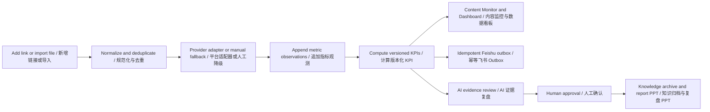

# TuringMarket Phase 7B Content Performance Intelligence And Client Review / TuringMarket 阶段 7B 内容效果智能与客户复盘

**Status / 状态：** In Review. Product direction is approved for the roadmap; implementation is released slice by slice only after each slice's decision and entry gates pass. / 评审中。产品方向已批准纳入路线图；只有每个切片的决策和进入门禁通过后，才逐切片进入实施。

**Target releases / 目标版本：** `v0.8.1-performance-manual-foundation`, `v0.8.2-performance-collection-feishu`, `v0.8.3-performance-ai-review`

**Product owner intent / 产品目标：** Turn campaign publication links, recurring performance data, manual commercial inputs, Feishu projection, AI diagnosis, knowledge growth, and customer review PPT into one auditable operating loop. / 将项目内容链接、周期性效果数据、人工商业数据、飞书投影、AI 诊断、知识成长和客户复盘 PPT 串成一个可审计的运营闭环。

**Reference direction / 参考方向：** The supplied benchmark screens are used as a functional benchmark for project selection, cross-platform filtering, content monitoring, KPI overview, Top-content ranking, trends, and creator contribution. TuringMarket keeps its own approved shell and interaction language rather than copying the benchmark brand or visual palette. / 用户提供的参考看板用于对标项目切换、跨平台筛选、内容监控、指标总览、Top 内容排行、趋势和达人贡献等功能；TuringMarket 保留已批准的产品壳层与交互语言，不复制参考产品的品牌和视觉配色。

---

## 1. Product Boundary / 产品边界

### 1.1 Jobs To Be Done / 核心任务

- **Campaign operator / 项目运营：** Register one or many published-content links, see collection state, correct business fields, and resolve failed updates. / 登记单条或批量发布链接，查看采集状态，补充业务字段并处理更新失败。
- **Account manager / 客户经理：** Understand whether the campaign is on track, identify the best and weakest content, and turn evidence into customer-safe recommendations. / 判断项目是否达标，识别最佳与较弱内容，并将证据转化为可向客户交付的建议。
- **Finance or commercial owner / 财务或商务负责人：** Enter or approve spend, client charge, clicks, orders, conversions, and attributed revenue with an audit history. / 录入或确认花费、客户报价、点击、订单、转化和归因收入，并保留审计历史。
- **Manager / 管理者：** Compare platforms, creator tiers, products, owners, and periods while seeing data freshness and coverage. / 对比平台、达人层级、产品、负责人和周期，同时掌握数据新鲜度与覆盖率。
- **AI and knowledge layer / AI 与知识底座：** Explain patterns with traceable evidence, require human confirmation, and archive approved conclusions for later proposals and PPT generation. / 基于可追溯证据解释规律，经人工确认后沉淀到知识库，供后续方案与 PPT 调用。

### 1.2 Non-Goals For V1 / V1 非目标

- Do not promise public metrics that a platform or authorization scope does not expose. / 不承诺平台或授权范围无法提供的公开指标。
- Do not infer missing metrics as zero. / 不把缺失指标推断为零。
- Do not let Feishu become a second uncontrolled source of truth. / 不让飞书成为第二套失控的事实源。
- Do not archive unconfirmed AI causal claims as facts. / 不把未经确认的 AI 因果判断作为事实归档。
- Do not rebuild or regress the frozen proposal/PPT experience while adding this module. / 新增本模块时不得重做或回退已冻结的方案/PPT 体验。

### 1.3 Decision Ledger / 决策台账

| Decision / 决策 | Working default / 当前默认 | Gate / 门禁 |
| --- | --- | --- |
| First usable release / 首个可用版本 | `7B.1` uses link import, CSV/XLSX, manual metrics, and no external provider dependency. / `7B.1` 使用链接导入、CSV/XLSX 和人工指标，不依赖外部平台服务商。 | Approved for detailed design after Phase 7 data contracts are stable. / 阶段 7 数据契约稳定后可进入详细设计。 |
| Automatic providers / 自动平台 | Recommended order: TikTok, Instagram, YouTube; Facebook and X remain manual/CSV/Feishu until approved access exists. / 建议顺序为 TikTok、Instagram、YouTube；Facebook 和 X 在取得获批访问前保留人工、CSV、飞书。 | Exact provider, authorization scope, available metric matrix, rate limits, price, and data-retention terms require explicit confirmation before `7B.2`. / `7B.2` 前须明确确认服务商、授权范围、可用指标矩阵、限流、价格和数据保留条款。 |
| Default engagement comparison / 默认互动率对比 | Cross-platform default is Core View ER: `(likes + comments) / views`; Extended View ER adds saves and shares only when all four components are available. / 跨平台默认使用核心播放互动率“点赞加评论除以播放”；仅在四个互动分项均可用时使用包含收藏和转发的扩展播放互动率。 | A ranking never mixes denominator or component signatures. / 同一排行不得混用分母或互动分项组合。 |
| Feishu authority / 飞书权威性 | Platform database is authoritative; Feishu is an idempotent operational projection with optional whitelisted inbound commercial fields. / 平台数据库为权威事实源；飞书为幂等运营投影，仅可选回写白名单商业字段。 | Project manager and organization admin approve table mapping; finance approves inbound commercial-field ownership. / 项目经理与组织管理员批准表格映射；财务批准商业字段回写归属。 |
| Knowledge scope / 知识范围 | Raw observations remain campaign lineage; only human-approved conclusions are retrievable methodology. Promotion to organization methodology requires a second approval. / 原始观测仅作为项目血缘；只有人工确认结论才作为可检索方法论，晋升组织方法论需二次批准。 | Knowledge curator or organization admin approves promotion, supersession, and deletion. / 知识管理员或组织管理员批准晋升、替代和删除。 |

---

## 2. Information Architecture / 信息架构

The module is divided into two separate routes and views. They share one campaign context but solve different jobs. / 模块拆成两个独立路由和界面，共享同一个项目上下文，但分别解决不同任务。

### 2.1 Content Monitor / 内容监控

**Purpose / 目的：** Operational control of links, collection, manual fields, and exceptions. / 管理链接、采集、人工字段和异常。

**Primary areas / 主要区域：**

1. **Campaign context bar / 项目上下文栏**
   - Campaign switcher, client, product, owner, reporting period, timezone, and currency. / 项目切换、客户、产品、负责人、报告周期、时区和币种。
   - `Add link`, `Bulk import`, `Refresh now`, `Export`, and `Feishu sync` commands. / 新增链接、批量导入、立即更新、导出和飞书同步命令。
2. **Platform segmented control / 平台分段控件**
   - All, TikTok, Instagram, YouTube, Facebook, X, and custom/manual, each with content count. / 全部及各平台与自定义/人工来源，并显示内容数量。
3. **Filter and saved-view bar / 筛选与保存视图栏**
   - Collection state, region, creator tier, video tags, product, owner, creator, publish date, created date, monitoring duration, view range, and source mode. / 采集状态、地区、达人层级、视频标签、产品、负责人、达人、发布时间、创建时间、监控时长、播放量区间和来源模式。
   - One full-field search supports creator name/ID, alias, title, caption, URL, platform content ID, tags, and custom fields. / 一个全字段搜索项支持达人名称/ID、别名、标题、文案、链接、平台内容 ID、标签和自定义字段。
   - Users can save named views per person or team. / 用户可保存个人或团队筛选视图。
4. **Monitoring table / 监控表格**
   - Sticky header and first content column; horizontal scrolling does not hide row identity. / 表头和首个内容列固定，横向滚动不丢失行身份。
   - A stable 16 px checkbox and compact selected state; selection never resizes the row or header. / 使用稳定的 16 px 复选框和紧凑选中态，勾选不得改变行高或表头尺寸。
   - Default columns: content, creator, platform, publish date, monitoring state, freshness, views, impressions, likes, comments, saves, shares, engagement rate, spend, clicks, CPC, revenue, ROI, ROAS, source, last collection, and owner. / 默认字段包含内容、达人、平台、发布时间、监控状态、新鲜度、播放、曝光、点赞、评论、收藏、转发、互动率、花费、点击、CPC、收入、ROI、ROAS、来源、最近采集和负责人。
   - Column settings, sorting, per-column filters, density control, and pre-filter/post-filter export. / 支持字段设置、排序、按列筛选、密度切换及筛选前/筛选后导出。
   - Each metric exposes cumulative value, period delta, trend, availability, source, and last update. / 每个指标可查看累计值、周期增量、趋势、可用性、来源和最近更新时间。
5. **Content detail drawer / 内容详情抽屉**
   - Original URL, canonical ID, creator, campaign/product linkage, collection history, raw-source audit pointer, manual-input history, comments, and AI analysis state. / 原始链接、规范 ID、达人、项目/产品关联、采集历史、原始来源审计指针、人工录入历史、备注和 AI 分析状态。
   - Commercial fields are explicit components: creator fee, product/sample cost, logistics cost, paid-media spend, platform/agency fee, approved other cost, client charge, attributed revenue, currency, FX rate/time, attribution window/model, approval state, and correction reason. / 商业字段采用明确分项：达人费用、产品/样品成本、物流成本、付费媒体花费、平台/代理费用、已批准其他成本、客户报价、归因收入、币种、汇率/时间、归因窗口/模型、批准状态和更正原因。
   - Outcome fields include clicks, visits, installs, leads, conversions, orders, affiliate sales, and versioned custom metrics. / 结果字段包括点击、访问、安装、线索、转化、订单、联盟销售和版本化自定义指标。

### 2.2 Performance Dashboard / 数据看板

**Purpose / 目的：** Campaign analysis, comparison, diagnosis, and client review. / 项目分析、对比、诊断和客户复盘。

**Primary areas / 主要区域：**

1. **Shared context and filters / 共享上下文与筛选**
   - Uses the same campaign, platform, region, product, creator tier, owner, tag, source, and date filters as Content Monitor. / 与内容监控共享项目、平台、地区、产品、达人层级、负责人、标签、来源和时间筛选。
   - Filter state is encoded in navigation state and can be shared or restored. / 筛选状态写入导航状态，可分享并恢复。
2. **Outcome overview / 结果总览**
   - Reach group: impressions, views, unique reach when available, active content, and creator count. / 触达组：曝光、播放、可用时的独立触达、活跃内容数和达人数。
   - Engagement group: likes, comments, saves, shares, Core View ER, Extended View ER, Impression ER, component-coverage signature, and platform-native rate when available. / 互动组：点赞、评论、收藏、转发、核心播放互动率、扩展播放互动率、曝光互动率、分项覆盖签名，以及可用时的平台原生互动率。
   - Efficiency group: spend, CPM, CPV, CPE, clicks, CTR, CPC, conversions, CVR, CPA, orders, revenue, ROI, and ROAS. / 效率组：花费、CPM、CPV、CPE、点击、CTR、CPC、转化、CVR、CPA、订单、收入、ROI 和 ROAS。
   - Users pin a focused KPI set; secondary metrics remain in grouped drill-down instead of showing dozens of equal-weight cards. / 用户可固定重点 KPI，次要指标进入分组下钻，避免几十个等权重卡片同时堆叠。
3. **Top content ranking / Top 内容排行**
   - Top 10 by cumulative value or period delta for views, engagements, likes, comments, saves, shares, engagement rate, clicks, revenue, ROI, or ROAS. / 支持按累计值或周期增量查看播放、互动、点赞、评论、收藏、转发、互动率、点击、收入、ROI 或 ROAS 的 Top 10。
   - Ranking includes thumbnail, title/link, creator, platform, publish date, source/freshness, selected metric, denominator, and delta. / 排行包含缩略图、标题/链接、达人、平台、发布时间、来源/新鲜度、所选指标、分母和增量。
4. **Trend analysis / 趋势分析**
   - Time series for views, impressions, engagement components, clicks, conversions, spend, and revenue. / 展示播放、曝光、互动分项、点击、转化、花费和收入的时间趋势。
   - Supports cumulative and incremental modes, daily/weekly granularity, period comparison, and annotation for publication or correction events. / 支持累计/增量模式、日/周粒度、周期对比，以及发布或更正事件标注。
5. **Contribution and comparison / 贡献与对比**
   - Creator/channel contribution, platform comparison, creator-tier comparison, product comparison, and custom-tag cohorts. / 达人/频道贡献、平台对比、达人层级对比、产品对比和自定义标签分组。
   - Every percentage discloses its numerator, denominator, coverage, and unavailable records. / 每个百分比均披露分子、分母、覆盖率和不可用记录数。
6. **Data quality and freshness / 数据质量与新鲜度**
   - Coverage, stale records, authorization failures, manual-only metrics, conflicts, last successful run, and next scheduled run. / 展示覆盖率、过期记录、授权失败、仅人工指标、冲突、最近成功任务和下次计划任务。
7. **AI campaign review / AI 项目复盘**
   - Best and weakest content, evidence, confidence, hook/content/style diagnosis, reusable methodology, improvement actions, execution issues, risks, and next-cycle plan. / 输出最佳与较弱内容、证据、置信度、钩子/内容/风格诊断、可复用方法论、改进动作、执行问题、风险和下周期计划。
   - Human review is required before customer delivery or knowledge archive. / 对客交付或知识归档前必须人工确认。
8. **Report builder / 复盘报告生成**
   - Generates a customer-safe report/PPT from a frozen metric snapshot and approved narrative, with source notes, missing-data disclosure, field-level redaction, and delivery approval. / 基于冻结指标快照和已确认叙述生成对客报告/PPT，并包含来源说明、缺失数据披露、字段级脱敏和交付批准。
   - Required report sections are project overview, data summary, platform/creator-tier comparison, product comparison, key efficiency and conversion metrics, excellent cases, execution issues/risks, optimization actions, and next-cycle plan. / 报告必含项目概况、数据汇总、平台/达人层级对比、产品对比、关键效率与转化指标、优秀案例、执行问题/风险、优化动作和下周期计划。

---

## 3. Metric Contract / 指标口径

| Metric / 指标 | Definition / 定义 | Missing-data rule / 缺失规则 |
| --- | --- | --- |
| Observed engagements / 已观测互动 | Sum of available likes, comments, saves, and shares with an exact component signature / 对可用的点赞、评论、收藏和转发求和，并记录精确分项签名 | Descriptive only; never used for cross-platform ranking when signatures differ / 仅作描述；分项签名不同时不得用于跨平台排行 |
| Core View ER / 核心播放互动率 | `(likes + comments) / views`; both components are required / “点赞加评论”除以播放，两个分项均必须可用 | Default cross-platform ER; unknown without likes, comments, or positive views / 默认跨平台互动率；任一分项或正播放缺失时未知 |
| Extended View ER / 扩展播放互动率 | `(likes + comments + saves + shares) / views`; all four components are required / 四项互动之和除以播放，四个分项均必须可用 | Compare only records with the same four-component coverage / 仅比较四个分项覆盖一致的记录 |
| Impression ER / 曝光互动率 | Same declared interaction component signature divided by impressions / 使用明确声明的互动分项签名除以曝光 | Unknown when impressions are unavailable or zero; never mixed with view-based ER / 曝光缺失或为零时未知，且不得与播放互动率混排 |
| Total campaign cost / 项目总成本 | `creator fee + product/sample cost + logistics cost + paid-media spend + platform/agency fee + approved other cost` / 达人费用、产品/样品成本、物流成本、付费媒体花费、平台/代理费用及已批准其他成本之和 | Uses only approved components in one base currency / 仅使用已批准且换算到同一基础币种的分项 |
| CPM | `selected cost basis / impressions * 1000`; default basis is total campaign cost, optional basis is paid-media spend / 选定成本口径除以曝光再乘 1000，默认项目总成本，可选付费媒体花费 | Cost basis is always visible; unknown without confirmed cost or impressions / 始终展示成本口径；缺少已确认成本或曝光时未知 |
| CPV | `selected cost basis / views` with visible cost basis / 使用明确展示的成本口径除以播放 | Unknown without confirmed cost or views / 缺少已确认成本或播放时未知 |
| CPE | `selected cost basis / declared engagement total` with visible component signature / 使用明确成本口径除以声明分项签名的互动总数 | Unknown without confirmed cost or a comparable engagement total / 缺少已确认成本或可比互动总数时未知 |
| CTR | `clicks / impressions` with an explicitly selected denominator / 点击除以明确选定的曝光分母 | Never substitute views silently / 不得静默用播放替代曝光 |
| CPC | `selected cost basis / clicks` with visible cost basis / 使用明确展示的成本口径除以点击 | Unknown without confirmed cost or clicks / 缺少已确认成本或点击时未知 |
| CVR | `conversions / clicks` | Unknown without conversions or clicks / 缺少转化或点击时未知 |
| CPA | `selected cost basis / conversions` with visible cost basis / 使用明确展示的成本口径除以转化 | Unknown without confirmed cost or conversions / 缺少已确认成本或转化时未知 |
| ROI | `(attributed revenue - total campaign cost) / total campaign cost` within the approved attribution window/model / 在已批准归因窗口/模型内，以“归因收入减项目总成本”除以项目总成本 | Unknown without approved attributed revenue, approved cost components, model, window, and currency conversion / 缺少已批准归因收入、成本分项、模型、窗口或币种换算时未知 |
| ROAS | `attributed revenue / paid-media spend` within the approved attribution window/model / 在已批准归因窗口/模型内，以归因收入除以付费媒体花费 | Unknown without approved attributed revenue or positive paid-media spend; creator fees are not silently substituted / 缺少已批准归因收入或正付费媒体花费时未知；不得静默用达人费用替代 |
| Gross margin rate / 毛利率 | `(client charge - total campaign cost) / client charge`; client charge is not attributed commerce revenue / “客户报价减项目总成本”除以客户报价；客户报价不等于归因销售收入 | Unknown without approved client charge and cost; internal-only by default / 缺少已批准客户报价或成本时未知，默认仅内部可见 |

**Aggregation and comparison rule / 汇总与对比规则：** Rates are recomputed from weighted totals for the selected cohort; the system never averages row-level rates. Rankings and AI comparisons require the same denominator, interaction-component signature, cost basis, attribution model/window, and at least 80% metric coverage in the selected cohort. Partial records carry a visible badge and are excluded from comparable ranking by default. Currency values remain grouped unless converted with a recorded source, rate, effective timestamp, base currency, and approval. / 比率均使用所选分组的汇总分子和分母重新计算，不平均单行比率；排行和 AI 对比要求分母、互动分项签名、成本口径、归因模型/窗口一致，且所选分组指标覆盖率至少 80%。部分数据必须显示标识，默认不进入可比排行；金额保持按币种分组，除非记录汇率来源、汇率、生效时间、基础币种和批准信息。

---

## 4. Data And Provenance Model / 数据与血缘模型

### 4.1 Core entities / 核心实体

- `campaign_publications`: canonical content identity, campaign, creator, product, platform, original/canonical URL, publish time, status, ownership, and Phase 7 source order/deliverable linkage. / 内容规范身份、项目、达人、产品、平台、原始/规范链接、发布时间、状态、归属，以及阶段 7 来源订单/交付物关联。
- `performance_collection_runs`: provider, schedule, attempt, status, rate-limit/retry details, started/finished time, and error classification. / 服务商、计划、尝试、状态、限流/重试、起止时间和错误分类。
- `performance_metric_observations`: append-only metric value, unit, cumulative/delta mode, observed/collected time, provider, source mode, availability, confidence, and raw payload pointer. / 只追加指标值、单位、累计/增量模式、观测/采集时间、服务商、来源模式、可用性、置信度和原始响应指针。
- `performance_manual_inputs`: separate creator fee, product/sample cost, logistics cost, paid-media spend, platform/agency fee, other cost, client charge, attributed revenue, outcome values, base/original currency, FX evidence, attribution window/model, owner, version, approval state, and correction reason. / 分开保存达人费用、产品/样品成本、物流成本、付费媒体花费、平台/代理费用、其他成本、客户报价、归因收入、结果数值、基础/原始币种、汇率证据、归因窗口/模型、操作人、版本、批准状态和更正原因。
- `performance_metric_definitions`: system and custom metric name, type, unit, formula, denominator, scope, visibility, and version. / 系统及自定义指标名称、类型、单位、公式、分母、范围、可见性和版本。
- `performance_media_evidence`: authorized acquisition mode, content hash, caption/transcript/frame references, retention deadline, deletion state, and access audit. Raw media is not copied into general knowledge search. / 获授权采集模式、内容哈希、文案/字幕/画面帧引用、保留期限、删除状态和访问审计；原始媒体不得复制到通用知识搜索。
- `performance_ai_reviews`: metric snapshot ID, evidence references, model/prompt version, findings, confidence, reviewer, approval, campaign-knowledge linkage, organization-methodology promotion state, dedupe fingerprint, and supersession link. / 指标快照 ID、证据引用、模型/提示词版本、发现、置信度、审核人、批准状态、项目知识关联、组织方法论晋升状态、去重指纹和替代关系。
- `performance_report_snapshots`: immutable report dataset, approved narrative, redaction policy/version, generated artifacts, delivery approver/time, recipient classification, and customer-delivery status. / 不可变报告数据集、已确认叙述、脱敏策略/版本、生成产物、交付批准人/时间、接收方分类和对客交付状态。
- `feishu_sync_mappings`, `feishu_sync_outbox`, and `feishu_sync_runs`: project/table mapping, idempotency key, field mapping, retry/dead-letter state, watermark, and reconciliation result. / 项目/表格映射、幂等键、字段映射、重试/死信、水位和对账结果。

### 4.2 Source modes / 来源模式

- `provider_api`: authorized or approved provider response. / 已授权或获批服务商响应。
- `manual`: user-entered value with owner and version history. / 带操作人和版本历史的人工录入。
- `csv_xlsx`: imported value with file hash, row, and field mapping. / 带文件哈希、行号和字段映射的导入值。
- `feishu`: whitelisted inbound business field with record/version linkage. / 带记录和版本关联的飞书白名单回写字段。
- `derived`: server-computed metric with definition version and input observation IDs. / 带口径版本和输入观测 ID 的后端派生指标。

Provider values and manual values remain separate; a visible conflict state is resolved by an authorized user and never overwritten silently. / 服务商值与人工值分开保存；冲突必须显式展示并由有权限用户处理，不得静默覆盖。

### 4.3 Provider Capability Matrix Gate / 服务商能力矩阵门禁

Before an adapter is estimated or implemented, its approved matrix must record every requested metric (`views`, `impressions`, `likes`, `comments`, `saves`, `shares`, `clicks`, `orders`, `revenue`, and provider-native metrics) against: authorization type, account/content eligibility, granularity, cumulative/delta semantics, historical availability, refresh limit, latency, retention, correction behavior, source terms, and fallback mode. Unsupported and permission-limited are distinct states. The matrix is versioned and exposed to KPI/report logic; a provider schema change blocks derived KPI publication until reviewed. / 在估算或开发任何适配器前，其获批能力矩阵必须逐项记录播放、曝光、点赞、评论、收藏、转发、点击、订单、收入和平台原生指标，并标明授权类型、账号/内容适用条件、粒度、累计/增量语义、历史可用性、刷新限制、延迟、保留期限、更正行为、来源条款和降级模式。"不支持"与"权限受限"是不同状态。矩阵必须版本化并供 KPI/报告逻辑使用；服务商结构变化在复审前阻止派生 KPI 发布。

---

## 5. Collection And Feishu Workflow / 采集与飞书工作流

- Phase 7 handoff is automatic: when a collaboration deliverable becomes `published` with a valid URL, one idempotent `campaign_publication` is created from the order/deliverable identity. Multiple deliverables create multiple linked publications; canonical platform/content identity prevents manual-import duplicates. / 阶段 7 自动交接：合作交付物进入 `published` 且链接有效时，按订单/交付物身份幂等创建一条 `campaign_publication`；多个交付物分别创建并关联，平台/内容规范身份阻止手工导入重复。
- Default provider cadence is explicit: publication age 0-72 hours every 6 hours; day 4-14 every 12 hours; day 15-45 daily; then weekly. The deterministic monitoring end is `min(max(published_at + 45 days, campaign_closed_at + 30 days), published_at + 180 days)`; when no close time exists, use `published_at + 180 days`. Capture one final snapshot at the end and stop unless an approved extension creates a new policy version. Provider limits may slow a run but cannot fabricate compliance. / 默认平台采集节奏明确为：发布后 0-72 小时每 6 小时；第 4-14 天每 12 小时；第 15-45 天每日；随后每周。确定性监控截止时间为“发布时间加 45 天”和“项目关闭时间加 30 天”取较晚者，再与“发布时间加 180 天”取较早者；没有关闭时间时使用“发布时间加 180 天”。截止时采集最终快照并停止，除非获批延期生成新策略版本。服务商限流可导致延迟，但不得伪造达标。
- Freshness SLA is 90% of eligible authorized publications collected within twice their configured cadence; three consecutive misses create an operational alert. The UI always shows last success, next run, stale reason, and authorized manual refresh. / 新鲜度 SLA 为至少 90% 的符合条件且已授权内容在配置频率两倍时间内完成采集；连续三次未完成会生成运营告警。界面始终展示最近成功、下次任务、过期原因和有权限的手动更新。
- Recovery collects the latest truthful cumulative value and records the gap; it never invents historical snapshots. A configured provider may backfill only history the provider actually returns, labeled with provider observation time and collection time. / 恢复后采集最新真实累计值并记录空档，不伪造历史快照；仅当服务商真实返回历史时才允许回填，并同时标注平台观测时间和平台采集时间。
- Every content item has isolated retry/backoff and rate-limit state so one bad link does not block the campaign. / 每条内容独立重试/退避和限流状态，单条坏链接不得阻塞整个项目。
- The platform database is authoritative. Feishu uses two explicit projections: a current-state table upserts one row per campaign publication after every successful collection/manual approval, and an optional daily snapshot table appends at most one row per publication per project-local day. / 平台数据库是权威事实源。飞书使用两种明确投影：当前表在每次采集成功或人工批准后按项目内容一行幂等更新；可选日快照表按项目本地日期、每条内容每日最多追加一行。
- A nightly reconciliation runs at 02:00 in the project timezone, retries partial failures, repairs missed outbox events, and detects duplicate/missing rows without silently deleting user columns. / 每晚项目时区 02:00 执行对账，重试部分失败、修复遗漏 Outbox 事件、检测重复/缺失行，且不得静默删除用户字段。
- Optional Feishu inbound sync runs hourly and is restricted to separately approved commercial/outcome fields. Each inbound value carries Feishu record/version, editor, mapping version, and approval owner; conflicts create a review item rather than overwriting platform data. / 可选飞书回写每小时执行，仅开放单独获批的商业/结果字段；每个回写值携带飞书记录/版本、编辑人、映射版本和批准责任人；冲突生成审核项，不覆盖平台数据。
- Operators can see last success, pending count, failed count, dead letters, field mapping, and a safe retry command. / 运营可查看最近成功、待处理、失败、死信、字段映射和安全重试操作。

---

## 6. AI Review And Knowledge Growth / AI 复盘与知识成长

### 6.1 Evidence ladder / 证据阶梯

1. Metric snapshot and comparison cohort. / 指标快照与对比分组。
2. Content metadata, caption, transcript, visual frames, hook, CTA, format, and creator/product tags when available and authorized. / 在可用且获授权时使用内容元数据、文案、字幕、画面帧、钩子、CTA、形式和达人/产品标签。
3. Campaign brief, approved strategy, client/product knowledge, prior confirmed methodology, and relevant web research. / 项目需求、已确认策略、客户/产品知识、历史已确认方法论和相关联网研究。
4. Explicit uncertainty when evidence is incomplete. / 证据不完整时明确说明不确定性。

### 6.2 Required AI output / AI 必须输出

- Best-performing and weakest-performing content with the selected KPI, comparison baseline, denominator/component/cost signature, coverage, and exclusion reason for non-comparable records. / 按所选 KPI、对比基线、分母/分项/成本签名、覆盖率指出最佳与较弱内容，并说明不可比记录的排除原因。
- Evidence-backed hypotheses for content theme, first-three-second hook, structure, creator fit, platform style, CTA, timing, and paid efficiency. / 针对主题、前三秒钩子、结构、达人匹配、平台风格、CTA、时机和付费效率给出有证据的假设。
- Reusable methodology split into `reuse`, `test`, and `avoid`, each with confidence. / 将可复用方法拆为“复用、测试、避免”，并标注置信度。
- Improvement actions with owner, priority, expected KPI, and next-cycle experiment. / 改进动作包含负责人、优先级、预期 KPI 和下周期实验。
- Data-quality caveats and alternative explanations. / 数据质量限制和其他可能解释。

### 6.3 Media And Knowledge Governance / 媒体与知识治理

- Caption, transcript, thumbnail, and frame analysis is performed only from an official authorized provider, a client/creator-supplied asset, or an explicitly approved public-access workflow. The system records acquisition mode, rights basis, and source hash. / 文案、字幕、缩略图和画面帧分析仅可使用官方授权服务、客户/达人提供素材或明确批准的公开访问流程，并记录采集模式、权利依据和来源哈希。
- Raw media and extracted frames have an absolute deletion deadline: the earliest of `acquired_at + 30 days`, provider maximum retention, client/project policy, or a shorter legal/consent requirement. Report completion never extends this deadline. Authorization revocation stops new processing immediately and deletes restricted media within 24 hours or sooner when required. A documented legal hold is the only extension: it isolates the asset from AI/retrieval, records approver/reason/expiry, and is reviewed at least every 30 days. Structured labels, evidence hashes, approved excerpts, and audit lineage may remain only when the same rights basis permits. / 原始媒体和提取画面采用绝对删除期限：采集后 30 天、服务商最大保留期、客户/项目策略或更短法律/同意要求中的最早时间；报告完成不得延长期限。授权撤销后立即停止新处理，并在 24 小时内或更早按要求删除受限媒体。仅记录在案的法律保全可延期：素材必须与 AI/检索隔离，记录批准人、原因和到期时间，并至少每 30 天复审。结构化标签、证据哈希、已批准摘录和审计血缘仅在同一权利依据允许时继续保留。
- When media evidence is unavailable, AI degrades to metadata/caption/metric analysis and must not claim hook, visual style, or scene-level causes. / 媒体证据不可用时，AI 降级为元数据、文案和指标分析，不得声称钩子、视觉风格或画面级原因。
- Human approval converts the review into a campaign knowledge entry with metric-snapshot lineage. Raw metric observations remain structured campaign lineage and are not general methodology search results. / 人工确认后，复盘才携带指标快照血缘进入项目知识；原始指标观测仅保留为结构化项目血缘，不进入通用方法论检索结果。
- Promotion to team/organization methodology requires a second approver. Campaign entries deduplicate within campaign; promoted entries deduplicate within organization by organization, product/category, platform, audience, and hypothesis fingerprint. A later method records `supersedes` links instead of overwriting. Rejected, edited, retired, expired, or superseded claims remain auditable but are not returned as current confirmed methodology. / 晋升团队/组织方法论需要第二位批准人；项目条目在项目内去重，晋升条目按组织、产品/品类、平台、受众和假设指纹在组织内去重。后续方法通过 `supersedes` 关系替代，不覆盖旧记录。被拒绝、修改、停用、过期或已替代判断保留审计，但不作为当前已确认方法论返回。

---

## 7. API Surface / API 边界

- `GET /api/organizations/:organizationId/performance/campaigns`
- `POST /api/campaigns/:campaignId/performance/contents`
- `POST /api/campaigns/:campaignId/performance/contents/upload`
- `GET /api/campaigns/:campaignId/performance/contents`
- `GET /api/campaigns/:campaignId/performance/contents/:contentId`
- `PATCH /api/campaigns/:campaignId/performance/contents/:contentId`
- `POST /api/campaigns/:campaignId/performance/contents/:contentId/corrections`
- `POST /api/campaigns/:campaignId/performance/contents/:contentId/pause`
- `POST /api/campaigns/:campaignId/performance/contents/:contentId/resume`
- `POST /api/campaigns/:campaignId/performance/contents/:contentId/collect`
- `POST /api/campaigns/:campaignId/performance/contents/:contentId/manual-inputs`
- `POST /api/campaigns/:campaignId/performance/manual-inputs/:inputId/approve`
- `POST /api/campaigns/:campaignId/performance/manual-inputs/:inputId/correct`
- `POST /api/campaigns/:campaignId/performance/collect`
- `GET /api/campaigns/:campaignId/performance/schedule`
- `POST /api/campaigns/:campaignId/performance/schedule-change-requests`
- `POST /api/campaigns/:campaignId/performance/schedule-change-requests/:requestId/approve`
- `GET /api/campaigns/:campaignId/performance/collection-runs`
- `GET /api/campaigns/:campaignId/performance/dashboard`
- `GET /api/campaigns/:campaignId/performance/trends`
- `GET /api/campaigns/:campaignId/performance/rankings`
- `GET /api/campaigns/:campaignId/performance/data-quality`
- `POST /api/campaigns/:campaignId/performance/feishu/sync`
- `GET /api/campaigns/:campaignId/performance/feishu/mapping`
- `POST /api/campaigns/:campaignId/performance/feishu/mapping-change-requests`
- `POST /api/campaigns/:campaignId/performance/feishu/mapping-change-requests/:requestId/approve`
- `GET /api/campaigns/:campaignId/performance/feishu/runs`
- `POST /api/campaigns/:campaignId/performance/feishu/runs/:runId/retry`
- `GET /api/campaigns/:campaignId/performance/conflicts`
- `POST /api/campaigns/:campaignId/performance/conflicts/:conflictId/resolve`
- `GET /api/campaigns/:campaignId/performance/metric-definitions`
- `POST /api/campaigns/:campaignId/performance/metric-definition-requests`
- `POST /api/campaigns/:campaignId/performance/metric-definition-requests/:requestId/approve`
- `POST /api/campaigns/:campaignId/performance/exports`
- `POST /api/campaigns/:campaignId/performance/restricted-export-grant-requests`
- `POST /api/campaigns/:campaignId/performance/restricted-export-grant-requests/:requestId/approve`
- `POST /api/campaigns/:campaignId/performance/restricted-export-grants/:grantId/revoke`
- `POST /api/campaigns/:campaignId/performance/ai-review`
- `POST /api/campaigns/:campaignId/performance/ai-review/:reviewId/approve`
- `POST /api/campaigns/:campaignId/performance/ai-review/:reviewId/promotion-requests`
- `POST /api/campaigns/:campaignId/performance/methodology-promotions/:promotionId/approve`
- `POST /api/campaigns/:campaignId/performance/methodologies/:entryId/supersede`
- `POST /api/campaigns/:campaignId/performance/methodologies/:entryId/retire`
- `POST /api/campaigns/:campaignId/performance/media-evidence/:evidenceId/revoke`
- `POST /api/campaigns/:campaignId/performance/legal-hold-requests`
- `POST /api/campaigns/:campaignId/performance/legal-hold-requests/:requestId/approve`
- `POST /api/campaigns/:campaignId/performance/legal-holds/:holdId/review`
- `POST /api/campaigns/:campaignId/performance/legal-holds/:holdId/release`
- `POST /api/campaigns/:campaignId/performance/reports`
- `POST /api/campaigns/:campaignId/performance/reports/:reportId/approve`
- `POST /api/campaigns/:campaignId/performance/reports/:reportId/deliver`
- `POST /api/admin/support-access-sessions`
- `DELETE /api/admin/support-access-sessions/:sessionId`

Campaign endpoints are organization- and campaign-scoped; the organization roll-up returns only policy-authorized campaigns/fields; platform support endpoints require a short-lived audited support session bound to organization, campaign, purpose, approver, and expiry. Every command validates stable role/action policy, uses idempotency, and records privileged commercial-data access. / 项目接口按组织和项目隔离；组织汇总仅返回权限允许的项目/字段；平台支持接口必须使用绑定组织、项目、用途、批准人和到期时间的短期审计支持会话。每个命令均校验稳定角色/动作策略、使用幂等并记录商业敏感数据访问。

---

## 8. Permission Model / 权限模型

| Policy ID / 策略 ID | Action / 动作 | Allowed role or owner / 可执行角色或责任人 | API or access path / API 或访问路径 | Approval and audit rule / 批准与审计规则 |
| --- | --- | --- | --- | --- |
| `PERF_VIEW` | View campaign/team/organization metrics / 查看项目、团队、组织指标 | Assigned member; team manager; organization admin / 分配成员、团队经理、组织管理员 | Campaign `GET` content/dashboard/trend/ranking/data-quality endpoints; `GET .../collection-runs` summary projection; organization roll-up `GET /api/organizations/:organizationId/performance/campaigns` / 项目查询接口、采集运行摘要及组织汇总接口 | Roll-up applies row/field policy; collection-run summary exposes status, freshness, counts, and safe error category but redacts provider payloads, credentials, rate-limit identifiers, restricted commercial fields, and internal diagnostics; cross-campaign view is audited. / 汇总执行行/字段权限；采集运行摘要仅展示状态、新鲜度、计数和安全错误分类，脱敏服务商响应、凭据、限流标识、受限商业字段和内部诊断；跨项目查看审计。 |
| `PERF_CONTENT_MANAGE` | Add/edit/correct/pause/resume publication / 新增、编辑、更正、暂停、恢复内容 | Assigned operator or campaign manager / 分配运营或项目经理 | Content `POST`, metadata `PATCH`, `/corrections`, `/pause`, `/resume` / 内容新增、元数据修改、更正、暂停、恢复接口 | Canonical identity or Phase 7 lineage changes only through `/corrections`; all versions retained. / 规范身份或阶段 7 血缘只能通过更正接口修改并保留全部版本。 |
| `PERF_REFRESH_ONE` | Refresh one publication / 更新单条内容 | Assigned operator or campaign manager / 分配运营或项目经理 | `POST .../contents/:contentId/collect` | Rate-limited, idempotent, and audited. / 限流、幂等并审计。 |
| `PERF_SCHEDULE_ADMIN` | Change schedule/provider, inspect operational runs, or run campaign refresh / 修改调度、服务商、查看运行诊断或执行全项目更新 | Manager requests; organization admin approves / 经理申请，组织管理员批准 | Schedule `GET`, privileged `GET .../collection-runs` detail projection, schedule-change request/approve, campaign `POST .../collect` | Provider readiness required; operational detail remains tenant-scoped and never returns credentials or raw secret-bearing headers; old/new policy, approval, and diagnostic access are recorded. / 需要服务商就绪；运行明细保持租户隔离且不得返回凭据或含密钥原始请求头；记录新旧策略、批准和诊断访问。 |
| `PERF_FEISHU_ADMIN` | Configure mapping, sync, retry / 配置映射、同步、重试 | Integration owner requests; campaign manager approves; organization admin may execute / 集成负责人申请，项目经理批准，组织管理员可执行 | Feishu mapping request/approve, `/sync`, runs, `/retry` | Mapping version and every retry are idempotent/audited. / 映射版本及每次重试均幂等并审计。 |
| `PERF_COMMERCIAL_EDIT` | Enter commercial/outcome data / 录入商业或结果数据 | Finance/commercial owner or delegated project role / 财务商务负责人或委派项目角色 | `POST .../contents/:contentId/manual-inputs` | Creates draft only; approved KPI is unchanged. / 仅创建草稿，不改变已批准 KPI。 |
| `PERF_COMMERCIAL_APPROVE` | Approve/correct commercial data and FX / 批准或更正商业数据与汇率 | Finance approver or organization admin / 财务批准人或组织管理员 | Manual-input `/approve` and `/correct` | Four-eyes rule; correction supersedes and never overwrites. / 四眼原则；更正替代但不覆盖。 |
| `PERF_CONFLICT_RESOLVE` | Resolve provider/manual/Feishu conflict / 处理来源冲突 | Metric owner; finance for commercial, manager for operational / 指标责任人；商业由财务、运营由经理 | Conflict `GET` and `/resolve` | Records selected value, reason, and all competing source IDs. / 记录选定值、原因和全部冲突来源 ID。 |
| `PERF_METRIC_DEFINE` | Create/version custom metric / 新增或版本化自定义指标 | Data owner requests; organization admin approves / 数据负责人申请，组织管理员批准 | Metric-definition `GET`, request, and `/approve` | Existing snapshots/reports keep the prior definition version. / 历史快照/报告保留旧口径版本。 |
| `PERF_RESTRICTED_EXPORT` | Export cost/revenue/margin / 导出成本、收入、毛利 | Finance/admin by role; manager only through approved grant / 财务/管理员按角色；经理需获批授权 | Export command plus restricted-export grant request/approve/revoke | Grant has campaign, fields, purpose, expiry; export/filter/row/download audited. / 授权绑定项目、字段、用途、到期；审计导出、筛选、行数和下载。 |
| `PERF_AI_APPROVE` | Approve AI review and publish campaign methodology / 批准 AI 复盘并发布项目方法论 | Campaign manager or account owner / 项目经理或客户负责人 | AI review create and `/approve` | Approval records evidence, coverage, confidence, missing media, and campaign knowledge ID. / 记录证据、覆盖率、置信度、媒体缺失和项目知识 ID。 |
| `PERF_REPORT_DELIVER` | Approve and deliver report/PPT / 批准并交付报告/PPT | Account owner or campaign manager / 客户负责人或项目经理 | Report create, `/approve`, `/deliver` | Records redaction preview, snapshot, recipient, approver, delivery time. / 记录脱敏预览、快照、接收方、批准人和交付时间。 |
| `PERF_METHODOLOGY_GOVERN` | Promote/supersede/retire methodology / 晋升、替代、停用方法论 | Knowledge curator or organization admin / 知识管理员或组织管理员 | Promotion request/approve, methodology `/supersede`, `/retire` | Organization promotion needs second approver and organization-scope dedupe review. / 组织晋升需第二批准人和组织范围去重审查。 |
| `PERF_MEDIA_GOVERN` | Revoke media or manage legal hold / 撤销媒体或管理法律保全 | Privacy/compliance owner requests; organization admin or legal approver approves / 隐私合规负责人申请，组织管理员或法务批准 | Media `/revoke`; legal-hold request/approve/review/release | Hold records basis, approver, expiry, 30-day review; release resumes deletion deadline. / 保全记录依据、批准人、到期、30 天复审；解除后恢复删除期限。 |
| `PERF_SUPPORT_ACCESS` | Platform support read access / 平台支持只读访问 | Platform admin with approved short-lived support session / 具备获批短期支持会话的平台管理员 | Admin support-session create/delete, then policy-limited read endpoints / 管理员支持会话创建/删除后使用受限只读接口 | Session binds organization/campaign/purpose/approver/expiry; cannot approve business data, AI, reports, or knowledge. / 会话绑定组织、项目、用途、批准人、到期；不得批准业务数据、AI、报告或知识。 |

Cost, client charge, margin, attributed revenue, and conversion details are independently hideable from public performance metrics. Phase 7B ships its own action policies and does not wait for Phase 8 to make these endpoints safe; Phase 8 later centralizes the same policy primitives. / 成本、客户报价、毛利、归因收入和转化明细可独立于公开指标隐藏。阶段 7B 必须自带动作级权限，不得等待阶段 8 才保证接口安全；阶段 8 再统一这些权限原语。

---

## 9. Accelerated Delivery Slices / 加速交付切片

**Estimate basis / 估算口径：** Effort is aggregate engineering person-days and includes 20% implementation/review contingency. Typical elapsed build time assumes one backend and one frontend engineer working in parallel with fractional product/data/review support. External provider approval, credentials, production observation, and user-browser scheduling are lead time, not hidden inside engineering effort. / 工作量以工程人日合计并包含 20% 实施/审查预留；典型构建周期假设一名前端与一名后端并行，并由产品、数据和审查角色部分投入。外部服务商批准、凭据、生产观察和用户浏览器排期属于发布前置时间，不隐含在工程工作量内。

### 7B.1 Reliable Manual Foundation / 可靠人工数据底座

- **Version and estimate / 版本与估算：** `v0.8.1-performance-manual-foundation`, 10-14 person-days, typically 5-7 business days elapsed after entry gates. / 10-14 人日，进入门禁通过后典型构建周期 5-7 个工作日。
- **Owners / 责任角色：** Product manager, backend architect, frontend developer, data engineer, code reviewer. / 产品经理、后端架构师、前端开发、数据工程师、代码审查者。
- **Dependencies and entry gates / 依赖与进入门禁：** Phase 4 campaign identity/access stable; Phase 7 publication/order/deliverable identity stable; financial taxonomy, metric dictionary, and action policy approved. No external provider is required. / 阶段 4 项目身份/权限稳定；阶段 7 发布/订单/交付物身份稳定；财务分类、指标口径和动作权限获批；不依赖外部平台服务商。
- **Scope / 范围：** Two separate working views, automatic Phase 7 handoff, manual link registration, CSV/XLSX import, versioned manual/commercial inputs, approval/correction, sticky searchable table, baseline dashboard, ranking/trends/contribution from truthful imported data, data-quality states, restricted export, and tests. / 两个独立可用界面、阶段 7 自动交接、手工链接登记、CSV/XLSX 导入、版本化人工/商业输入、批准/更正、固定可搜索表格、基于真实导入数据的基础看板/排行/趋势/贡献、数据质量状态、受限导出和测试。
- **Exit gate / 退出门禁：** Acceptance scenarios `1`, `2`, `4`, `5`, `9`, `10`, `15`, and `18`; a production-shaped 500-publication campaign reconciles monitor/export/dashboard totals with no provider, scheduler, or Feishu dependency. / 通过验收场景 `1`、`2`、`4`、`5`、`9`、`10`、`15`、`18`；类生产 500 条内容项目在无服务商、调度器或飞书依赖时，监控、导出和看板对账一致。

### 7B.2 Scheduled Collection And Feishu / 定时采集与飞书

- **Version and estimate / 版本与估算：** `v0.8.2-performance-collection-feishu`, re-baselined after the approved capability matrix; planning range is 14-22 person-days and 7-10 business days build time for Feishu plus one provider, followed by seven calendar days of shadow-baseline collection and then 14 consecutive calendar days of passing candidate/production observation. Allow at least 30 calendar days after credentials and entry gates; a typical calendar lead is 30-37 days before approval/holiday delays because the build estimate is in business days. Each additional provider is a separately estimated/reviewed patch, initially budgeted at 6-10 person-days before matrix confirmation. / 获批能力矩阵后重新基准估算；当前规划为飞书加一个服务商 14-22 人日、7-10 个工作日构建，随后先进行 7 个自然日影子基线采集，再连续 14 个自然日通过候选/生产观察。凭据和进入门禁就绪后至少预留 30 个自然日；由于构建按工作日估算，未计审批和节假日延迟时，典型日历周期为 30-37 天。每增加一个服务商均独立估算和审查，能力矩阵确认前暂按 6-10 人日预算。
- **Owners / 责任角色：** Backend architect, data engineer, workflow architect, frontend developer, integration owner, security reviewer, code reviewer. / 后端架构师、数据工程师、工作流架构师、前端开发、集成负责人、安全审查者、代码审查者。
- **Dependencies and entry gates / 依赖与进入门禁：** `v0.8.1` stable; one provider's legal access, metric matrix, authorization flow, rate limits, cost, retention, and test account approved; Feishu app/table credentials and mapping owner approved. / `v0.8.1` 稳定；一个服务商的合法访问、指标矩阵、授权流程、限流、成本、保留条款和测试账号获批；飞书应用/表格凭据及映射责任人获批。
- **Scope / 范围：** One provider adapter, explicit cadence, scheduler, retries, availability/source/freshness states, gap recording, collection history, current-state and daily-snapshot Feishu projections, outbox, hourly whitelisted inbound, nightly reconciliation, conflict resolution, and recovery UI. / 一个平台适配器、明确频率、调度、重试、可用性/来源/新鲜度、空档记录、采集历史、飞书当前表与日快照表、Outbox、每小时白名单回写、夜间对账、冲突处理和恢复界面。
- **Provider order / 服务商顺序：** TikTok, Instagram, and YouTube remain the recommended sequence, but `v0.8.2` commits to only the first approved provider. Facebook and X remain manual/CSV/Feishu until approved access exists. / TikTok、Instagram 和 YouTube 仍为建议顺序，但 `v0.8.2` 只承诺首个获批服务商；Facebook 和 X 在获批前保持人工、CSV 和飞书。
- **Exit gate / 退出门禁：** Acceptance scenarios `3`, `6`, `11`, `12`, `13`, and `19`; after the seven-calendar-day shadow baseline is recorded, freshness and Feishu success targets below pass for the following 14 consecutive calendar days in candidate/production observation. / 通过验收场景 `3`、`6`、`11`、`12`、`13`、`19`；记录 7 个自然日影子基线后，下列新鲜度及飞书目标在随后候选/生产观察中连续 14 个自然日通过。

### 7B.3 AI Review And Client Deliverables / AI 复盘与客户交付

- **Version and estimate / 版本与估算：** `v0.8.3-performance-ai-review`, 14-20 person-days, typically 7-10 business days elapsed after entry gates, excluding external media-rights approval. / 14-20 人日，进入门禁通过后典型构建周期 7-10 个工作日，不含外部媒体权利批准时间。
- **Owners / 责任角色：** Product manager, AI engineer, data engineer, workflow architect, backend architect, frontend developer, knowledge curator, security reviewer, code reviewer. / 产品经理、AI 工程师、数据工程师、工作流架构师、后端架构师、前端开发、知识管理员、安全审查者、代码审查者。
- **Dependencies and entry gates / 依赖与进入门禁：** `v0.8.1` stable; Phase 6 AI/RAG, knowledge custody, report/PPT snapshot contract stable; media-analysis rights and retention policy approved. `v0.8.2` is optional when the report uses truthful manual/imported snapshots. / `v0.8.1` 稳定；阶段 6 AI/RAG、知识托管、报告/PPT 快照契约稳定；媒体分析权利及保留策略获批。若报告使用真实人工/导入快照，`v0.8.2` 非强依赖。
- **Scope / 范围：** Authorized evidence extraction, comparable-cohort best/weak diagnosis, degraded analysis when media is missing, human approval, campaign knowledge, second-approval organization promotion, methodology reuse/supersession, redacted customer report, immutable snapshot, and PPT generation. / 获授权证据提取、可比分组最佳/较弱诊断、媒体缺失降级分析、人工批准、项目知识、二次批准组织晋升、方法论复用/替代、脱敏客户报告、不可变快照和 PPT 生成。
- **Exit gate / 退出门禁：** Acceptance scenarios `7`, `8`, `14`, `16`, and `17`; AI evidence, report fields, redaction, knowledge retrieval, and frozen-PPT regression are independently approved. / 通过验收场景 `7`、`8`、`14`、`16`、`17`；AI 证据、报告字段、脱敏、知识检索和冻结 PPT 回归均获独立批准。

### Feature-By-Feature Release Cadence / 单功能即时发布节奏

Every independently usable feature is a release slice. Once the feature is complete, it is published to production instead of waiting for a larger phase bundle. The default release path is: affected-scope checks, one independent code review, a verified backup, production deployment, online core-path smoke verification, and version/archive synchronization. / 每个可独立使用的功能都是一个发布切片。功能完成后直接发布到生产，不再等待更大的阶段包。默认发布路径为：受影响范围校验、一次独立代码审查、可验证备份、生产部署、线上核心路径冒烟验收，以及版本和归档同步。

Routine feature slices use focused checks only: changed API/service behavior, changed UI contract, and the directly affected workflow. We do not run unrelated platform-wide heavy regression for every ordinary feature. / 常规功能切片只运行定向校验：已改 API 或服务行为、已改 UI 契约及直接受影响的业务流程。普通功能不再每次执行无关的平台级重型回归。

Database migrations, authentication or authorization, security controls, systemd or shared infrastructure, production data transformations, and any real external write require the additional migration, security, rollback, and integration checks appropriate to that risk. / 数据库迁移、认证或授权、安全控制、systemd 或共享基础设施、生产数据转换，以及任何真实外部写入，仍必须按风险增加迁移、安全、回滚和集成校验。

Each released slice still records its migration status, focused verification evidence, review verdict, backup and rollback reference, production result, version record, Obsidian archive, and GitHub commit. / 每个已发布切片仍记录迁移状态、定向验证证据、审查结论、备份及回滚引用、生产结果、版本记录、Obsidian 归档和 GitHub 提交。

### Product Success Targets / 产品成功目标

| Slice / 切片 | Target / 目标 | Accountable owner / 责任人 | Baseline rule / 基线规则 |
| --- | --- | --- | --- |
| `7B.1` | Production-shaped 500-publication, 365-day monitor/dashboard first-page p95 under 2 seconds with pagination and no full-table browser rendering. / 类生产 500 条内容、365 天监控/看板首屏 p95 小于 2 秒，使用分页且不全量渲染。 | Backend architect / 后端架构师 | Record pre-optimization query/render baseline on the same frozen fixture at slice entry; never compare different datasets. / 切片进入时在同一冻结数据集记录优化前查询/渲染基线，不比较不同数据集。 |
| `7B.2` | At least 90% of eligible authorized publications meet freshness SLA with visible coverage/exclusions. / 至少 90% 的符合条件授权内容满足新鲜度 SLA，并可见覆盖率/排除项。 | Provider integration owner / 服务商集成负责人 | First seven-day shadow collection is the operational baseline; release target must pass the following 14 calendar days. / 首 7 天影子采集为运营基线，随后 14 个自然日达到发布目标。 |
| `7B.2` | At least 99% of Feishu current-state updates finish within 15 minutes; nightly reconciliation has zero duplicate content rows. / 至少 99% 飞书当前表更新在 15 分钟内完成，夜间对账重复内容行为零。 | Feishu integration owner / 飞书集成负责人 | Record seven-day shadow outbox latency, retries, and duplicates before enabling customer tables. / 启用客户表格前记录 7 天影子 Outbox 延迟、重试和重复基线。 |
| `7B.3` | For a complete ten-content campaign, first review preparation is at most 30 minutes after data approval and at least 70% faster than the measured manual baseline, excluding copy edits. / 对输入完整的 10 条内容项目，数据批准后首次复盘准备不超过 30 分钟，且较人工基线至少缩短 70%，不含文案修改。 | Account operations owner / 客户运营负责人 | Measure at least five comparable historical/manual review preparations before pilot; if unavailable, collect five pilot shadow runs before claiming improvement. / 试点前测量至少 5 个可比历史/人工复盘；无法取得时先做 5 次试点影子运行再声明提升。 |
| `7B.3` | At least 30% of eligible next-cycle campaigns explicitly reuse or test an approved method within 90 days, with downstream KPI outcome recorded. / 至少 30% 的符合条件下周期项目在 90 天内明确复用或测试已批准方法，并记录后续 KPI。 | Knowledge curator / 知识管理员 | Tracked reuse baseline is zero before instrumentation; adoption is assessed only after a complete 90-day cohort. / 埋点前可追踪复用基线为零，仅在完整 90 天分组后评估采用率。 |

---

## 10. Acceptance Scenarios / 验收场景

1. Import ten mixed-platform links, reject malformed links clearly, deduplicate canonical duplicates, and preserve the original URL. / 导入 10 条跨平台链接，明确拒绝错误链接，对规范重复链接去重，并保留原始链接。
2. Enter each cost component, client charge, paid-media spend, clicks, attributed revenue, attribution window/model, currency, and FX evidence; require four-eyes approval, then verify total cost, CPC/CPM/CPV cost-basis labels, ROI, ROAS, and gross margin. Corrections supersede prior versions and missing inputs stay unknown. / 录入各成本分项、客户报价、付费媒体花费、点击、归因收入、归因窗口/模型、币种和汇率证据，经四眼批准后验证项目总成本、带成本口径的 CPC/CPM/CPV、ROI、ROAS 和毛利率；更正替代旧版本，缺失输入保持未知。
3. Show provider, manual, and missing metrics distinctly; a late provider update appends a new observation without erasing history. / 区分服务商、人工和缺失指标；延迟到达的服务商数据追加新观测，不覆盖历史。
4. Scroll a long content list while the table header and content identity remain visible; search creator ID, tag, link, and custom fields. / 长列表滚动时表头和内容身份保持可见，并可搜索达人 ID、标签、链接和自定义字段。
5. Switch dashboard KPI between cumulative and period delta; ranking, trend, and contribution views reconcile to the same selected cohort. Core View ER never mixes with Extended or Impression ER, and partial records are visibly excluded from comparable ranking. / 看板在累计值和周期增量间切换时，排行、趋势和贡献视图与同一筛选分组对账一致；核心播放互动率不得与扩展或曝光互动率混排，部分数据被明确标识并排除出可比排行。
6. A partial Feishu failure retries safely, produces no duplicate records, and exposes recovery status in the platform. / 飞书部分失败可安全重试、不产生重复记录，并在平台内展示恢复状态。
7. AI identifies a best and weak item with cited evidence and confidence; an approver edits and confirms the methodology before it enters the knowledge base. / AI 基于引用证据和置信度识别最佳与较弱内容；审核人编辑确认后方法论才进入知识库。
8. Generate a customer review PPT from an immutable snapshot; later data refreshes do not change the delivered report silently. / 基于不可变快照生成客户复盘 PPT；后续数据更新不得静默改变已交付报告。
9. Campaign members cannot access another campaign or restricted commercial fields; organization and platform admin access is audited. / 项目成员不能访问其他项目或受限商业字段；组织及平台管理员访问均写审计。
10. Desktop and mobile layouts have no overlapping text, oversized selection marks, hidden sticky headers, or blank chart states. / 桌面和移动布局不得出现文字重叠、过大勾选图标、隐藏表头或空白图表状态。
11. Simulated time advances publications through 6-hour, 12-hour, daily, weekly, and final-snapshot states; early close, late close, no close, 180-day cap, and approved extension resolve deterministically; three misses alert, recovery records a gap, and unavailable history is never fabricated. / 模拟时间推动内容经过每 6 小时、每 12 小时、每日、每周和最终快照状态；提前关闭、延迟关闭、未关闭、180 天上限和获批延期均确定性处理；连续三次遗漏告警，恢复记录空档，不伪造不可用历史。
12. Successful collection/manual approval emits an idempotent Feishu current-row upsert within target time; daily snapshot appends once per local day, hourly inbound accepts only whitelisted fields, and 02:00 reconciliation repairs partial failure without duplicates. / 采集成功或人工批准后在目标时间内幂等更新飞书当前行；日快照按本地日期每日只追加一次；每小时回写仅接受白名单字段；02:00 对账修复部分失败且不重复。
13. The approved provider metric matrix is exercised for available, unavailable, permission-limited, delayed, and removed fields. Every 7B.2 KPI, Content Monitor row/detail, Performance Dashboard view, and export discloses source, freshness, component coverage, and exclusions. / 对已批准服务商指标矩阵测试可用、不可用、权限受限、延迟和已移除字段；7B.2 的每个 KPI、内容监控行/详情、数据看板视图和导出均披露来源、新鲜度、分项覆盖和排除项。
14. Authorized media enables hook/content/style evidence; unavailable or expired media forces metadata-only analysis. Raw media/frame retention expiry is audited. Authorization revocation stops new processing and proves deletion within 24 hours. A legal hold requires request and independent approval, isolates evidence from AI/retrieval, records reason/expiry, is reviewed within each 30-day window, and resumes the original deletion rule on release or expiry; approved structured conclusions remain traceable only when their rights basis still permits. / 获授权媒体支持钩子/内容/风格证据；媒体不可用或过期时强制降级为元数据分析；原始媒体/画面帧到期删除并审计。授权撤销后立即停止新处理，并证明在 24 小时内完成删除。法律保全必须经过申请和独立批准，将证据与 AI/检索隔离，记录原因/到期时间，每个 30 天窗口内复审，并在解除或到期后恢复原删除规则；已批准结构化结论仅在权利依据仍允许时保持可追溯。
15. A provider-independent production-shaped 500-publication, 365-day fixture passes pagination, p95 query target, CSV/XLSX import, restricted export, and monitor/dashboard reconciliation without scheduler, Feishu, or full-dataset browser rendering. / 不依赖服务商的类生产 500 条内容、365 天数据通过分页、p95 查询目标、CSV/XLSX 导入、受限导出和监控/看板对账，不依赖调度器或飞书，浏览器不全量渲染。
16. Customer report/PPT contains every required review module, redacts restricted financial/internal fields by recipient policy, records immutable snapshot and approver, and never changes after later data refresh. / 客户报告/PPT 包含所有必需复盘模块，按接收方策略脱敏受限财务/内部字段，记录不可变快照和批准人，后续数据更新不得改变已交付版本。
17. An approved campaign method is retrievable in a later eligible campaign with source lineage; organization promotion requires a second approver, duplicates merge by fingerprint, and superseded guidance is not returned as current. / 已批准项目方法可在后续符合条件项目中携带来源血缘被检索；晋升组织方法需第二批准人，重复内容按指纹合并，已替代指导不作为当前结果返回。
18. Phase 7 publish-event replay creates one publication per deliverable idempotently; multiple deliverables remain distinct, manual import of the same canonical content is rejected as duplicate, and correction/pause/resume preserves the order/deliverable lineage and audit history. / 阶段 7 发布事件重放按交付物幂等创建一条内容；多个交付物保持独立，手工导入同一规范内容被判重；更正、暂停和恢复保留订单/交付物血缘及审计历史。
19. A production-shaped 500-publication provider fixture sustains scheduler and Feishu outbox load, per-content retry/backoff, nightly reconciliation, and bounded export while meeting freshness and sync targets without duplicate work. / 类生产 500 条内容服务商数据集承受调度器和飞书 Outbox 负载、逐内容重试/退避、夜间对账和有界导出，并满足新鲜度和同步目标且不重复执行。

---

## 11. Release Gate / 发布门禁

- **`7B.1`:** KPI golden tests cover interaction component signatures, weighted aggregation, every cost basis, total campaign cost, ROI, ROAS, gross margin, missing denominators, attribution window/model, FX evidence, approval, and correction history. / KPI 黄金测试覆盖互动分项签名、加权汇总、全部成本口径、项目总成本、ROI、ROAS、毛利率、分母缺失、归因窗口/模型、汇率证据、批准和更正历史。
- **`7B.1`:** Append-only imported/manual observations, canonical publication deduplication, Phase 7 handoff, manual-version supersession, campaign isolation, and policies `PERF_VIEW`, `PERF_CONTENT_MANAGE`, `PERF_COMMERCIAL_EDIT`, `PERF_COMMERCIAL_APPROVE`, `PERF_CONFLICT_RESOLVE`, `PERF_METRIC_DEFINE`, and `PERF_RESTRICTED_EXPORT`. / 覆盖只追加导入/人工观测、规范内容去重、阶段 7 交接、人工版本替代、项目隔离，以及查看、内容管理、商业录入/批准、冲突、指标定义和受限导出策略。
- **`7B.1`:** Production-shaped manual/import load covers 500 publications and 365 days, pagination, p95 query target, export bounds, and browser row pagination without scheduler or outbox. / 类生产人工/导入负载覆盖 500 条内容和 365 天、分页、p95 查询目标、导出边界和浏览器行分页，不包含调度器或 Outbox。
- **`7B.2`:** Provider contracts cover unavailable/limited metrics, authorization expiry, rate limiting, late data, and schema drift. / 服务商契约覆盖指标不可用/受限、授权到期、限流、延迟数据和结构漂移。
- **`7B.2`:** Deterministic scheduler covers every age tier, early/late/no close, 180-day cap, three missed runs, gap recovery, final stop, and no fabricated backfill. / 确定性调度覆盖全部年龄层级、提前/延迟/未关闭、180 天上限、连续三次遗漏、空档恢复、最终停止和禁止伪造回填。
- **`7B.2`:** Feishu covers current upsert, daily snapshot, hourly inbound whitelist, 02:00 reconciliation, idempotency, partial failure, retry, dead letter, mapping approval/version, conflict, and user-column preservation; test `PERF_SCHEDULE_ADMIN`, `PERF_FEISHU_ADMIN`, and provider-related conflict policies. / 飞书覆盖当前表更新、日快照、每小时回写白名单、02:00 对账、幂等、部分失败、重试、死信、映射批准/版本、冲突和用户字段保留，并测试调度、飞书及平台冲突策略。
- **`7B.2`:** Production-shaped provider load covers scheduler backlog and outbox pressure for 500 publications while meeting freshness/sync targets. / 类生产服务商负载覆盖 500 条内容的调度积压和 Outbox 压力，并满足新鲜度/同步目标。
- **`7B.3`:** AI/media tests cover authorized acquisition, evidence lineage, unavailable-media degradation, absolute retention, revocation, legal-hold create/review/release, report immutability/redaction, campaign retrieval, organization promotion, dedupe, supersession, and `PERF_AI_APPROVE` through `PERF_MEDIA_GOVERN`. / AI/媒体测试覆盖授权采集、证据血缘、媒体不可用降级、绝对保留期限、撤权、法律保全创建/复审/解除、报告不可变/脱敏、项目检索、组织晋升、去重、替代及 AI 至媒体治理策略。
- **Each shipped slice / 每个已发布切片：** Organization/campaign isolation, applicable policy IDs and API paths, privileged support audit, backup/rollback, and browser verification in the user-approved browser cover only the flows shipped by that slice. / 组织/项目隔离、适用策略 ID 与 API、特权支持审计、备份/回滚和用户批准浏览器验收只覆盖该切片实际交付流程。
- **Program completion / 项目群完成：** All three slice exit gates and product success targets pass; every release has independent approval, deployment evidence, and rollback. `7B.2` cannot begin provider implementation before its provider decision gate, and `7B.3` cannot analyze media before its rights/retention gate. / 三个切片退出门禁和产品成功目标全部通过；每个版本有独立批准、部署证据和回滚。`7B.2` 未通过服务商决策门禁不得开发平台采集，`7B.3` 未通过媒体权利/保留门禁不得分析媒体。
