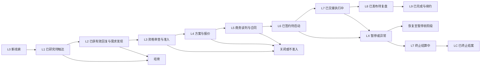

# 商务团队客户全生命周期与日常作业 SOP v2.1

> 本 SOP 统一图灵集市商务团队从线索研究、客户触达、需求诊断、方案报价、合同回款，到项目交接、执行协同、数据复盘和续约增购的操作标准。每个阶段必须有明确责任人、系统记录、完成证据和下一步，不允许用口头承诺代替审批、合同或客户书面确认。

## 目录

1. [文档控制与使用规则](#0-文档控制与使用规则)
2. [客户全生命周期总览](#1-客户全生命周期总览)
3. [角色、系统与通用 SLA](#2-角色系统与通用-sla)
4. [线索与客户开发](#3-线索与客户开发)
5. [需求诊断与项目准入](#4-需求诊断与项目准入)
6. [策略、方案与报价](#5-策略方案与报价)
7. [合同、开票与回款](#6-合同开票与回款)
8. [项目交接与执行协同](#7-项目交接与执行协同)
9. [上线、数据、复盘与续约](#8-上线数据复盘与续约)
10. [客户沟通与 CRM 规范](#9-客户沟通与-crm-规范)
11. [商务日常管理](#10-商务日常管理)
12. [风险、异常与升级](#11-风险异常与升级)
13. [销售作战手册](#12-销售作战手册)
14. [模板与检查清单](#13-模板与检查清单)
15. [培训、考核与制度边界](#14-培训考核与制度边界)
16. [审计与版本记录](#15-审计与版本记录)

## 0. 文档控制与使用规则

本章规定本 SOP 的适用对象、权威层级和执行原则。遇到冲突时，先停止越级推进，再按本章确定依据和升级路径。

### 0.1 适用范围

| 项目 | 规定 |
|---|---|
| 适用团队 | 商务、销售管理、策略、红人运营、项目管理、客户成功、财务、法务及管理层 |
| 适用业务 | 新客户、存量客户增购、测试项目、批次项目、年度框架项目、代理或机构合作项目 |
| 覆盖范围 | 线索到续约的商务主流程，以及商务在交付阶段的客户关系和商业责任 |
| 不替代内容 | 达人开发细节、合同法律意见、财务核算制度、薪酬提成制度及当地法规解释 |
| 当前状态 | 受控试运行版，2026-09-04 开始试运行，2026-09-30 复审 |
| 已确认规则 | 80%/20% 客户付款、$10K 项目、$1K 达人及 30% 贡献毛利默认线 |
| 正式生效门禁 | 完成第 15.5 节的系统、审批、模板、通讯录及培训认证验收 |
| 流程 Owner | 商务负责人负责版本、培训、执行检查和跨部门协调 |
| 执行要求 | 未达到阶段退出门槛的事项，不得进入下一阶段 |

### 0.2 权威层级

同一事项出现不同说法时，按以下顺序执行：

1. 适用法律法规、平台规则和双方已签署合同
2. 已批准的发布单、补充协议或例外审批
3. 本 SOP 当前生效版本
4. 已批准的模板、财务制度、法务指引和部门操作手册
5. 话术、案例、价格参考和个人经验

聊天记录可以作为客户确认的证据，但不能覆盖合同、审批或正式变更单。任何人口头承诺的价格、效果、档期、赔付或新增范围，在完成书面确认和内部审批前均不生效。

### 0.3 六项执行原则

1. **一个事实源**：客户与商机以客户关系管理系统（Customer Relationship Management，CRM）为准，合同和回款分别以合同库和财务台账为准
2. **先确认再投入**：合同、发布单和启动款未满足前，不发生不可撤销成本
3. **先记录再推进**：每个阶段都要有完成证据、下一步、责任人和截止时间
4. **预测不等于承诺**：案例、行业基准、回报测算和达人历史表现只用于决策参考
5. **变更必须留痕**：范围、预算、达人、排期、授权和付款变化均需书面确认
6. **例外必须审批**：低预算、低毛利、长账期、保量、赔付及高风险项目不得由个人决定

### 0.4 两份源文件的整合方式

| 原内容 | v2.0 处理方式 |
|---|---|
| 客户研究、电话与微信触达 | 进入第 3 章及第 12 章销售作战手册 |
| 关键需求问题和倾听要点 | 扩展为第 4 章的标准需求诊断表 |
| 客户分级与成熟度 | 保留并改为双维度分级 |
| 平台选择、红人营销价值、价格因素 | 移入第 12 章销售作战手册 |
| 需求、名单、内容、发布、复盘五阶段 | 补齐合同、回款、责任、门禁和异常后成为主流程 |
| 法务、飞书、客户群和客户跟进表 | 改为按角色和系统管理，移除个人姓名与个人邮箱依赖 |
| 日报、周报和新人训练 | 进入第 10 章和第 14 章 |
| 提成和转正标准 | 不作为本 SOP 的薪酬授权，转入独立受控制度 |
| 无来源的效果、价格或周期数字 | 删除无条件承诺，保留经核验后可使用的表达原则 |

### 0.5 关联资料

- [00-培训资料索引与版本说明](商务培训/00-培训资料索引与版本说明.md)（培训包唯一导航入口）
- [01-商务新人海外红人营销基础培训手册-v1.0](商务培训/01-商务新人海外红人营销基础培训手册-v1.0.md)
- [02-主流社媒平台档案与商业化路径-v1.0](商务培训/02-主流社媒平台档案与商业化路径-v1.0.md)
- [03-产品平台达人内容匹配案例库-v1.0](商务培训/03-产品平台达人内容匹配案例库-v1.0.md)
- [04-达人质量评估评分卡-v1.0](商务培训/04-达人质量评估评分卡-v1.0.md)
- [05-商务新人Roleplay与知识题库-v2.0](商务培训/05-商务新人Roleplay与知识题库-v2.0.md)
- [06-五周培养与上岗认证-v1.0](商务培训/06-五周培养与上岗认证-v1.0.md)
- [07-平台事实与来源维护台账-v1.0](商务培训/07-平台事实与来源维护台账-v1.0.md)
- [[02-海外红人营销销售培训手册2026版]]
- [[06-网红营销实战手册2026版(含合同模板)]]
- [项目审批与执行表](https://zcn9fg9hqb9a.feishu.cn/wiki/BQiEwyuhxiJ5HdkYUGtcLMgansh?sheet=3YhgbA&table=tblUrwcLeBjvFhVY&view=vewMXTUxG4)
- [方案归档文件夹](https://zcn9fg9hqb9a.feishu.cn/drive/folder/RpWHf07pMlGzzTdK3JTc0D8onZe?from=from_copylink)
- [合同文件夹](https://zcn9fg9hqb9a.feishu.cn/drive/folder/SeL8fcpTzlWVwFdPiaacPzUHnPg?from=from_copylink)
- [客户跟进表](https://zcn9fg9hqb9a.feishu.cn/wiki/PSaCwKLBficbAlkl9gHcnrIIntc)
- [红人营销 ROI 计算表](https://docs.google.com/spreadsheets/d/1DGOAZFja46-CrZT3fRi9R74P41dFoDHeXYIjWQeAr9c/edit?gid=581951337#gid=581951337)

01—06 为课程与认证资料，07 为动态事实台账；平台功能、链接、商店、广告授权等动态事项须按00索引及项目级核验要求复核，不在本 SOP 中固化。外部链接和联系人可能变化。商务负责人每季度检查一次权限和有效性，失效链接应在本版本中更新，不得私建平行资料库。

## 1. 客户全生命周期总览

客户全生命周期采用 L0 至 L9 状态。状态代表已经完成的事实，不代表销售人员的主观判断。



### 1.1 阶段状态与门禁

| 阶段 | 状态 | 准入条件 | 退出标准 | 阶段禁止事项 | 主责 |
|---|---|---|---|---|---|
| L0 | 新线索 | 获得基本公司、品牌或联系人信息 | 完成查重、归属、基础研究和触达准备 | 重复建档、直接报价 | 商务 |
| L1 | 已研究待触达 | 有唯一归属人并完成基础研究 | 完成首次触达，获得回复或进入规定跟进节奏 | 发送无针对性的批量承诺 | 商务 |
| L2 | 已获有效回复与需求发现 | 客户明确回复、同意沟通或提供实质信息 | 需求信息达到可评估标准，会议纪要已发送 | 承诺具体达人、价格、效果或档期 | 商务 |
| L3 | 资格审查与准入 | 需求、预算级别、时点和决策链可评估 | 获得标准准入、例外准入、培育或不准入结论 | 未准入即投入方案或锁定资源 | 商务与销售负责人 |
| L4 | 方案与报价 | 需求冻结到可报价粒度 | 方案、报价、毛利和必要审批完成并对客 | 把预测写成保证，把旧报价当现价 | 商务 |
| L5 | 商务谈判与合同 | 客户认可合作方向和预算范围 | 框架合同或项目服务合同签署，付款条件明确；已有执行批次时对应发布单也须签署 | 未签署即产生不可撤销承诺 | 商务、法务与财务 |
| L6 | 已签约待启动 | 主合同或项目服务合同有效，启动资料齐备 | 当前批次发布单签署、80% 启动款到账、交接验收和启动会完成 | 未达到当前批次门禁即锁档、寄样或垫付不可退款成本 | 商务与财务 |
| L7 | 已交接执行中 | 项目基线、人员和沟通机制已确认 | 达人、内容、发布及约定交付完成 | 无变更单扩大范围或预算 | 运营或项目经理 |
| L8 | 已发布待复盘 | 内容发布且数据可取得 | 数据复盘、财务结算和后续机会记录完成 | 隐瞒异常或用不可验证数据推定销售结果 | 运营与客户成功 |
| L9 | 已完成与续约 | 复盘和结算完成 | 续约、增购、转介绍、培育或关闭结果明确 | 覆盖历史商机或删除项目记录 | 客户成功与商务 |
| LX | 暂停或异常 | 出现付款、合同、合规、客户或交付重大风险 | 风险关闭且恢复审批完成，或项目终止 | 新增成本、发布或新承诺 | 当前阶段 Owner |
| LT | 终止结算中 | 已签约项目确定取消或终止 | 客户、达人、合同、样品、内容、应收应付和退款全部形成书面处置结论 | 在结算完成前删除记录或承诺结清 | PM、Finance 与 Sales |
| LC | 已终止并结案 | 终止结算完成 | 归档、客户通知、财务核销和复盘全部完成 | 覆盖或删除终止证据 | 流程 Owner |

### 1.2 赢单、输单、培育和暂停定义

| 状态 | 定义 | 必须记录 |
|---|---|---|
| 框架已签 | 无最低采购承诺的框架合同已经生效，但尚无已承诺金额的批次 | 框架期限、适用主体、当前批次状态、下次推进动作 |
| Closed Won | 已签项目服务合同且其中包含明确执行金额，或框架合同与首批有效发布单均已签署 | 承诺金额、币种、签约日、当前批次、预计回款日、项目负责人 |
| Closed Lost | 客户明确拒绝、选择竞品、项目取消或经批准停止推进 | 标准输单原因、最后有效报价、关键原因、可否再次激活 |
| 培育 | 客户匹配但预算、时点、需求或决策链尚未成熟 | 唤醒条件、下次联系日期、可提供的价值内容 |
| 暂停 | 已签或执行项目因风险暂时冻结 | 原因、影响、停止动作、恢复条件、批准人 |
| 已终止 | 已签项目按照合同或书面协议停止，正在结算或已完成结案 | 终止依据、各方通知、已发生成本、应收应付、内容与样品处置、关闭证据 |

不得用“客户有意向”“关系不错”或“等客户回复”作为独立阶段。所有活跃商机都必须有一个可验证的下一步动作和日期。

## 2. 角色、系统与通用 SLA

本章明确谁执行、谁最终负责、需要咨询谁以及需要通知谁。责任分配采用 RACI：Responsible（执行）、Accountable（最终负责）、Consulted（协商）、Informed（知会）。

### 2.1 角色定义

| 角色 | 核心责任 |
|---|---|
| 商务 Sales | 线索、需求、客户关系、方案统筹、商务推进、CRM 完整性和回款协同 |
| 销售负责人 SL | 线索归属、商机质量、项目准入、报价授权、预测和商务团队管理 |
| 策略 Strategy | 竞品分析、平台与达人策略、内容方向、KPI 假设和方案质量 |
| 运营 Ops | 达人真实性、价格与档期、名单质量、Brief、内容、发布和执行风险 |
| 项目经理 PM | 排期、跨方协同、变更、风险、交付证据和客户进度同步 |
| 客户成功 CS | 签约后客户体验、复盘、满意度、续约和增购机会 |
| 财务 Finance | 成本、毛利、开票、应收、实收、供应商付款、退款和财务锁数 |
| 法务 Legal | 合同、授权、知识产权、保密、广告披露和争议风险 |
| 业务负责人 GM | 重大例外、低毛利、高风险、赔付、重大客诉和跨部门决策 |

小型项目可以由一人兼任商务和客户成功，但系统内仍要明确每项责任。任何阶段必须有单一最终负责人。

### 2.2 精简 RACI

| 事项 | R | A | C | I |
|---|---|---|---|---|
| 线索建档、查重、触达和跟进 | Sales | SL | 无 | 无 |
| 需求诊断与资格审查 | Sales | SL | Strategy、Ops | Finance |
| 项目准入与交付可行性 | Sales | SL | Ops、Strategy、Finance | GM |
| 策略、方案、报价和回报假设 | Sales | SL | Strategy、Ops、Finance | GM |
| 折扣、毛利和账期例外 | Sales | 审批矩阵指定人 | Finance、SL | Ops |
| 合同及非标条款 | Sales | Legal | Finance、SL | GM |
| 开票、收款、退款和毛利核算 | Finance | Finance | Sales | SL、GM |
| 商务向运营交接 | Sales | Sales | Ops、PM、CS | SL |
| 达人、内容和发布管理 | Ops | Ops 负责人 | PM、Sales、CS | 客户 |
| 项目变更和异常处理 | 当前阶段 Owner | 对应职能负责人 | 相关职能 | GM |
| 结案、续约和增购 | CS、Sales | CS 负责人或 SL | Ops、Strategy、Finance | GM |
| SOP、模板、字段和审计 | 流程 Owner | GM | 各职能负责人 | 全员 |

商务负责名单与客户需求的一致性以及对客呈现。运营负责达人真实性、报价、档期和交付可行性，商务不得替代运营作资源真实性判断。

### 2.3 唯一事实源与系统边界

| 系统或载体 | 唯一事实源内容 | Owner |
|---|---|---|
| CRM | 客户、联系人、商机、阶段、预测、下一步、赢单、输单和续约机会 | 销售管理或 CRM 管理员 |
| 审批系统 | 项目准入、折扣、毛利、账期、合同例外、预算变更、开票和付款审批 | 审批发起部门 |
| 合同库 | 已签合同、发布单、补充协议、客户采购订单和正式发票或付款凭证 | 法务与商务 |
| 项目管理表 | 排期、达人名单、内容审核、发布状态、风险、交付物和项目数据 | 运营 |
| 财务台账 | 开票、应收、实收、退款、成本、汇兑、毛利和账龄 | 财务 |
| 知识库 | 已脱敏案例、复盘、模板、话术、方法论和版本记录 | 知识库 Owner |
| 客户群或邮件 | 沟通和书面确认的渠道 | 当前客户 Owner |

聊天、邮件和会议内容应在 24 小时内回写对应系统。CRM 尚未完全启用的字段，可暂时记录在公司指定客户跟进表，但不得同时维护两个相互冲突的主版本。

### 2.4 数据冲突处理

| 数据 | 权威依据 | 更新时限 |
|---|---|---|
| 商机阶段、预测、负责人 | CRM | 事件发生后 24 小时内 |
| 准入、折扣、账期和例外 | 审批系统 | 审批完成当日同步 CRM |
| 合同金额、付款条款和签署日 | 已签合同或补充协议 | 签署后 1 个工作日内 |
| 应收、实收、成本、退款和毛利 | 财务台账 | 财务确认后 1 个工作日内 |
| 达人、内容、发布和交付风险 | 项目管理表 | 状态变化后 1 个工作日内 |

### 2.5 服务水平协议（SLA）

服务水平协议（Service Level Agreement，SLA）从所需输入完整时起算。下表是试运行期受控运营标准，不是未经合同确认即可对客承诺的时限；因客户等待、第三方平台或不可抗力暂停计时，Owner 必须记录暂停原因、开始时间、影响和恢复时间。

| 事项 | SLA | 起算点 | Owner | 超时升级 |
|---|---:|---|---|---|
| 新线索查重与分配 | 4 个工作小时 | 线索录入 | Sales | SL |
| 线索完整研究 | 1 个工作日 | 完成分配 | Sales | SL |
| A 类客户首次触达 | 1 个工作日 | 完成分配 | Sales | SL |
| B 类客户首次触达 | 3 个工作日 | 完成分配 | Sales | SL |
| 会议纪要和 CRM 更新 | 24 小时 | 会议结束 | Sales | SL |
| 项目可接性初评 | 2 个工作日 | 需求达到评审条件 | Ops | Ops 负责人 |
| 轻量测试方案或报价 | 3 个工作日 | 需求冻结 | Sales | SL |
| 标准或 KA 方案 | 5 个工作日 | 需求冻结 | Sales | SL 或 GM |
| 达人初版名单 | 3 至 5 个工作日 | 启动条件满足 | Ops | Ops 负责人 |
| 标准合同审阅 | 2 个工作日 | 材料齐全 | Legal | Legal 负责人 |
| 非标合同审阅 | 5 个工作日 | 材料齐全 | Legal | Legal 负责人或 GM |
| 发票或付款凭证开具 | 1 个工作日 | 开票资料齐全 | Finance | Finance 负责人 |
| 商务向运营交接 | 1 个工作日 | 合同、启动款和资料齐备 | Sales | SL |
| 客户启动会 | 2 个工作日 | 内部交接完成 | PM | Ops 负责人 |
| 上线后首轮数据检查 | 24 小时 | 内容发布 | Ops | Ops 负责人 |
| 上线数据快报 | 48 小时 | 内容发布 | PM 或 CS | CS 负责人 |
| 阶段复盘报告 | 7 个自然日 | 达到约定观察窗口 | Ops 或 CS | CS 负责人 |

无法按时完成时，Owner 必须在到期前说明原因、影响、替代方案和新日期。静默超时视为流程违规。

### 2.6 试运行过渡控制

本版在系统字段、审批和培训完成前按“受控试运行版”执行，复审日期为 2026-09-30。过渡期只允许使用以下载体，不得新建个人主表：

| 信息或动作 | 试运行唯一载体 | 临时 Owner | 正式迁移要求 |
|---|---|---|---|
| 客户、联系人、商机、跟进和下一步 | 已启用的 TuringMarket CRM 字段；缺失字段暂存公司指定[客户跟进表](https://zcn9fg9hqb9a.feishu.cn/wiki/PSaCwKLBficbAlkl9gHcnrIIntc) | SL 或 CRM 管理员 | 字段上线后 5 个工作日内回迁、核验并停止更新过渡字段 |
| 项目准入、报价、毛利、账期和例外 | 公司指定[项目审批与执行表](https://zcn9fg9hqb9a.feishu.cn/wiki/BQiEwyuhxiJ5HdkYUGtcLMgansh?sheet=3YhgbA&table=tblUrwcLeBjvFhVY&view=vewMXTUxG4)及现行飞书审批 | 审批发起部门 | 正式审批流启用后回填审批编号并锁定旧记录 |
| 合同、发布单和补充协议 | 公司指定[合同文件夹](https://zcn9fg9hqb9a.feishu.cn/drive/folder/SeL8fcpTzlWVwFdPiaacPzUHnPg?from=from_copylink) | Sales、Legal | 迁入正式合同库并完成版本、权限和签署状态核验 |
| 应收、实收、成本、退款和毛利 | Finance 指定受限台账 | Finance | 与 CRM 按合同号和批次号映射，财务数据保持权威 |
| 需求、交接、变更和复盘模板 | 本 SOP 第 13 章模板，存入指定项目空间 | 对应阶段 Owner | 正式模板启用后保留旧表只读并迁移有效记录 |

试运行期内，需求与商务模板由 SL 负责，达人与内容模板由 Ops 负责人负责，合同模板由 Legal 负责，付款与毛利字段由 Finance 负责。权限按最小必要原则设置，复审时必须提交字段映射、审批样本、迁移结果、Owner 清单，以及角色培训完成记录、理论/实操/Roleplay/答辩成绩、补考记录、实名版本签收和权限限制/解除记录；验收完成后再发布正式生效版本。

## 3. 线索与客户开发

本章将公开线索转化为可验证商机。目标不是追求通讯录数量，而是形成有归属、有背景、有下一步的合格客户记录。

### 3.1 理想客户画像

理想客户画像（Ideal Customer Profile，ICP）用于初筛，不替代项目准入。

**优先特征：**

- 已有或即将启动海外市场、跨境电商或品牌全球化业务
- 产品适合通过内容演示、测评、场景体验或口碑传播
- 有明确新品、旺季、市场进入、站外引流或品牌增长节点
- 能提供合规产品、样品、素材、库存和基本数据追踪条件
- 可以识别业务负责人、采购、法务和付款路径
- 单项目及单达人预算达到标准，或具备可批准的战略价值

**立即暂停并核验的风险：**

- 产品主体、知识产权或销售合法性无法核验
- 要求虚假数据、隐瞒广告合作或规避平台规则
- 要求无条件保证销量、播放、回报或低于成本执行
- 拒绝确认合同主体、付款主体或终端品牌授权
- 敏感品类缺少必要资质或合规材料
- 历史严重逾期、争议或不当使用客户与达人数据

### 3.2 线索来源

| 渠道 | 标准动作 | 质量判断 |
|---|---|---|
| 行业展会 | 记录展会、展位、对话和业务节点 | 有真实联系人和明确后续动作 |
| 平台与榜单 | 从 Amazon、品牌榜单、Similarweb 等公开信息研究 | 主体、产品和海外销售可验证 |
| 行业媒体与社群 | 以内容、案例和行业问题建立联系 | 禁止未经允许批量拉群或骚扰 |
| LinkedIn 等职业平台 | 按职能寻找业务、市场和采购联系人 | 岗位与项目决策链相关 |
| 内容引流 | 用报告、案例和方法论收集主动需求 | 记录内容来源和客户主动行为 |
| 转介绍 | 记录介绍人、关系和授权范围 | 不披露原客户机密 |
| 线下圈层与商会 | 记录活动、组织和合作背景 | 识别终端客户与中间机构 |

原文件中的招聘平台线索不列为默认核心渠道。只有在有可验证的合规获客路径和转化数据时，销售负责人才能批准使用。

### 3.3 线索研究卡

商务获得线索后，应完成以下研究：

1. 在 CRM 搜索公司中英文名、品牌名、域名、联系人邮箱和手机号
2. 核验官网、主要产品、价格带、销售渠道、目标市场和语言
3. 查看品牌社媒及近 90 天公开红人合作内容
4. 使用公开数据判断流量和体量趋势，禁止把第三方估算写成客户真实营收
5. 记录主要竞品、已知营销节点和可能的业务问题
6. 写出一条个性化触达假设：为什么现在联系、可以提供什么价值

**退出标准：** 去重完成、归属明确、最小信息齐全、下一次触达已设定。无法核验主体或明显不符合 ICP 的线索，应记录原因后关闭或转入待核验。

### 3.4 线索归属与保护

1. 线索默认归属最先在 CRM 完成有效建档并提供来源证据的商务
2. 同一客户只能有一个主负责人，协作人员通过关联方式加入
3. 每次触达动作和有效回复须在当日更新 CRM
4. 连续 14 个自然日无有效动作且无明确下一步的线索，销售负责人可以回收
5. 同一集团的不同品牌或采购主体可分别建档，但必须关联集团关系
6. 归属争议以 CRM 时间戳、客户回复、来源证据和有效跟进为依据

客户主动要求更换联系人时，应保留原记录并更新负责人。任何人不得通过新建重复客户绕过归属规则。

### 3.5 标准触达节奏

| 节点 | 动作 | 必须记录 |
|---|---|---|
| 第 0 天 | 个性化邮件、微信或电话首次触达 | 渠道、核心信息、时间和结果 |
| 第 2 个工作日 | 更换渠道或补充同品类案例、营销洞察 | 客户反馈和下一步 |
| 第 5 个工作日 | 明确询问需求窗口和会议时间 | 需求状态、决策人和时间 |
| 第 10 个工作日 | 最后一次低打扰触达，提供资料留存选项 | 关闭或培育原因 |
| 第 11 天起 | 按新品、旺季或内容节点低频培育 | 唤醒条件和下次日期 |

客户明确拒绝联系时，立即标记“拒绝联系”并停止触达。完成四次触达动作仍无有效回复的线索，转入培育，不得通过新建记录重新开始高频联系。

### 3.6 L0 至 L2 阶段控制卡

| 转换 | 主责与批准 | 输入 | 系统记录与输出 | SLA | 异常与回退 |
|---|---|---|---|---|---|
| L0 → L1 | Sales 执行，SL 处理归属争议 | 品牌、公司或联系人线索 | 去重结果、来源证据、研究卡、归属人、触达假设和截止时间 | 查重分配 4 个工作小时，研究 1 个工作日 | 重复客户合并；主体待核验则暂停；不符合 ICP 则关闭 |
| L1 → L2 | Sales 执行 | 完整研究卡和触达计划 | 每次触达动作、客户有效回复、需求会时间或培育原因 | A 类 1 个工作日首触，B 类 3 个工作日首触 | 四次动作无回复转培育；拒绝联系立即停止；紧急需求仍须完成最小诊断 |

### 3.7 L0 至 L1 研究与触达准备检查点

- [ ] CRM 查重完成
- [ ] 客户与品牌主体基本可核验
- [ ] 线索来源及证据已记录
- [ ] 归属人唯一
- [ ] 官网、品类、市场、渠道和社媒情况已记录
- [ ] 已形成个性化触达假设
- [ ] 已按客户等级设置首次触达截止时间
- [ ] 下一步动作和日期已填写

## 4. 需求诊断与项目准入

本章确认客户真正要解决的问题，以及图灵是否应该承接。需求完整度达到 80% 才能进入准入评审，达到 100% 才能发出正式报价。

### 4.1 需求诊断会

建议会议时长为 30 至 45 分钟：

| 环节 | 建议时长 | 目标 |
|---|---:|---|
| 背景与议程 | 5 分钟 | 对齐会议目标和决策结果 |
| 业务与既往投放 | 10 分钟 | 了解现状、问题和经验 |
| 产品、市场与受众 | 10 分钟 | 判断内容与资源匹配 |
| 目标、预算、时间和决策 | 10 分钟 | 判断商机真实性和可行性 |
| 复述与下一步 | 5 分钟 | 确认待办、责任人和日期 |

会后 1 个工作日内发送《客户需求确认单》。客户未确认时，明确标记待确认项，不得把商务推测写成客户要求。

### 4.2 必问信息

| 类别 | 必问信息 |
|---|---|
| 客户与产品 | 法定主体、品牌、产品或 SKU、核心卖点、价格、库存和销售链接 |
| 市场与受众 | 国家、语言、用户年龄、兴趣、消费场景和核心痛点 |
| 当前状态 | 销售渠道、社媒、既往红人投放、有效经验和失败问题 |
| 项目目标 | 品牌认知、内容资产、搜索、流量、转化或其他主目标 |
| 平台与达人 | 平台偏好、达人量级、内容形式、地区、禁忌和竞品冲突 |
| 预算与排期 | 预算区间、币种、关键上线节点、合作周期和分批计划 |
| 数据与归因 | 链接、折扣码、站内数据、归因窗口、可提供数据和数据 Owner |
| 内容与合规 | 品牌规范、必讲点、禁用词、资质、广告披露、素材和授权范围 |
| 样品与物流 | 数量、价值、库存、寄送国家、清关责任和补寄规则 |
| 决策与采购 | 经济决策人、业务负责人、采购、法务、财务、签约及付款主体 |
| 成功与风险 | 客户怎样定义成功、不可接受结果、主要担忧和历史争议 |
| 下一步 | 双方待办、责任人、交付日期和下一次会议 |

客户拒绝披露精确预算时，可以记录区间，但不得据此承诺具体名单、数量和报价。客户只要求“先给完整方案”时，可提供标准能力介绍和框架思路，定制方案仍需通过最小需求诊断。

**需求完整度计算规则：** 以本项目被标记为“必填”的字段为分母，已由客户或可信资料确认的字段为分子；确实不适用的字段须写明理由后计为完成。进入 L3 时完整度不得低于 80%，且客户主体与产品、目标市场、核心目标、预算区间、关键排期、决策及付款路径、合规红线不得缺失。发出正式报价前，所有影响范围、价格、交付和风险的必填字段必须达到 100%。

需求重新打开并发生重大变化时，商机退回 L2 或 L3，重新完成准入、报价和排期评估。不得继续沿用已经失效的需求完整度。

### 4.3 客户价值分级

客户价值和客户成熟度是两个独立维度。预算只是一项信号，不得单独决定资源投入。

| 概念 | 用途 | 记录位置 | 是否决定项目准入 |
|---|---|---|---|
| 客户价值等级 | 决定客户经营投入和沟通频率 | Account | 否 |
| 客户成熟度 | 决定销售教育和方案深度 | Account、Opportunity | 否 |
| 商机资格评分 | 判断当前机会质量 | Opportunity | 是，作为审批依据 |
| 项目准入结论 | 决定能否投入方案和资源 | 审批系统 | 是，唯一门禁 |

| 等级 | 参考特征 | 服务策略 | 建议沟通频率 |
|---|---|---|---|
| A 战略 | 年度潜力高、跨市场或多产品、决策链清晰、复购可能强 | 专属客户 Owner、策略参与、季度增长计划 | 活跃期每周 1 至 2 次 |
| B 成长 | 有明确项目和预算，具备扩量空间 | 标准方案、重点节点策略支持 | 活跃期每两周至少 1 次 |
| C 测试 | 单次测试或需求仍需验证，但符合准入 | 标准化测试包和清晰复盘 | 按里程碑，培育期每月 1 次 |
| D 暂缓 | 预算、主体、时点、可交付性或信用不满足 | 关闭、待核验或低频培育 | 仅按唤醒条件联系 |

成熟客户优先提供高匹配、已核验的精简名单。不成熟客户先完成行业教育、竞品分析、测试假设和小规模验证，再讨论放大。

### 4.4 商机资格评分

| 维度 | 分值 | 高分标准 |
|---|---:|---|
| 产品与市场匹配 | 15 | 适合红人内容，有可验证海外销售或上市计划 |
| 需求与目标清晰度 | 15 | 问题、目标和成功标准明确 |
| 预算与付款能力 | 20 | 预算达到门槛，付款条件可接受 |
| 决策链与采购路径 | 15 | 决策人、采购、法务和付款路径可识别 |
| 时间与紧迫性 | 10 | 有真实节点且排期可实现 |
| 交付可行性 | 10 | 达人、产品、物流、内容和数据条件可满足 |
| 预估毛利与现金流 | 10 | 达到公司标准且无需高风险垫资 |
| 战略与复购价值 | 5 | 有品类、市场、案例或长期合作价值 |
| 合计 | 100 | 不得用关系判断替代评分证据 |

- 70 分及以上：可提交标准准入
- 55 至 69 分：补充信息、培育或提交例外准入
- 54 分及以下：默认不准入，除非管理层记录特殊理由

评分不覆盖红线。即使总分达标，存在违法、侵权、严重信用或无授权转包风险时仍须暂停。

### 4.5 项目准入标准

默认商业门槛：

- 单项目预算不低于 **$10K USD**
- 单达人预算不低于 **$1K USD**
- 项目目标毛利率不低于公司批准的标准线，当前默认线为 **30%**
- 客户接受合同、发布单和启动款门禁
- 产品、市场、时间、资源和合规具备可交付性

低于预算门槛但具有明确战略价值、复购潜力或资源协同价值的项目，可以走例外审批。例外申请必须写明最低毛利、投入上限、验证目标、退出条件和有效期。

### 4.6 机构或代理客户附加准入

机构客户在标准准入之外，必须确认：

- 终端品牌及项目授权可以核验
- 需求决策权、内容审批权和付款责任主体明确
- 客户信息和修改意见能够及时、完整传递
- 二次转包、报价披露、保密和案例使用边界明确
- 终端客户取消或拖延时的成本承担方式明确

无法核验终端品牌授权、付款主体或决策路径时，不得承诺名单、价格或档期。

### 4.7 准入结论

准入结论只能为以下五种：

1. 准入：标准项目
2. 准入：例外项目
3. 待补充信息
4. 培育
5. 不准入

准入审批完成后，CRM 必须记录结论、审批角色、预算、单达人预算、预计毛利、风险、例外边界和下一步责任人。

### 4.8 L2 至 L4 阶段控制卡

| 转换 | 主责与批准 | 输入 | 系统记录与输出 | SLA | 异常与回退 |
|---|---|---|---|---|---|
| L2 → L3 | Sales 执行，SL 批准 | 客户有效回复、需求会及需求确认单 | 需求完整度、会议纪要、预算、时点、决策与付款路径、风险标签 | 会后 24 小时更新，资料达到评审条件后 2 个工作日内出结论 | 需求不足转待补充或培育；重大变化退回 L2 |
| L3 → L4 | Sales 发起，SL 批准，Ops、Strategy、Finance 按需会签 | 需求确认单、资格评分、可交付性和初步成本 | 准入结论、审批记录、例外边界、方案 Owner 与交付日期 | 标准评审 2 个工作日 | 未准入不得报价或投入资源；审批超时升级对应负责人 |

审批输入包至少包含需求确认单、资格评分、预算与单达人预算、初步成本和毛利、排期、资源可行性、付款风险、合规风险及例外事项。报价过期、客户重开需求或关键条件改变时，应退回相应阶段重新评审。

## 5. 策略、方案与报价

本章将客户需求转为可执行、可报价、可验收的项目基线。未经内部审批的策略、预算、效果预期和资源价格不得对客承诺。

### 5.1 方案分级

| 方案类型 | 适用情形 | 标准交付 | 内部 SLA |
|---|---|---|---:|
| 轻量测试方案 | 首次测试、单一市场或平台、目标明确 | 需求摘要、达人策略、内容方向、预算、KPI、排期和风险 | 3 个工作日 |
| 标准项目方案 | 多达人、多内容或双平台项目 | 竞品洞察、策略、名单框架、内容、预算、测量和复盘计划 | 5 个工作日 |
| KA 或年度框架 | 多市场、多产品、长期或季度投放 | 年度路线、资源配置、预算节奏、治理、汇报和优化机制 | 单独确认计划 |

### 5.2 方案必含内容

1. 客户背景、产品和本轮业务问题
2. 项目目标、优先级和成功标准
3. 目标市场、受众和竞品洞察
4. 平台、达人、内容和发布策略
5. 默认 60-30-10 预算框架及调整理由
6. 达人数量、量级、筛选标准和资源假设
7. 内容形式、Brief、审核、授权和广告披露
8. 预算构成、付款节点、排期和客户依赖
9. KPI、数据源、归因窗口和数据不可得情形
10. 范围边界、排除项、风险、变更和补救原则

60-30-10 是默认优化框架：60% 投入已验证的高回报渠道或达人，30% 用于放大有效内容，10% 用于新达人、新内容或新平台实验。没有历史数据时，应先定义测试假设，不得把固定比例包装为唯一正确答案。

### 5.3 达人可行性预审

正式方案和报价前，运营至少核验：

- 受众地区、年龄和兴趣与客户目标匹配
- 近 30 至 90 天内容表现和异常波动
- 内容质量、品牌安全和既往商业合作
- 竞品冲突、排他、档期和合作意愿
- 预估价格、授权、平台、形式和修改要求
- 历史数据来源和抓取日期

可行性预审不等于锁档。客户必须明确知道，达人价格和档期以正式确认时的实际状态为准。

### 5.4 报价构成

报价必须拆分并说明：

- 达人合作费用
- 图灵服务费
- 内容使用权、白名单投放、二次剪辑和排他费用
- 样品、物流、清关、税费和支付手续费
- 第三方工具或制作费用
- 客户自行承担的费用及不包含项目
- 币种、税务口径、报价有效期和汇率假设

达人报价默认有效期应写入报价单，建议不超过 7 个自然日。过期后必须重新核验价格和档期。

### 5.5 贡献毛利定义与审批

本 SOP 使用“项目贡献毛利率”判断项目准入和报价。最终财务确认以公司财务制度、收入确认和成本归集结果为准。

```text
项目确认净收入 = 财务确认收入 - 折扣 - 退款 - 折让 - 冲销
项目贡献成本 = 达人费用 + 支付手续费 + 物流/寄样 + 授权费用 + 项目专属第三方成本 + 不可抵扣税费 + 已实现汇兑损失 + 财务规定的其他直接归集成本
项目贡献毛利额 = 项目确认净收入 - 项目贡献成本
项目贡献毛利率 = 项目贡献毛利额 / 项目确认净收入 × 100%
```

达人取消或替换损失、不可回收支出、项目专属人工及坏账是否计入，由财务制度明确并保持跨项目一致。报价审批使用最新预计数据，提成和项目结算使用财务锁定的实际数据。

| 情形 | 审批要求 |
|---|---|
| 贡献毛利率达到 30% 及以上，使用标准付款和合同 | 销售负责人按授权审批 |
| 贡献毛利率低于 30% | Finance 与 GM 会签，并在项目审批中写明最低止损线、投入上限和退出条件 |
| 预计亏损或形成负现金流 | GM 与 Finance 明确批准，否则不得对客 |
| 免费增项、折扣、长账期或不可退款成本 | 按对毛利和现金流的实际影响升级审批 |

在独立财务政策设定更低的公司级底线前，任何低于 30% 的项目均按例外处理。销售提成的毛利基数由财务独立锁定，不得用方案预计毛利代替实际核算。

### 5.6 对客方案与报价控制

1. 商务在会后 1 个工作日内发送需求确认单
2. 策略明确客户阶段、平台、达人、内容、KPI 和预算逻辑
3. 运营核验资源、价格、档期、授权和风险
4. 财务核验成本、毛利、币种和付款条件
5. 商务统一输出方案、范围说明和报价，不允许多个部门分别报价
6. 对客前完成内部审批并登记版本号
7. 客户反馈后记录变更原因，旧版本标记为已失效
8. 客户书面确认方向、范围、预算和 KPI 后进入合同阶段

**禁止事项：**

- 把历史案例结果、行业均值或达人历史播放量写成保证
- 未经运营核验即承诺达人、档期或价格
- 未经审批承诺补量、赔付、排他、返点、免费修改或无限次服务
- 只给总价，不说明范围、费用构成、税费和授权
- 用未注明来源和日期的价格表作为对客报价依据

### 5.7 审批权限矩阵

所有审批以公司审批系统记录为准。具体金额授权由财务和业务负责人维护；本表规定必须审批的事项，不允许通过拆单规避。

| 事项 | 常规条件 | 常规审批 | 必须升级的情形 |
|---|---|---|---|
| 项目准入 | 达到预算、毛利、付款和交付标准 | SL | 低于门槛、机构客户、高风险品类或特殊主体：GM 与相关职能会签 |
| 方案对客 | 范围、假设、风险和数据边界明确 | SL | 非标准服务、资源预留或结果承诺：GM |
| 标准报价 | 贡献毛利率不低于 30%，采用标准付款及合同 | SL | 低于 30%、折扣、免费增项或负现金流：Finance 与 GM 按风险审批 |
| 付款与账期 | 80% 预付款加 20% 尾款，尾款上线后 7 个工作日内支付 | Finance、SL | 降低预付款、延长尾款、分期或历史逾期客户：GM 与 Finance |
| 合同条款 | 使用标准模板且无实质修改 | 标准合同流程 | 赔偿、违约、排他、知识产权（IP）、数据、保量、管辖或自动续约：Legal 与 GM |
| 供应商成本 | 合同和启动款有效，预算内且资料齐全 | Ops、Finance | 未到账先垫资、超预算或不可退款支出：GM 与 Finance |
| 项目变更 | 不改变已批预算、毛利和关键排期 | Sales、Ops | 预算、范围、授权、付款或关键节点变化：客户书面确认及相应审批 |
| 退款、赔付或补偿 | 有合同依据、证据和授权额度 | Finance、SL | 超出授权、存在争议或法律风险：GM、Legal、Finance |
| 对外案例与数据 | 已脱敏或取得授权 | 业务负责人 | 客户名称、财务、转化或达人商业条件：客户授权，Legal 按需审阅 |

客户要求紧急处理时，审批要求不自动失效。Owner 可以同步准备可撤销材料，但在批准前不得产生对外义务。

### 5.8 L4 至 L5 阶段控制卡

| 主责与批准 | 输入 | 关键动作 | 系统记录与输出 | SLA | 退出与回退 |
|---|---|---|---|---|---|
| Sales 执行，SL 批准，Strategy、Ops、Finance 协作 | 已准入需求、成本、资源和风险评估 | 形成方案、范围、测量口径和报价；完成毛利与例外审批；对客讲解并收集反馈 | 方案及报价版本、审批号、有效期、客户反馈、下一步 | 轻量方案 3 个工作日，标准方案 5 个工作日 | 客户书面认可后进入 L5；报价过期须重新核价；需求重大变化退回 L2 或 L3 |

## 6. 合同、开票与回款

本章将客户意向转为受合同保护的商业项目。客户付款与图灵向达人付款是两条独立资金流，不得在话术、台账或合同中混为一体。

### 6.1 标准商业结构

1. 双方签署年度框架协议或项目服务合同
2. 每一执行批次签署《发布单》或同等订单文件
3. 发布单列明本批次应收总额、税务口径、币种及 80% 和 20% 的具体金额
4. 客户支付发布单所列批次应收总额的 **80% 预付款**
5. 财务确认到账后，项目进入锁档、寄样和正式执行
6. 本批次全部约定内容按客户最终批准版本发布后，客户在发布单载明的具体到期日前支付 **20% 尾款**；默认账期为全部内容发布后 7 个工作日
7. 多阶段发布项目可以在发布单中约定逐条或分阶段尾款，未写明时按本批次全部内容发布触发
8. 图灵按独立达人合同、验收和供应商付款流程向达人付款

批次应收总额是否含税，以及服务费、物流、授权和可选项是否计入，必须在发布单逐项写明。效果是否达到预测不影响已完成交付的付款义务，除非合同明确约定效果保障及对应补救。

若客户合同另有经批准的付款条件，以合同和例外审批为准。Finance 应在签署后 1 个工作日内生成每笔应收的金额、币种、到期日、触发条件和暂停规则，并同步财务台账；CRM 只同步状态，不得人工套用默认 80/20。任何人不得口头改变付款比例、账期或启动门槛。

### 6.2 合同必备条款

- 客户、签约、付款和开票主体
- 项目范围、平台、达人、内容、数量和排期
- 预算构成、币种、税费、付款节点和逾期责任
- 客户提供产品、素材、资质、链接、数据和反馈的时限
- Brief、脚本、初稿、最终稿和修改次数
- 客户审批逾期时的暂停、重新排期、档期失效、取消费用和已发生成本处理；除非合同明确约定，不采用默认视为同意
- 达人取消、替换、延期、拒绝修改和内容下架的处理
- 内容知识产权、二次使用、广告投放、排他范围和期限
- 数据来源、归因方式、不可验证结果和效果不构成付款暂停的原则
- 保密、数据保护、广告披露、适用法律和争议处理
- 项目暂停、取消、退款、赔付及责任上限

### 6.3 发布单必填项

- 合同编号和批次编号
- 达人、平台、内容形式和数量
- 单项及批次应收总额、币种、税额、汇率规则和费用包含或排除项
- 80% 预付款的计价基础、金额及到期日
- 20% 尾款的计价基础、金额、逐条或整批触发方式、到期日及时区
- 内容、修改、发布时间窗和客户审批要求
- 链接、折扣码、标签、广告披露和授权
- 取消、替换、延期和变更规则
- 双方授权代表、指定电子签或盖章方式及签署完成标准

发布单须由合同约定的双方授权代表通过公司指定电子签或盖章方式签署。邮件和聊天只用于确认不改变合同核心条款的执行细节；金额、付款、范围、授权、关键排期或取消规则变化时，必须签署变更单、补充协议或更新后的发布单。

### 6.4 合同审批

| 情形 | 审批 |
|---|---|
| 使用标准模板且无实质修改 | 按标准合同流程 |
| 修改付款、验收、取消或违约条款 | 法务与财务会签 |
| 涉及保量、赔付、排他、IP、数据、管辖或自动续约 | 法务与业务负责人批准 |
| 客户提供合同模板 | 法务审核，商务不得直接接受红线条款 |
| 涉及高风险品类、地区或主体 | 法务或合规完成专项评估 |

法务联系人和邮箱以公司通讯录及审批配置为准，不在长期 SOP 中绑定个人信息。所有有效合同进入合同库，聊天中的草案不得作为最终版本。

### 6.5 开票与回款节奏

| 节点 | 动作 | Owner | 升级条件 |
|---|---|---|---|
| 发布单签署当日 | Finance 按适用制度开具付款通知、形式发票或法定发票，并发送收款信息 | Sales、Finance | 客户主体、凭证类型或金额不一致 |
| 到期前 2 个工作日 | 确认客户付款流程、收票状态和计划 | Sales | 无明确付款计划 |
| 预付款逾期 1 个工作日 | 暂停锁档、寄样和不可撤销支出 | Sales、Finance | 升级 SL |
| 内容上线当日 | 保存上线证据并触发 20% 尾款通知 | PM、Sales | 客户对验收有书面异议 |
| 上线后第 5 个工作日 | 发送尾款到期提醒和对账材料 | Sales、Finance | 客户无付款安排 |
| 发布单载明的到期日 | 确认尾款安排和到账状态 | Sales、Finance | 当日结束仍未到账 |
| 到期日后的第 1 个工作日 | 标记逾期，暂停后续批次和新增服务 | Sales、Finance | 升级 SL 或 GM |
| 逾期 15 天 | 明确催收、暂停或终止方案 | Finance、SL | 视合同咨询 Legal |
| 逾期 30 天或重大风险 | 评估争议处理、催收或坏账 | GM、Legal、Finance | 管理层决策 |

### 6.6 启动门禁

以下条件全部满足后，项目才能由 L6 进入 L7：

- [ ] 合同和本批次发布单完成有效签署
- [ ] 报价、毛利、折扣和例外审批完成
- [ ] 80% 预付款到账并由财务确认
- [ ] 客户、合同、付款和开票主体关系已核验；代付或关联主体有书面说明及 Finance 批准
- [ ] 方案、需求、达人策略、筛选标准、预算边界、关键绩效指标（KPI）、排期及优先候选名单（Shortlist，如适用）已确认
- [ ] 客户资料、样品、素材、资质和授权责任明确
- [ ] 项目 Owner、运营、客户成功和升级路径已明确

未达到门禁但客户要求紧急启动时，只能完成可撤销的内部准备。任何对外锁档、付款、寄送高价值样品或不可退款支出都必须获得书面例外审批。

## 7. 项目交接与执行协同

商务交接的目标是让运营完整理解客户已经购买什么、承诺了什么、怎样验收以及有哪些风险。商务不得用聊天转发替代交接包。

### 7.1 商务向运营交接

| 项目 | 标准 |
|---|---|
| 主责 | 商务 |
| 接收 | 项目经理、运营和客户成功 |
| 输入 | 合同、发布单、付款凭证、方案、报价、需求确认单和会议纪要 |
| SLA | 启动款确认后 1 个工作日内完成内部交接 |
| 交付 | 项目交接包、基线排期、风险登记册和客户启动会议程 |
| 退出 | 接收方确认范围、预算、承诺、资源、风险和下一步 |

### 7.2 项目交接包

- 客户和品牌背景、产品链接、目标市场及敏感信息
- 业务决策人、执行人、财务、法务和内容审批人
- 合同、发布单、报价、方案和所有当前有效版本
- 目标、KPI、数据源、链接、折扣码和归因窗口
- 达人范围、平台、内容形式、预算、排期和授权
- 样品、素材、品牌规范、物流和客户审核时限
- 已批准的修改、替换、补量、折扣、赔付或其他例外
- 竞品冲突、合规、库存、物流、客户回复和回款风险
- 下一步动作、责任人、截止时间和升级路径

任何未写入交接包的额外承诺，应退回商务核验。运营不得默认为客户免费增加范围，商务也不得要求运营“先做再补手续”。

### 7.3 客户启动会

启动会在内部交接完成后 2 个工作日内举行，至少确认：

1. 双方项目人员和单一沟通窗口
2. 项目目标、范围、预算、达人和内容基线
3. 关键里程碑、客户反馈时限和延误影响
4. Brief、脚本、初稿、最终稿和发布的确认方式
5. 样品、物流、链接、折扣码、素材和资质责任
6. 数据源、归因窗口、汇报节奏和复盘时间
7. 变更、异常和升级机制

会后 24 小时内发送纪要。客户提出与合同或发布单不一致的内容时，先启动变更流程，不得直接纳入项目基线。

### 7.4 客户群规范

项目群应在项目进入交接阶段后建立。成员按角色加入，不绑定长期固定个人：

- 客户业务负责人及内容审批人
- 图灵商务负责人
- 图灵项目经理或客户成功负责人
- 图灵运营负责人
- 其他人员仅在需要时加入

建议命名：`品牌名 × TuringMarket | 市场-平台 | YYYYMM`。

群聊用于沟通，不是项目事实源。关键确认、版本、风险、付款和变更仍须回写 CRM、项目表或合同库。

### 7.5 达人名单流程

| 步骤 | 责任 | 标准输出 |
|---|---|---|
| 初筛 | Ops | 20 至 30 名候选资源池，数量可按项目调整 |
| 核验 | Ops | 受众、内容、历史表现、异常数据、品牌安全、竞品、档期和预估价格 |
| 内部推荐 | Ops、Strategy、Sales | 与需求一致、价格和交付可行的对客名单 |
| 客户短名单 | Sales、客户 | 客户书面确认 5 至 10 名优先候选，数量可按项目调整 |
| 最终确认 | Ops、客户 | 达人确认意愿、价格、档期、内容和合作文件 |

达人名单至少包含：主页链接、平台、地区、受众、近 30 至 90 天数据、历史合作、推荐理由、风险、价格、授权、档期、数据来源和抓取日期。

客户确认短名单不等于锁档。最终合作以达人确认、有效合作文件和项目启动门禁为准。

### 7.5.1 达人确认与供应商启动门禁

客户书面选择达人后，Ops 才能发起最终合作确认。进入 Brief、寄样和制作前，以下条件必须全部满足：

| 项目 | 要求 |
|---|---|
| 主责 | Ops |
| 协作与审批 | PM、Sales 协作，Finance 完成预算和付款条件审核 |
| 输入 | 客户书面选择、批准预算、达人身份及收款信息、最新报价、档期、授权和合作条款 |
| 必须动作 | 复核价格、档期、竞品冲突、交付、授权、修改、取消及付款条件；签署有效达人合作文件 |
| 退出标准 | 达人合作文件有效、预算锁定、供应商付款审批完成、项目系统记录齐全 |
| 异常回退 | 报价或档期变化、达人拒签、客户撤回、达人失联时退回替补或变更流程，不得以口头确认继续 |

客户尚未最终选择达人时，Ops 可以进行可撤销询价和可行性核验，但不得以公司名义作不可取消的锁档、付款或采购承诺。

### 7.6 Brief 与样品

达人确认后 2 个工作日内完成 Brief 初稿。Brief 至少包含：

- 品牌和产品背景
- 核心卖点、必须展示内容和禁用表述
- 内容形式、时长、场景、链接、标签和折扣码
- 广告披露、资质和平台合规要求
- 脚本、初稿、修改、终稿和发布时间窗
- 内容使用权、二次剪辑、广告投放和排他
- 联系人、反馈时限和异常处理

客户原则上在 2 个工作日内反馈 Brief。客户未反馈导致排期变化时，项目经理应在当日书面说明影响并更新基线。

寄样表必须记录样品名称、数量、价值、地址、承运商、单号、清关责任、寄出时间、预计到达时间和签收证据。高价值样品的丢失、拒收和补寄规则应在合同或发布单中明确。收件地址和联系方式只存入受限物流记录，按最小必要权限访问，不进入公开复盘或知识库。

### 7.7 内容审核与发布

默认实行两轮控制：脚本或大纲审核，以及初稿审核。合同允许跳过脚本时，仍需在 Brief 中记录并取得客户书面确认。

以下为受控运营默认时限，合同或发布单可以书面覆盖：

| 节点 | Owner | 默认 SLA | 退出标准 | 超时处理 |
|---|---|---:|---|---|
| 脚本或大纲内部审核 | Ops、Strategy（按需） | 收到后 1 个工作日 | 一次性整合审核意见 | 到期前升级 Ops 负责人并给出新时间 |
| 脚本或大纲客户审核 | 客户、PM 跟进 | 2 个工作日 | 书面通过或一次性修改意见 | 不视为自动同意；书面顺延排期，影响档期或成本时发起变更 |
| 初稿内部审核 | Ops | 收到后 1 个工作日 | 与 Brief、脚本及合规要求一致 | 到期前升级 Ops 负责人 |
| 初稿客户审核 | 客户、PM 跟进 | 2 个工作日 | 书面通过或一次性整合修改 | 新增范围或超出约定轮次时发起变更 |
| 达人修改 | Ops 跟进达人 | 以发布单约定为准 | 完成已批准修改并提交终稿 | 评估档期和替补，必要时升级 PM 与 Sales |
| 最终发布确认 | 客户、PM | 1 个工作日或发布单约定 | 最终版本、链接、标签、披露和时间获得书面批准 | 未批准不得上线；更新档期、成本和风险 |

| 检查点 | 负责人 | 完成证据 |
|---|---|---|
| 脚本或大纲 | Ops、Strategy、客户 | 审核意见和客户确认 |
| 视频或图文初稿 | Ops、客户 | 版本、时间、修改意见和确认 |
| 合规检查 | Ops、Legal（按需） | 广告披露、敏感宣称和授权检查结果 |
| 最终发布确认 | 客户、PM | 上线版本、链接、标签、折扣码、时间和书面批准 |
| 上线登记 | PM | 链接、时间、截图、平台和追踪信息 |

未经客户最终书面确认不得上线。涉及健康、医疗、儿童、金融、环保功效或其他敏感宣称时，无合规依据的表述不得发布。客户原因造成的等待、重新排期、达人档期失效、取消费和其他不可退成本，按合同或已批准变更单处理。

### 7.7.1 评论区维护边界

默认服务仅监测与项目、品牌安全和重大舆情相关的评论风险。达人负责其账号下的正常互动，客户负责产品客服、售后、退款、功效解释和官方立场，图灵不得擅自代表客户回答敏感问题。

如客户购买日常评论运营，发布单必须写明平台、语言、时段、回复数量、审核机制、禁答事项、升级路径和费用。出现医疗功效、法律争议、消费者投诉、攻击性内容或媒体问询时，立即停止常规回复并按异常流程升级。

### 7.8 变更控制

以下变化必须使用《项目变更单》：

- 增减达人、平台、内容形式或发布数量
- 修改预算、付款、授权、排他或使用期限
- 延迟关键排期或改变上线窗口
- 增加修改轮次、语言、素材或二次制作
- 调整 KPI、数据源或归因口径
- 客户新增合同外要求

变更单必须写明原因、影响、费用、排期、责任和客户确认。未批准变更不得执行，紧急口头请求应在行动前转为书面确认。

## 8. 上线、数据、复盘与续约

本章将发布行为转化为可核验的数据和下一轮决策。报告必须区分平台可见数据、客户回传数据和推算数据。

### 8.1 上线检查

- [ ] 发布内容与客户最终确认版本一致
- [ ] 平台、账号、链接和发布时间正确
- [ ] 折扣码、追踪链接和落地页可用
- [ ] 广告或赞助披露符合适用要求
- [ ] 标签、置顶评论和简介链接符合发布单
- [ ] 内容使用权和广告投放权限已确认
- [ ] 上线截图、链接和时间已进入项目表
- [ ] 客户已收到上线通知

### 8.2 数据采集节奏

| 节点 | 标准动作 | 输出 |
|---|---|---|
| 上线当日 | 登记链接、时间、内容和基础数据 | 上线确认单 |
| 24 小时 | 检查链接、内容、平台状态和异常 | 首轮异常检查 |
| 48 小时 | 汇总首轮曝光、互动和可得点击数据 | 上线快报 |
| 7 天或约定窗口 | 汇总项目核心指标并对比 KPI | 阶段复盘 |
| 30 天或长尾窗口 | 适用于 YouTube、搜索和长周期转化项目 | 补充复盘 |

不同平台的数据成熟周期不同。项目应在发布前约定观察窗口，不得为了满足固定日报而把未成熟数据写成最终结论。

### 8.3 指标公式

项目发布前必须完成《项目测量口径表》，至少锁定：平台和数据源、曝光或播放分母、点击追踪方式、转化事件、归因窗口及模型、达人或媒体成本、客户总投入成本、归因收入类型、退款和折扣、税费、物流、产品成本、币种与汇率、数据冻结时间。未完成口径表时，只报告平台原始数据，不输出 ROAS、ROI 或 CPA 的对比结论。

| 指标 | 公式 | 口径要求 |
|---|---|---|
| 互动数 | 点赞 + 评论 + 分享 + 收藏等约定行为 | 各平台项目要明确互动项 |
| 互动率 ER | 互动数 ÷ 曝光量或播放量 × 100% | 分母必须标明，不能混比 |
| 链接点击率 Link CTR | 追踪点击数 ÷ 可点击展示量 × 100% | 有可靠展示量时使用 |
| 曝光点击率 | 追踪点击数 ÷ 约定曝光量或播放量 × 100% | 仅在无法获得可点击展示量且项目预先约定时使用 |
| 转化率 CVR | 归因转化数 ÷ 追踪点击数 × 100% | 明确下单、注册或其他转化 |
| 千次曝光成本 CPM | 投放成本 ÷ 曝光量 × 1,000 | 写明成本是否含服务费 |
| 单次互动成本 CPE | 投放成本 ÷ 互动数 | 不乘以 1,000 |
| 单次点击成本 CPC | 投放成本 ÷ 追踪点击数 | 点击为 0 时不计算 |
| 单次转化成本 CPA | 投放成本 ÷ 归因转化数 | 转化为 0 时不计算 |
| 广告支出回报 ROAS | 归因销售收入 ÷ 投放成本 | 衡量收入，不等于利润 |
| 投资回报 ROI | （归因贡献毛利 - 总投入成本）÷ 总投入成本 × 100% | 贡献毛利和成本范围必须在项目开始前约定 |

同一项目只能选择一种点击率作为主 KPI，跨达人或跨平台报告不得混用不同分母。所有数据必须记录平台、数据源、统计窗口、归因方式、币种、成本范围和提取日期。无法追踪转化时，只汇报可验证的曝光、互动和点击，不推定销售结果。

### 8.4 复盘报告

复盘至少包含：

1. 项目目标、范围、预算和已完成交付
2. 各达人、平台和内容表现
3. 预算消耗、KPI 达成和数据来源
4. 高表现内容的可复用特征
5. 低表现内容的原因及证据
6. 达人、内容、预算、平台和时机的调整建议
7. 下一轮测试假设和预算建议；具备多渠道或可比较历史数据时，可采用或调整 60-30-10 框架并说明依据
8. 客户待确认事项、Owner 和时间

低于预期不自动触发补量、赔付或折扣。只有合同已约定，或内部完成例外审批后，商务才能提出具体补救方案。

### 8.5 L8 至 L9 结案门禁

以下条件全部满足后，项目才能进入 L9：

- [ ] 合同与发布单约定的交付全部完成，或未决项已有书面处置结论
- [ ] 尾款到账并完成财务核销；如存在应收争议，已转 LX 或 LT 并由 Finance、Legal 接管
- [ ] 达到约定数据观察窗口，或客户书面接受阶段性报告
- [ ] 复盘报告已发送，客户异议及处理结果已记录
- [ ] 达人、样品、内容、授权和供应商应付状态已关闭
- [ ] CRM 已建立续约或增购商机，或填写明确关闭原因
- [ ] 项目文件、审批、合同、数据和复盘完成归档

尾款逾期、重大数据异常、内容下架或客户拒绝验收时，项目保留在 L8 或转入 LX，不得为了完成率提前标记 L9。风险关闭后，应重新核验数据和财务状态。

### 8.6 续约、增购与转介绍

复盘会后 2 个工作日内，商务或客户成功应在 CRM 新建或更新续约商机：

- 续约概率、预算、启动时间和决策链
- 建议保留、淘汰或新增的达人及内容
- 下一轮 KPI、预算分配和验证假设
- 跨平台、跨市场、跨产品的增购机会
- 客户满意度和转介绍意愿
- 下一次沟通的动作、责任人和日期

续约必须新建关联商机，不得覆盖原项目历史。客户案例和项目数据进入知识库前，必须脱敏或取得授权。

## 9. 客户沟通与 CRM 规范

客户沟通的目标是让双方清楚当前事实、待办和决策。商务不得以高频问候替代有效推进。

### 9.1 客户响应标准

| 场景 | 首次响应 | 完整处理 |
|---|---:|---|
| 普通问题 | 4 个工作小时内确认收到 | 1 个工作日内给出答案或处理计划 |
| 影响排期的问题 | 2 个工作小时内确认 | 当日给出影响和选择 |
| 投诉、舆情、合规或重大付款争议 | 1 个工作小时内内部升级 | 由指定 Owner 统一对客口径 |

跨时区客户以双方约定的工作时段为准。无法立即解决时，应先说明责任人、预计回复时间和临时措施。

### 9.2 会议纪要

所有需求会、提案会、合同会、启动会、复盘会和重大异常会后 24 小时内发送纪要。纪要至少包含：

- 会议时间、参会人和目的
- 已确认事实和决策
- 未决问题及需要谁确认
- 双方待办、Owner 和截止时间
- 对预算、范围、排期、付款和风险的影响
- 下一次会议或检查点

客户未回复纪要时，不代表默认同意。影响合同、费用、范围、授权和发布时间的事项必须获得明确书面确认。

### 9.3 CRM 字段

#### 客户 Account

| 必填字段 | 最晚时点 |
|---|---|
| 客户名称、官网、品类、国家或地区、来源、归属商务 | L0 |
| 法定主体、销售模式、目标市场、客户等级、成熟度 | L2 |
| 合规风险标签、集团和品牌关系 | L3 |

#### 联系人 Contact

| 必填字段 | 最晚时点 |
|---|---|
| 姓名、岗位、部门、联系方式 | L1 |
| 决策角色、决策权级别、最近触达和下次行动 | L2 |
| 采购、法务、财务和内容审批关系 | L4 |

#### 商机 Opportunity

| 必填字段 | 最晚时点 |
|---|---|
| 商机名称、来源、阶段、Owner、下一步和日期 | L1 |
| 项目类型、目标、市场、平台、预算区间、时点和决策链 | L2 |
| 准入结论、风险、预计金额、预计毛利、预计签约日 | L3 |
| 报价版本、预测分类、预计首款日期和竞争方案 | L4 |
| 合同状态、实际金额、付款节点和项目关联 | L6 |
| 输单原因或续约机会 | Closed Lost 或 L9 |

#### 合同与项目 Contract / Project

| 必填字段 | 最晚时点 |
|---|---|
| 合同编号、框架状态、承诺金额、币种、签署日和付款节点 | L5 |
| 当前批次、发布单状态、批次应收计划、预付款状态、预算、目标毛利、运营、客户成功和启动会 | L6 |
| 当前批次、达人和内容状态、变更、风险及数据方式 | L7 |
| 实际毛利、复盘链接、客户反馈和续约商机 | L9 |

无最低采购承诺的框架合同不能用框架金额计入 Closed Won。框架下每个新批次都必须建立独立发布单状态和应收计划，并重新通过 L6 至 L7 启动门禁。

### 9.4 CRM 更新规则

1. 客户触达、会议和关键承诺在当日更新
2. 每个活跃商机必须有下一步动作、Owner 和日期
3. 预算未知时填写“未确认”，不得用 0 代替
4. 阶段变化必须满足本 SOP 的退出门槛
5. Closed Lost 必须填写受控输单原因和简要说明
6. 客户数据按最小必要原则授权，不在公开复盘中暴露敏感信息
7. 日报和周报不能代替 CRM，数据不一致时优先修正 CRM

## 10. 商务日常管理

本章把团队活动转化为可检查的客户推进和经营结果。数量目标用于观察过程，不得诱导无效触达或虚假记录。

### 10.1 每日工作

每天开始工作前检查：

- 当日到期客户跟进和会议
- 超过 SLA 的内部审批、合同、付款和交接
- 待客户回复、待方案、待报价和待复盘事项
- 高风险商机和项目异常

每天结束前完成：

- 更新所有客户动作、会议、阶段、风险和附件
- 为每个活跃商机填写下一步、Owner 和日期
- 核对当日签约、回款和预计回款
- 提交日报，但不得重复抄写 CRM 的完整明细

**日报模板：**

1. 新增线索、触达动作、有效回复、有效需求会和合格商机
2. 重点客户：当前状态、今日变化、下一步、日期和风险
3. 今日签约、今日回款、本周累计和目标完成率
4. 阻塞、需要支持和建议决策
5. 明日最重要的三项动作

### 10.2 每周工作

每周最后一个工作日完成管道清理和周报：

- 新增线索、触达动作、有效回复、有效需求会、准入、方案、合同、赢单和回款
- 重点商机的目标、预算、决策链、时点和下一步变化
- 赢单与输单原因
- 方案、合同、回款和交付风险
- 下周客户计划和需要的跨部门支持

连续两周无实质推进的商机应标记停滞，由销售负责人决定继续、降级培育或关闭。预计金额或日期发生重大变化时，必须说明原因，不得为了预测好看保留失真数据。

### 10.3 每月工作

次月第 3 个工作日前完成：

1. 核对 CRM、合同、发票或付款凭证、回款和项目状态
2. 检查 A 类客户及执行中客户的健康度
3. 复盘漏斗、销售周期、赢输原因、毛利和回款质量
4. 检查已结束但未复盘、未结算或未建续约机会的项目
5. 确定下月重点客户、目标项目、培育计划和资源需求

CRM 与财务数据不一致时，以财务确认数据为准，并在 2 个工作日内修正 CRM。项目结束但未完成复盘和结算时，不得标记完全关闭。

### 10.4 经营指标

#### 销售漏斗

本节统一使用三个过程术语：“触达动作”指有证据的电话、邮件或微信联系尝试；“有效回复”指客户明确回复、同意会谈或提供实质信息；“有效需求会”指完成最小需求诊断并形成纪要。日报、周报和仪表盘不得混用。

| 指标 | 公式 |
|---|---|
| 有效回复率 | 获得有效回复的线索数 ÷ 已完成触达动作的线索数 × 100% |
| 需求会转化率 | 完成需求会的商机数 ÷ 有效回复线索数 × 100% |
| 方案转化率 | 已提交方案商机数 ÷ 已完成需求会商机数 × 100% |
| 赢单率 | Closed Won ÷（Closed Won + Closed Lost）× 100% |
| 平均销售周期 | 赢单商机的合同签署日与商机创建日差值平均数 |
| Pipeline 覆盖倍数 | 指定预测期有效 Pipeline 金额 ÷ 同期目标 |
| 预测准确率 | max（0，1 - ｜预测回款 - 实际回款｜÷ 实际回款）× 100% |

预测必须固定快照日、预测期间和纳入范围。实际回款为 0 时，不计算预测准确率，标记为 N/A 并单独说明。

#### 财务质量

| 指标 | 公式或口径 |
|---|---|
| 签约额 | 统计期内已签有效合同金额 |
| 实际回款 | 财务确认到账且可用的客户付款 |
| 回款及时率 | 按期回款金额 ÷ 当期到期应收 × 100%；当期无到期应收时记为 N/A |
| 项目贡献毛利率 | 项目贡献毛利额 ÷ 项目确认净收入 × 100%，按第 5.5 节口径 |
| 退款率 | 退款金额 ÷ 同期实际确认收入 × 100% |
| 逾期率 | 逾期应收余额 ÷ 应收余额 × 100% |

#### 交付质量

| 指标 | 公式或口径 |
|---|---|
| 商务交接一次验收率 | 首次即被运营确认完整的项目数 ÷ 应交接项目数 × 100% |
| 准时交付率 | 按批准基线完成的节点数 ÷ 应完成节点数 × 100% |
| 达人替换率 | 执行期被替换达人 ÷ 客户已确认达人 × 100% |
| 内容返工率 | 超过约定审核轮次的内容 ÷ 已提交审核内容 × 100% |
| 预算偏差率 | ｜实际成本 - 批准成本｜÷ 批准成本 × 100% |
| SLA 达标率 | SLA 内完成事项 ÷ 应完成事项 × 100% |

#### 客户增长

| 指标 | 公式或口径 |
|---|---|
| 客户复购率 | 再次购买客户数 ÷ 具备复购条件的存量客户数 × 100% |
| 续约率 | 完成续约客户数 ÷ 当期到期且具备续约资格客户数 × 100% |
| 增购额 | 存量客户在统计期内新增合同金额 |
| 客户满意度 | 有效满意度得分总和 ÷ 有效反馈数 |
| 客诉及时关闭率 | 承诺时限内关闭客诉数 ÷ 已关闭客诉数 × 100% |

## 11. 风险、异常与升级

出现重大风险时，先保护客户、品牌、公司资金和证据，再讨论责任。所有异常都必须进入风险登记册。

### 11.1 异常升级矩阵

| 异常 | 第一责任人 | 首次响应 | 立即动作 | 升级 |
|---|---|---:|---|---|
| 80% 预付款逾期 | Sales、Finance | 1 个工作日 | 暂停锁档、寄样和不可撤销支出 | SL |
| 20% 尾款逾期 | Sales、Finance | 逾期当日 | 对账、催款、暂停后续批次 | SL、GM |
| 达人取消或失联 | Ops | 4 个工作小时 | 保存证据，评估替补、预算和排期 | PM、Sales |
| 达人数据异常或疑似刷量 | Ops | 1 个工作日 | 暂停推荐，复核数据与条款 | Ops 负责人 |
| 内容违反 Brief 或品牌安全 | Ops | 4 个工作小时 | 暂停上线，提交修改并保存证据 | PM、Legal（按需） |
| 客户审核逾期 | PM | 逾期当日 | 书面催办并更新排期风险 | Sales |
| 物流或寄样异常 | PM | 1 个工作日 | 核验物流，评估补寄或改期 | Ops 负责人 |
| 竞品冲突或排他争议 | Ops | 1 个工作日 | 核对合同并暂停确认 | Sales、Legal |
| 平台限流、下架或处罚 | Ops | 4 个工作小时 | 保存截图，核验申诉和替代方案 | PM、Legal（按需） |
| 客户临时扩大范围 | Sales | 1 个工作日 | 发起变更单，未批准不执行 | SL、Finance |
| 毛利跌破审批线 | Finance、Sales | 1 个工作日 | 重新测算，暂停新增成本 | SL、GM |
| 舆情、投诉或法律风险 | PM | 1 个工作小时 | 停止扩散，保存证据，建立事件编号 | GM、Legal |

### 11.2 暂停、止损与恢复权限

| 风险 | 可立即冻结的动作 | 冻结权限 | 恢复批准 | 恢复证据 |
|---|---|---|---|---|
| 预付款或尾款逾期 | 新批次、锁档、寄样、供应商预付和新增服务 | Finance 或 SL | Finance 与 SL；重大逾期需 GM | 到账、批准应收计划或书面和解 |
| 毛利低于批准线 | 新增成本、免费增项和未批准变更 | Finance | Finance 与 GM | 重算毛利、止损线、预算和批准记录 |
| 合同、退款或赔付争议 | 退款、赔付、供应商付款和对外责任承诺 | Legal 或 Finance | GM、Legal、Finance | 合同依据、金额、处置方案和审批 |
| 内容、合规或舆情风险 | 发布、广告投放、公开回复和素材扩散 | PM、Ops 或 Legal | 对应职能负责人；重大事件需 GM | 风险审查、客户确认、发布版本和统一口径 |

Finance 对未满足付款、预算或审批条件的支出拥有止付权限。恢复时必须记录暂停前阶段、暂停期间已发生成本、更新后的应收和毛利、批准人及恢复日期，项目应回到暂停前的合法阶段，不自动回到 L6。

### 11.3 对客沟通原则

1. 事实未核验前，只说明“正在核验”，不得指控客户、达人或平台
2. 说明已知事实、影响、正在采取的措施、需要客户决定的事项和下次更新时间
3. 重大事件由 GM 或其书面授权人指定事件 Owner 和发言人，并在风险登记册记录后统一对外
4. 未经批准不得承认法律责任、承诺赔偿、退款、补量或折扣
5. 客户原因造成的等待、修改和排期影响要书面记录

### 11.4 异常关闭标准

异常记录至少包含发生时间、事实、影响、临时措施、Owner、客户沟通、恢复或终止条件和关闭证据。重大异常关闭后 3 个工作日内完成内部复盘，并判断是否更新 SOP、模板、供应商规则或培训。

### 11.5 项目暂停、取消与终止

已签约项目不能使用售前“关闭或不准入”状态结案。确定取消或终止后，项目先进入 LT“终止结算中”，完成以下步骤后才能进入 LC“已终止并结案”：

1. 当前阶段 Owner 记录触发条件、合同依据、事实、影响和建议，并立即停止新增达人确认、寄样、发布及不可撤销成本
2. Sales 或 PM 按批准口径通知客户，Ops 通知达人或供应商，所有通知保留书面证据
3. Ops 与 PM 盘点已签达人、样品、在制内容、已发布内容、授权、可交付资产和取消费用
4. Finance 盘点已收客户款、应收尾款、应付达人款、不可退成本、退款或补款、税费和汇兑影响
5. Legal 在存在违约、赔付、退款争议、IP、保密、舆情或客户拒绝确认时审查终止文件
6. 双方签署终止、变更或结算文件；无法达成一致时，按合同争议流程管理，不得口头宣告结清
7. CRM、项目表、财务台账和合同库同步最终状态，项目材料在结算完成后 3 个工作日内归档
8. 重大终止按本章要求复盘，并决定客户、达人和项目的后续限制或恢复条件

LC 的关闭证据至少包括终止依据、客户与达人通知、财务结算、样品和内容处置、授权状态、系统更新、文件归档及复盘结论。

## 12. 销售作战手册

本章是销售支持资料，不构成报价、效果或法律承诺。商务使用前要确认案例授权、数据日期和当前业务政策。

### 12.1 公司标准介绍

> 图灵集市 TuringMarket 专注于海外红人营销，为出海品牌提供从需求诊断、达人筛选、建联谈判、Brief 与内容审核，到发布追踪和数据复盘的全流程服务。我们的价值集中在资源匹配效率、跨平台执行能力、内容质量控制和可追踪的项目管理。

使用客户案例时，应优先选择同品类、同市场和可公开案例。不得在未获得授权时披露客户预算、回报、达人价格或内部过程数据。

### 12.2 电话首次联系

方括号内容是发送或拨打前必须替换的个性化字段，不得把占位符原样发给客户。

**开场：**

> 您好，请问是[客户姓名或品牌]吗？我是图灵集市 TuringMarket 的[姓名]。我们为出海品牌提供海外红人营销全流程服务。我了解到贵司在[产品、市场或平台]有相关布局，想用两分钟了解一下近期是否有红人营销或内容增长计划。现在方便沟通吗？

**客户暂不方便：**

> 理解。我可以通过[微信或邮箱]发一份与[行业或市场]相关的案例和服务介绍，您方便时查看。您看我在[明确日期和时间]再联系是否合适？

**客户愿意沟通：**

> 为了判断我们是否能提供有价值的支持，我想先确认四点：重点市场和产品、近期营销节点、过去红人投放情况，以及本次更关注品牌、内容、流量还是转化。如果方向匹配，我会整理需求纪要，再约一次会议把可行路径讲清楚。

### 12.3 微信首次联系

> [客户姓名]您好，我是图灵集市 TuringMarket 的[姓名]。了解到贵司在[产品类别或目标市场]有出海布局，我们为品牌提供 YouTube、TikTok、Instagram 等平台的海外红人营销服务。结合贵司近期的[产品或营销节点]，我们可以分享同类品牌的达人合作思路。请问您近期是否有海外红人投放或内容增长计划？

客户只要求资料或报价时，先发送基础介绍，并补问目标市场、主推产品、上线时间和核心目标。没有最小需求信息时，不提供定制名单和具体报价。

### 12.4 需求会开场与收尾

**开场：**

> 今天先了解贵司的业务目标、产品与市场、既往投放、时间和预算，然后说明可能的合作路径。会后我们会发送需求纪要，并在内部完成资源和交付评估后给出下一步建议。

**收尾：**

> 我会在 1 个工作日内发送需求纪要，请您确认目标、预算、时间和决策安排。信息确认后，我们会在 2 个工作日内完成可行性评估，明确进入方案报价、需要补充信息，还是建议调整合作范围。

### 12.5 客户异议处理

#### “价格太贵或预算不够”

先确认客户担心的是现金流、总预算还是效果不确定，再讨论缩小市场、达人量级、内容数量或测试范围。不得为了成交突破项目门槛、毛利和付款规则。

> 我们可以先拆解预算里包含的达人、服务、授权和其他成本，再判断哪些范围可以调整。如果适合测试，我们会把验证目标、投入上限和下一轮放大条件写清楚。

#### “我们自己也能找达人”

承认客户可以自主开发，重点询问效率、资源稳定、内容质量、数据和跨市场协同问题。

> 自主开发是可行的。我们更适合帮助客户降低筛选、询价、合同、内容审核和跨达人管理成本。您过去最希望改善的是哪一个环节？

#### “怎样保证效果”

不承诺确定销量、播放或回报。说明可控动作、测试设计、数据口径和合同内补救边界。

> 我们会在达人筛选、Brief、内容审核、追踪和复盘上建立控制点，但平台分发和消费者购买不能无条件保证。可以先明确测试窗口和成功标准，再根据数据决定是否放大。

#### “内容质量不可控”

> 项目默认设置脚本或大纲审核、初稿审核和最终发布确认。Brief 会写明必须展示、禁用表述、修改轮次和授权，未经您的最终书面确认不会上线。

#### “竞品都在做，怎样差异化”

从平台空白、达人层级、受众、内容角度和使用场景寻找差异。不得只用“换一批达人”代替策略。

### 12.6 红人营销价值框架

| 层级 | 可创造的价值 | 适合指标 |
|---|---|---|
| 即时行为 | 内容发布后的曝光、互动、点击和可追踪转化 | Views、ER、CTR、CVR、CPA |
| 整合营销 | 为再营销、广告素材和站外内容提供可复用资产 | 素材产出、授权、再营销表现 |
| 长期品牌 | 搜索、内容资产、品牌认知和长期合作关系 | 品牌搜索、自然流量、内容寿命、复购 |

像素只能追踪进入品牌可控页面并符合适用授权条件的行为，不能追踪全部社媒曝光用户。对客时必须说明数据边界。

### 12.7 产品与平台适配

| 产品类型 | 优先验证平台 | 辅助平台 | 策略方向 |
|---|---|---|---|
| 消费电子和 3C | YouTube | TikTok、Instagram | 深度测评与短视频场景传播 |
| 美妆护肤 | Instagram、TikTok | YouTube | 视觉种草、教程和长期测评 |
| 服装配饰 | Instagram、TikTok | YouTube | 穿搭、场景和短视频传播 |
| 家居用品 | TikTok、YouTube | Instagram | 场景演示和问题解决 |
| 户外运动 | YouTube、Instagram | TikTok | 实测、视觉和使用场景 |
| 宠物用品 | TikTok、Instagram | YouTube | 情绪内容、使用演示和测评 |
| 母婴产品 | YouTube、Instagram | TikTok | 深度说明、信任和社群内容 |
| 高客单科技 | YouTube | Instagram、TikTok | 深度测评、搜索和决策支持 |
| 食品或保健品 | 按合规评估 | 按品类评估 | 先完成资质和宣称审核 |

平台选择是方案假设，不是固定答案。最终选择应结合市场、受众、产品解释成本、内容形式、预算、归因和历史数据。

### 12.8 报价影响因素

- 达人粉丝和稳定播放水平
- 受众地区、年龄、兴趣和品牌匹配
- 产品复杂度、拍摄难度和样品价值
- 内容形式、时长、脚本和修改轮次
- 发布时间、旺季档期和交付速度
- 排他、内容使用权、白名单投放和二次剪辑
- 合作数量、长期框架和付款条件
- 国家、税费、物流、汇率和支付手续费

任何价格区间必须标注来源、数据日期和适用条件。批量采购和长期合作可能形成议价优势，但不得承诺固定折扣比例。

### 12.9 Q4 旺季倒排

| 月份 | 标准动作 | 目标 |
|---|---|---|
| 6 月 | 盘点存量客户 Q4 预算和新品 | 建立重点客户清单 |
| 7 月 | 提交初步策略和资源方向 | 确认市场、平台和预算 |
| 8 月 | 推进框架、发布单和启动款 | 预留重点资源和档期 |
| 9 月 | 完成 Brief、寄样和内容制作 | 形成内容储备 |
| 10 月 | 审核定稿并确认发布排期 | 降低临时变更风险 |
| 11 月 | 执行黑五和网一发布 | 集中监测与快速响应 |
| 12 月 | 圣诞发布、年度复盘和次年规划 | 续约与年度预算 |

档期占用比例、涨价幅度和资源稀缺程度必须来自当期核验。不得用未经核验的数字制造紧迫感。

## 13. 模板与检查清单

本章提供最小可执行模板。团队可以在飞书或 CRM 中实现这些字段，但不得删掉关键门禁信息。

### 13.1 线索研究卡

```text
客户或品牌：
法定主体（如已知）：
官网与主要渠道：
产品、价格带与目标市场：
社媒及近 90 天红人投放：
主要竞品：
近期营销节点：
联系人、岗位与来源：
ICP 判断及风险：
为什么现在联系：
本次可提供的价值：
下一步、Owner、日期：
```

### 13.2 客户需求确认单

```text
客户、项目和日期：
参会人及决策角色：
产品或 SKU：
目标市场与受众：
当前销售与既往投放：
本轮主目标及优先级：
平台、达人和内容偏好：
预算、币种和关键排期：
KPI、数据源和归因窗口：
样品、物流、素材和资质：
品牌必讲点与禁忌：
合同、采购、开票和付款主体：
已确认事项：
待确认事项、Owner、日期：
下一次会议：
```

### 13.3 项目准入单

```text
商机编号：
需求完整度：
资格评分：
项目预算及单达人预算：
预计收入、直接成本和毛利率：
客户主体、付款条件和信用风险：
资源与排期可行性：
合规、IP、品类和地区风险：
机构客户附加核验（如适用）：
例外事项及补偿控制：
结论：标准准入 / 例外准入 / 待补充 / 培育 / 不准入
审批角色、日期和审批记录：
```

### 13.4 方案与报价审批单

```text
需求确认版本：
方案版本与报价版本：
项目目标、范围和排除项：
达人、平台、内容和数量：
客户总价、币种和税务：
直接成本与毛利率：
付款条件：
报价有效期：
效果假设和数据边界：
折扣、免费项、账期或其他例外：
Strategy / Ops / Finance / SL 审批：
```

### 13.5 商务向运营交接单

```text
客户、商机、合同及发布单编号：
启动款到账状态：
项目目标、KPI、预算和排期：
已确认达人、平台、内容和授权：
客户决策人、执行人和审批人：
客户承诺提供的资料和日期：
图灵已承诺的范围、修改和例外：
风险、未决问题及升级路径：
下一步、Owner、日期：
Sales 交接确认：
Ops / PM / CS 接收确认：
```

### 13.6 会议纪要

```text
会议名称、日期和参会人：
会议目的：
已确认事实：
已作出的决策：
未决问题：
客户待办、Owner、日期：
图灵待办、Owner、日期：
预算、范围、排期和风险影响：
下一次会议或检查点：
```

### 13.7 项目变更单

```text
项目及原基线版本：
变更提出方和日期：
变更内容与原因：
对范围、预算、毛利、排期、达人、授权和 KPI 的影响：
新增费用或退款：
风险及替代方案：
客户书面确认：
内部审批：
新基线版本及生效日期：
```

### 13.8 上线与复盘清单

```text
上线内容、达人、平台、链接和时间：
最终确认版本：
标签、链接、折扣码和披露检查：
授权和广告投放权限：
24 小时异常检查：
48 小时快报：
7 天或约定窗口数据：
数据源、提取时间和归因方式：
高表现、低表现和原因：
下一轮假设、预算和达人动作：
客户反馈：
续约商机及下一步：
```

### 13.9 输单记录

标准输单原因建议包括：预算不足、时点取消、选择竞品、内部自做、采购或法务未通过、付款条件不接受、交付不可行、客户无响应、产品或合规风险、项目优先级改变。

输单记录必须包含最后有效阶段、最后报价、关键原因、可否再次激活、唤醒条件和经验回写。不得使用“客户原因”作为唯一说明。

## 14. 培训、考核与制度边界

本章保留原工作流中的新人培养框架，但不替代劳动合同、薪酬制度和管理层批准的考核文件。

### 14.1 新人五周培养

01—06 的当前版本、Owner、历史版本和07动态事实台账以[《00-培训资料索引与版本说明》](商务培训/00-培训资料索引与版本说明.md)为准。完整课程、作业、评分、补考和权限解除规则见[《06-五周培养与上岗认证-v1.0》](商务培训/06-五周培养与上岗认证-v1.0.md)；本 SOP 仅保留流程衔接所需的最低门禁，不重复课程正文。培训包建立商务判断能力，不替代 SOP 审批、合同、财务、法务或运营专业复核。

| 周次 | 主题与受控资料 | 最低验收标准 | 未通过时的权限 |
|---|---|---|---|
| 第1周 | 营销基础：[《01-商务新人海外红人营销基础培训手册-v1.0》](商务培训/01-商务新人海外红人营销基础培训手册-v1.0.md) | 理论考试 ≥85，红线题 100% 正确；能完成业务目标、购买阻力、KPI/归因、权利与合规基础判断 | 仅可在主管复核下学习和旁听，不得独立作对客效果、平台能力、权利或合规承诺 |
| 第2周 | 平台：[《02-主流社媒平台档案与商业化路径-v1.0》](商务培训/02-主流社媒平台档案与商业化路径-v1.0.md) | 平台与产品案例 ≥80，且无绝对化承诺；动态能力须记录市场、账号/类目条件、来源和核验日期 | 不得独立将链接、Shop、广告放大或站内结账能力写入正式提案 |
| 第3周 | 产品与达人：[《03-产品平台达人内容匹配案例库-v1.0》](商务培训/03-产品平台达人内容匹配案例库-v1.0.md)、[《04-达人质量评估评分卡-v1.0》](商务培训/04-达人质量评估评分卡-v1.0.md) | 达人评估实操 ≥85，重大红旗零漏判；完成初筛卡、推荐逻辑和待复核事项 | 不得以初筛替代运营终审，不得独立锁定达人、确认价格/档期、安排寄样、签达人合作或承诺交付 |
| 第4周 | 客户方案：[《05-商务新人Roleplay与知识题库-v2.0》](商务培训/05-商务新人Roleplay与知识题库-v2.0.md) | Roleplay ≥80；完成需求诊断、方案/报价边界、异议处理、测量口径和风险升级表达 | 不得在缺少主管复核或审批时独立正式报价、承诺 KPI、补量/退款、授权或例外 |
| 第5周 | 综合闭环：[《06-五周培养与上岗认证-v1.0》](商务培训/06-五周培养与上岗认证-v1.0.md) | 完整项目答辩无重大流程、合规或承诺漏判；完成研究—诊断—平台策略—达人短名单—方案—交接包演练 | 不得独立推进适用的下一关键门禁；维持陪同/复核并按06执行补训、补考和权限限制 |

独立上岗前还须完成：2 场跟会旁听（shadowed meetings）、2 场由学员主导且主管出席的客户会议、1 次报价/交接演练，并由直属主管或考官留存结果。任一适用门槛未通过，不得独立报价、对客承诺或推进 L0—L9 的关键门禁。

**商务—运营边界：**商务负责达人一轮初筛、推荐逻辑说明和重大风险识别，输出有证据、带风险标记的推荐及交接信息；运营负责最终达人名单的专业复核，并确认真实性/质量、报价与档期、物流、内容制作、授权、品牌安全和交付可行性。任何未通过运营最终专业复核的事项不得对客锁定或进入执行。通过培训认证只证明学员达到授权范围内的最低能力，不改变第2.1、2.2、7.5、7.5.1和7.7节规定的职责、审批、合同与项目门禁。

### 14.2 转正与提成制度

两份源文件对“下单、实际消耗、回款和毛利”的口径存在冲突。本 SOP 只规定经营数据的定义，不直接授权转正、提成比例或奖金发放。

正式薪酬制度必须单独明确：

- 转正是按签约、回款、毛利还是组合指标
- 第一季度与六个月标准是同时满足还是分阶段验收
- 提成档位由回款额、消耗额还是毛利额决定
- 提成基数包含和扣除哪些成本、税费、退款及汇损
- 跨季度尾款、多人协作、渠道客户、续约和转介绍怎样归属
- 退款、坏账和后续成本发生后的冲回规则
- 财务锁数、申诉、批准和发放日期

在新的受控薪酬制度生效前，以公司最近一次正式签署或批准的薪酬文件为准，不得引用本 SOP 的旧源文数字作为发薪依据。

## 15. 审计与版本记录

本章确保 SOP 不只存在于文档中，还能通过系统记录被检查。流程 Owner 每月抽检，管理层每季度复核。

### 15.1 月度抽检

| 审计项 | 合格标准 | 证据 |
|---|---|---|
| 客户与商机查重 | 无未处理重复或归属冲突 | CRM |
| 阶段合规 | 抽检商机满足当前阶段门禁 | CRM、审批 |
| 需求完整度 | L2 以后字段完整，缺失有待办 | 需求表、CRM |
| 方案、报价和毛利 | 有成本测算、版本和例外审批 | 报价、审批 |
| 合同与付款 | 无未签、未到账而启动的未批准项目 | 合同库、财务台账 |
| 商务交接 | 交接包、Owner 和接收确认完整 | 项目表 |
| 项目变更 | 重大变更有客户确认和内部审批 | 变更单 |
| 回款与账龄 | 每笔逾期有 Owner 和下一步 | 财务台账、CRM |
| 数据真实性 | 来源、窗口、归因和提取日期可复核 | 项目报告 |
| 复盘与续约 | 已结束项目有复盘和后续机会 | 知识库、CRM |
| 权限与敏感信息 | 遵守最小必要访问原则 | 权限记录 |
| 培训与权限 | 相关角色使用现行培训版本；认证、补考、实名签收及权限限制记录可复核 | 培训台账、评分表、签收记录、CRM 或审批权限记录 |
| SOP 版本 | 团队使用当前生效版本 | 知识库、模板库 |

### 15.2 重大事件复盘

以下事件关闭后 3 个工作日内复盘：

- 重大客诉、舆情、合规或法律事件
- 预付款未到账即发生不可撤销成本
- 毛利低于批准线或项目预计亏损
- 客户严重逾期、退款或坏账
- 达人重大失约、内容下架或品牌安全事件
- 商务承诺未进入合同或交接包
- 数据错误导致客户、财务或经营判断偏差

复盘结论必须决定是否修改 SOP、模板、系统字段、审批规则、供应商管理或培训。

### 15.3 版本治理

| 事项 | 规则 |
|---|---|
| 版本号 | 流程、责任或审批变化升级主版本；文字、链接和模板微调升级次版本 |
| 变更申请 | 写明问题、变更、影响、风险、Owner 和生效日期 |
| 会签 | 涉及合同、财务、数据或跨部门责任时，对应负责人必须会签 |
| 发布 | 最新版进入唯一知识库，旧版标记“已废止”并保留只读历史 |
| 培训 | 涉及角色、能力边界、平台/合规口径或认证门槛的更新，相关人员须完成角色培训、适用考核与实名版本签收；只阅读或仅作阅读确认不构成独立上岗认证 |
| 例外 | 只对批准项目、范围和期限有效，不自动变成常规流程 |
| 复核 | 每季度一次，重大组织、合规、回款或客诉事件后即时复核 |

### 15.4 修订记录

| 版本 | 日期 | 状态 | 主要变化 |
|---|---|---|---|
| v1.0 | 2026-06-01 | 已被本版替代 | 原《商务团队对客 SOP》增强版 |
| 原工作流 | 2026-09-04 前 | 已被本版整合 | 原《商务工作流文件》，包含获客、话术、内部流程和管理内容 |
| v2.0 | 2026-09-04 | 受控试运行版 | 合并两份源文件，建立 L0 至 L9 流程、RACI、SLA、CRM 门禁、80/20 回款、风险升级、模板和审计机制 |
| v2.1 | 2026-09-08 | 受控试运行版 | 接入商务新人培训体系 v1.0：重构五周培养、链接01—06、明确认证/权限门禁与商务初筛—运营终审边界；不改变 L0—L9、RACI、默认商业条款、贡献毛利、付款、合同、薪酬或提成制度 |

### 15.5 上线前最终检查

- [x] 管理层确认 80% 预付款与 20% 尾款规则
- [x] 管理层确认 $10K 项目、$1K 达人和 30% 毛利默认线
- [x] 试运行唯一载体、临时 Owner 和迁移规则已写入第 2.6 节
- [ ] CRM 或飞书字段可以承载本 SOP 的必填信息
- [ ] 审批系统已配置准入、折扣、毛利、账期和合同例外
- [ ] 合同、发布单、需求、交接、变更和复盘模板已设 Owner
- [ ] 团队通讯录替代文档中的个人邮箱和固定个人依赖
- [ ] 各适用角色完成01—06的角色培训；培训范围、讲师/考官、日期和当前文件版本可追溯
- [ ] 商务独立上岗人员达到：理论考试不低于 85 分、红线题 100% 正确、平台与产品案例不低于 80 分、达人评估实操不低于 85 分、Roleplay 不低于 80 分，且完整项目答辩无重大流程、合规或承诺漏判
- [ ] 未通过人员已有补训/补考计划和权限限制；通过前仅可在主管复核下参与，不得独立承担对客、报价、达人确认或交接责任
- [ ] 直属主管或培训 Owner 已复核评分证据并完成实名版本签收，记录适用权限、生效日期、复核人、培训包版本及限制或解除限制
- [ ] 运营、项目、策略等参与角色已完成适用模块与职责边界培训，运营最终专业复核职责已在培训和权限记录中确认

阅读或阅读确认只能作为实名版本签收的一部分，单独阅读不足以通过认证或解除权限限制。流程正式生效须同时满足上述系统、审批、模板、通讯录和角色培训认证门禁；个人认证不允许绕过任何项目的 L0—L9、审批或运营终审。流程正式生效不等于薪酬、转正或提成制度生效；相关制度仍须单独确认、批准和发布。本 SOP 在上述未完成项验收前保持受控试运行状态，并于 2026-09-30 复审；不得跳过第 2.6 节规定的同等信息和审批要求。
